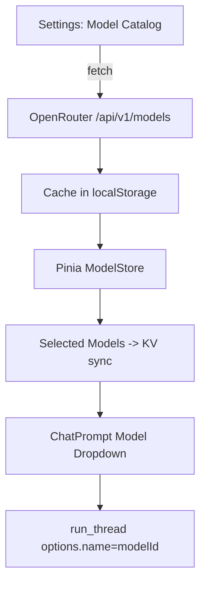

# design.md

## Overview

Implement a Settings-based Model Catalog UI backed by OpenRouter /models, allowing users to search, filter, and select favorites for use in the chat model dropdown. Selections persist locally and via KV; the chat run path uses the selected model id.

## Architecture



## Components and Interfaces

### ModelsService (client)

- Responsibilities:
  - Fetch /api/v1/models (Authorization if available) and map into internal shape.
  - Cache models in localStorage with ETag/lastFetched.
  - Provide filter/search helpers.

```ts
export interface OpenRouterModel {
  id: string; // e.g. "deepseek/deepseek-r1-0528:free"
  name: string; // friendly name
  description?: string;
  context_length?: number;
  architecture?: {
    input_modalities?: string[]; // 'text', 'image'
    output_modalities?: string[];
  };
  pricing?: {
    prompt?: string;
    completion?: string;
    image?: string;
  };
  supported_parameters?: string[];
}

export interface ModelsResponse {
  data: OpenRouterModel[];
}
```

### Pinia: useModelStore (extend)

- Add:
  - state.selectedModelIds: string[]
  - state.catalog: OpenRouterModel[]
  - getters.selectedModels
  - actions: fetchModels(), filterModels(query, filters), toggleSelected(id), saveSelection(), loadSelection()
- Persist:
  - localStorage: `openrouter_selected_models`
  - KV: `openrouter_selected_models`

### UI

- Settings page (new section): "Models"
  - Search input, filters (chips/toggles): Images, Min context length, Reasoning, Web search support, Price <= X (basic bucketed chips), Category (if available).
  - Grid/List of cards: name, id, context length, badges (image/text), price chips.
  - Select checkbox/star on each card; footer bar with Save selection.
  - Refresh button.
- ChatPrompt dropdown
  - Populate from selectedModels; show friendly names; store id as value.
  - If none selected, fall back to a minimal curated default (current DeepSeek R1 free) or top N from catalog.
  - Disable/enable toggles (ReasoningBudget/WebSearch) based on supported_parameters and modalities.

## Data and Persistence

- Cache models JSON in localStorage with `openrouter_model_catalog` and `openrouter_model_catalog_fetched_at`.
- Selection persisted in localStorage + KV; localStorage used immediately for UX; KV for multi-tab/restore.

## Error Handling

- If fetch 401 or network error: show toast; use cached list; expose "Retry".
- If empty or filter returns none: show empty state with clear reset filters action.

## Testing Strategy

- Unit: ModelsService mapping and filters; store selection persistence.
- Integration: settings selection -> dropdown population; run_thread emits selected id; toggles disable when unsupported.
- E2E: Login → open Models → search/select → save → send message with selected model → stream.

## Security

- Do not log API key.
- Keep key in client; Authorization header only when key exists.

```ts
// Run options contract used in sync-service
interface ModelRunOptions {
  name: string; // must be the OpenRouter model id
  thinkingBudget?: "low" | "medium" | "high";
  webSearch?: boolean;
}
```
