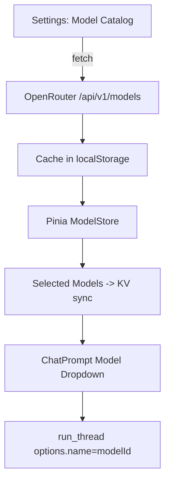

This file is a merged representation of a subset of the codebase, containing files not matching ignore patterns, combined into a single document by Repomix.

# File Summary

## Purpose
This file contains a packed representation of the entire repository's contents.
It is designed to be easily consumable by AI systems for analysis, code review,
or other automated processes.

## File Format
The content is organized as follows:
1. This summary section
2. Repository information
3. Directory structure
4. Repository files (if enabled)
5. Multiple file entries, each consisting of:
  a. A header with the file path (## File: path/to/file)
  b. The full contents of the file in a code block

## Usage Guidelines
- This file should be treated as read-only. Any changes should be made to the
  original repository files, not this packed version.
- When processing this file, use the file path to distinguish
  between different files in the repository.
- Be aware that this file may contain sensitive information. Handle it with
  the same level of security as you would the original repository.

## Notes
- Some files may have been excluded based on .gitignore rules and Repomix's configuration
- Binary files are not included in this packed representation. Please refer to the Repository Structure section for a complete list of file paths, including binary files
- Files matching these patterns are excluded: **.d.ts, **.js
- Files matching patterns in .gitignore are excluded
- Files matching default ignore patterns are excluded
- Files are sorted by Git change count (files with more changes are at the bottom)

# Directory Structure
```
.github/
  FUNDING.yml
packages/
  api/
    drizzle/
      meta/
        _journal.json
        0000_snapshot.json
      0000_brave_gladiator.sql
    .dev.vars
    drizzle.config.ts
    index.ts
    package.json
    schema.ts
    system-prompt.md
    types.ts
    wrangler.toml
  app/
    app/
      assets/
        css/
          main.css
        icons/
          nuxflare.svg
      components/
        chat/
          ChatMessage.client.vue
          ChatPrompt.vue
        color-mode/
          ColorModeToggle.vue
        content/
          Center.vue
          CodeCopy.vue
          ProseA.vue
          ProseBlockquote.vue
          ProseCode.vue
          ProseCodeBlock.vue
          ProseEm.vue
          ProseH1.vue
          ProseH2.vue
          ProseH3.vue
          ProseH4.vue
          ProseH5.vue
          ProseH6.vue
          ProseHr.vue
          ProseImg.vue
          ProseLi.vue
          ProseOl.vue
          ProseP.vue
          ProsePre.vue
          ProseStrong.vue
          ProseTable.vue
          ProseTbody.vue
          ProseTd.vue
          ProseTh.vue
          ProseThead.vue
          ProseTr.vue
          ProseUl.vue
        fragments/
          AccountMenu.vue
          ThreadMenu.vue
        AccountBarSkeleton.vue
        AssistantErrorMessage.vue
        AssistantMessage.vue
        ChatThread.vue
        DeleteModal.vue
        LoaderSpin.vue
        MarkdownChunkRenderer.client.vue
        MarkdownRenderer.vue
        MarkdownSkeleton.vue
        ModelSelector.vue
        Reasoning.vue
        ReasoningBudget.vue
        SearchBox.client.vue
        Settings.vue
        Sidebar.vue
        StreamingMessage.vue
        ThreadLists.client.vue
        ThreadLists.vue
        ThreadListSkeleton.vue
        WebSearch.vue
      composables/
        useModelStore.ts
        useOpenRouterAuth.ts
        usePromptStore.ts
        useRenderGate.ts
        useSearchRef.ts
        useSettingsRef.ts
        useThreadsPreview.ts
        useThreadsStore.ts
      layouts/
        chat.vue
      pages/
        [[id]].vue
        openrouter-callback.vue
      plugins/
        00-polyfills.client.ts
        markdown-warmup.client.ts
        perf.client.ts
        sync.client.ts
      utils/
        db-facade.ts
        markdown-lazy.ts
        markdown.ts
        models-service.ts
        preview-cache.ts
        showToast.ts
        sqlite.ts
        sync-service.ts
        uuid.ts
      workers/
        database.ts
        markdown.ts
      app.config.ts
      app.vue
    public/
      robots.txt
    server/
      tsconfig.json
    nuxt.config.ts
    package.json
    tsconfig.json
  wa-sqlite/
    src/
      examples/
        README.md
      types/
        tsconfig.json
      asyncify_imports.json
      exported_functions.json
      extra_exported_runtime_methods.json
      jspi_exports.json
      libadapters.h
      libauthorizer.c
      libfunction.c
      libhook.c
      libprogress.c
      libvfs.c
      main.c
    .editorconfig
    .gitignore
    .yarnrc.yml
    ACKNOWLEDGMENTS.md
    jsconfig.json
    Makefile
    package.json
    README.md
    typedoc.json
    web-test-runner.config.mjs
planning/
  openrouter-chat/
    design.md
    requirements.md
    tasks.md
  openrouter-models/
    design.md
    requirements.md
    tasks.md
  perf-boot/
    design.md
    requirements.md
    tasks.md
.env.example
.gitignore
.prettierrc.json
AGENTS.md
alchemy.run.ts
LICENSE.md
package.json
README.md
```

# Files

## File: .github/FUNDING.yml
````yaml
# These are supported funding model platforms

github: [tanayvk]
patreon: # Replace with a single Patreon username
open_collective: # Replace with a single Open Collective username
ko_fi: # Replace with a single Ko-fi username
tidelift: # Replace with a single Tidelift platform-name/package-name e.g., npm/babel
community_bridge: # Replace with a single Community Bridge project-name e.g., cloud-foundry
liberapay: # Replace with a single Liberapay username
issuehunt: # Replace with a single IssueHunt username
lfx_crowdfunding: # Replace with a single LFX Crowdfunding project-name e.g., cloud-foundry
polar: # Replace with a single Polar username
buy_me_a_coffee: # Replace with a single Buy Me a Coffee username
thanks_dev: # Replace with a single thanks.dev username
custom: # Replace with up to 4 custom sponsorship URLs e.g., ['link1', 'link2']
````

## File: packages/api/drizzle/0000_brave_gladiator.sql
````sql
CREATE TABLE `attachments` (
	`id` text PRIMARY KEY NOT NULL,
	`type` text NOT NULL,
	`name` text NOT NULL,
	`created_at` integer DEFAULT (unixepoch()) NOT NULL,
	`updated_at` integer DEFAULT (unixepoch()) NOT NULL,
	`deleted` integer DEFAULT false NOT NULL,
	`clock` integer NOT NULL
);
--> statement-breakpoint
CREATE TABLE `kv` (
	`id` text PRIMARY KEY NOT NULL,
	`name` text NOT NULL,
	`value` text,
	`created_at` integer DEFAULT (unixepoch()) NOT NULL,
	`updated_at` integer DEFAULT (unixepoch()) NOT NULL,
	`clock` integer NOT NULL
);
--> statement-breakpoint
CREATE UNIQUE INDEX `kv_name_unique` ON `kv` (`name`);--> statement-breakpoint
CREATE TABLE `messages` (
	`id` text PRIMARY KEY NOT NULL,
	`data` text,
	`role` text NOT NULL,
	`created_at` integer DEFAULT (unixepoch()) NOT NULL,
	`updated_at` integer DEFAULT (unixepoch()) NOT NULL,
	`error` text,
	`deleted` integer DEFAULT false NOT NULL,
	`thread_id` text NOT NULL,
	`index` integer NOT NULL,
	`clock` integer NOT NULL,
	`stream_id` text
);
--> statement-breakpoint
CREATE TABLE `threads` (
	`id` text PRIMARY KEY NOT NULL,
	`title` text,
	`created_at` integer DEFAULT (unixepoch()) NOT NULL,
	`updated_at` integer DEFAULT (unixepoch()) NOT NULL,
	`last_message_at` integer,
	`parent_thread_id` text,
	`status` text DEFAULT 'ready' NOT NULL,
	`deleted` integer DEFAULT false NOT NULL,
	`pinned` integer DEFAULT false NOT NULL,
	`clock` integer NOT NULL
);
````

## File: packages/api/.dev.vars
````
AUTH_URL="https://auth.chat.nuxflare.com"
AUTH_CLIENT_ID="nuxflare-chat"
````

## File: packages/api/drizzle.config.ts
````typescript
import { defineConfig } from "drizzle-kit";

export default defineConfig({
  out: "./drizzle",
  schema: "./schema.ts",
  dialect: "sqlite",
  driver: "durable-sqlite",
});
````

## File: packages/api/system-prompt.md
````markdown
I am Nuxflare Chat. My role is to assist and engage in conversation while being helpful, respectful, and engaging.

- The current date and time including timezone is {{time}}.
- Always use LaTeX for mathematical expressions:
  - Inline math must be wrapped in escaped parentheses: \( content \)
  - Do not use single dollar signs for inline math
  - Display math must be wrapped in double dollar signs: $$ content $$
- Do not use the backslash character to escape parenthesis. Use the actual parentheses instead.
- Ensure code is properly formatted using Prettier with a print width of 80 characters
- Present code in Markdown code blocks with the correct language extension indicated
````

## File: packages/app/app/assets/icons/nuxflare.svg
````
<svg width="500" height="500" viewBox="0 0 500 500" fill="none" xmlns="http://www.w3.org/2000/svg">
<circle cx="250" cy="250" r="150" fill="#FF6500" fill-opacity="0.1"/>
<circle cx="250" cy="250" r="210" fill="#FF6500" fill-opacity="0.1"/>
<circle cx="250" cy="250" r="240" fill="#FF6500" fill-opacity="0.1"/>
<circle cx="250" cy="250" r="239" stroke="#C40C0C" stroke-opacity="0.1" stroke-width="2"/>
<g filter="url(#filter0_f_262_50)">
<path fill-rule="evenodd" clip-rule="evenodd" d="M212.146 152.653L176.677 217.732C161.793 245.049 154.345 258.7 158.445 269.429L158.654 269.963C162.997 280.534 175.855 280.534 201.558 280.534C215.841 280.534 222.988 280.534 227.459 286.236L227.69 286.551L272.541 214.764L272.309 214.449C267.919 208.622 267.919 199.322 267.919 180.708V175.838C267.919 124.236 267.919 98.4433 257.228 93.9979C246.536 89.5524 235.069 110.586 212.146 152.653Z" fill="#FF8A08"/>
<path opacity="0.5" d="M232.081 320.292V325.162C232.081 376.748 232.081 402.557 242.772 407.002C253.463 411.448 264.931 390.414 287.866 348.347L323.334 283.268C338.207 255.951 345.655 242.3 341.555 231.571L341.346 231.037C337.002 220.466 324.145 220.466 298.441 220.466C284.159 220.466 277.012 220.466 272.541 214.764L227.69 286.551C232.081 292.378 232.081 301.678 232.081 320.292Z" fill="#FF8A08"/>
</g>
<path fill-rule="evenodd" clip-rule="evenodd" d="M212.146 152.653L176.677 217.732C161.793 245.049 154.345 258.7 158.445 269.429L158.654 269.963C162.997 280.534 175.855 280.534 201.558 280.534C215.841 280.534 222.988 280.534 227.459 286.236L227.69 286.551L272.541 214.764L272.309 214.449C267.919 208.622 267.919 199.322 267.919 180.708V175.838C267.919 124.236 267.919 98.4433 257.228 93.9979C246.536 89.5524 235.069 110.586 212.146 152.653Z" fill="#FF8A08"/>
<path opacity="0.5" d="M232.081 320.292V325.162C232.081 376.748 232.081 402.557 242.772 407.002C253.463 411.448 264.931 390.414 287.866 348.347L323.334 283.268C338.207 255.951 345.655 242.3 341.555 231.571L341.346 231.037C337.002 220.466 324.145 220.466 298.441 220.466C284.159 220.466 277.012 220.466 272.541 214.764L227.69 286.551C232.081 292.378 232.081 301.678 232.081 320.292Z" fill="#FF8A08"/>
<defs>
<filter id="filter0_f_262_50" x="81" y="32" width="338" height="437" filterUnits="userSpaceOnUse" color-interpolation-filters="sRGB">
<feFlood flood-opacity="0" result="BackgroundImageFix"/>
<feBlend mode="normal" in="SourceGraphic" in2="BackgroundImageFix" result="shape"/>
<feGaussianBlur stdDeviation="15" result="effect1_foregroundBlur_262_50"/>
</filter>
</defs>
</svg>
````

## File: packages/app/app/components/color-mode/ColorModeToggle.vue
````vue
<template>
  <ClientOnly>
    <UTooltip text="Theme">
      <UButton square color="neutral" variant="ghost" @click="switchMode">
        <Transition name="reveal-3d">
          <UIcon
            class="size-4 shrink-0"
            :name="colorMode.value === 'dark' ? icons.dark : icons.light"
            :key="colorMode.value"
          />
        </Transition>
      </UButton>
    </UTooltip>

    <template #fallback>
      <UTooltip text="Theme">
        <UButton
          color="neutral"
          variant="ghost"
          :icon="icons['dark']"
          @click="switchMode"
        />
      </UTooltip>
    </template>
  </ClientOnly>
</template>

<script setup>
const colorMode = useColorMode();
const switchMode = () => {
  const modes = ["light", "dark"];
  colorMode.preference =
    modes[(modes.indexOf(colorMode.value) + 1) % modes.length];
};
const icons = {
  light: "i-heroicons-moon",
  dark: "i-heroicons-sun",
};
</script>

<style scoped>
.reveal-3d-leave-active {
  position: absolute;
}
.reveal-3d-enter-active,
.reveal-3d-leave-active {
  transition: transform 0.1s ease-in-out;
}

.reveal-3d-enter-from,
.reveal-3d-leave-to {
  transform: scale(0.8) rotateZ(90deg);
}

.reveal-3d-enter-to,
.reveal-3d-leave-from {
  transform: scale(1) rotateZ(0deg);
}
</style>
````

## File: packages/app/app/components/content/Center.vue
````vue
<template>
  <div class="w-full flex justify-center">
    <slot />
  </div>
</template>
````

## File: packages/app/app/components/content/ProseA.vue
````vue
<template>
  <NuxtLink
    :href="href"
    :target="target"
    :external="external"
    class="font-semibold underline underline-offset-4"
  >
    <slot />
  </NuxtLink>
</template>

<script setup lang="ts">
const { href = "", external = false } = defineProps<{
  href?: string;
  target?: any;
  external?: boolean;
}>();
</script>
````

## File: packages/app/app/components/content/ProseBlockquote.vue
````vue
<template>
  <blockquote class="border-l-2 pl-6 italic [&:not(:first-child)]:mt-6">
    <slot />
  </blockquote>
</template>
````

## File: packages/app/app/components/content/ProseCodeBlock.vue
````vue
<template>
  <UCard
    :ui="{ body: 'px-0 py-0 sm:p-0' }"
    class="mt-4 relative overflow-hidden [&:not(:first-child)]:mt-5 [&:not(:last-child)]:mb-5"
    :class="[
      inGroup && 'mb-0 rounded-t-none border-none shadow-none',
      inStack && 'mb-0 rounded-none border-none shadow-none',
    ]"
  >
    <div
      v-if="!inGroup && filename"
      class="flex items-center border-b border-gray-200 dark:border-gray-800 px-3 py-2 font-mono text-sm"
    >
      <UIcon v-if="icon" :name="icon" class="mr-1.5 self-center" />
      {{ filename }}
      <CodeCopy :code class="ml-auto" />
    </div>

    <span v-if="!filename" class="absolute right-2 top-2 z-10">
      <CodeCopy :code />
    </span>
    <div class="bg-gray-200/5 dark:bg-gray-800/5">
      <div
        class="overflow-x-auto py-3 text-sm"
        :class="[
          !inGroup && !filename && 'inline-copy',
          !language && 'pl-3',
          !inGroup,
        ]"
      >
        <slot />
      </div>
    </div>
  </UCard>
</template>

<script setup lang="ts">
import type { BuiltinLanguage } from "shiki";

const props = defineProps({
  code: {
    type: String,
    default: "",
  },
  language: {
    type: String as PropType<BuiltinLanguage>,
    default: null,
  },
  filename: {
    type: String,
    default: null,
  },
  inGroup: {
    type: Boolean,
    default: false,
  },
  inStack: {
    type: Boolean,
    default: false,
  },
  highlights: {
    type: Array as () => number[],
    default: () => [],
  },
});

const iconMap = new Map();
const icon =
  iconMap.get(props.filename?.toLowerCase()) || iconMap.get(props.language);
</script>

<style>
.fade-enter-active {
  transition: opacity 0.5s ease;
}

.fade-enter-from,
.fade-leave-to {
  opacity: 0;
}

.shiki .line.highlight {
  background-color: hsl(var(--muted) / 0.8);
}

.shiki .line {
  padding-left: 0.75rem;
  padding-right: 0.75rem;
}

.inline-copy .line {
  padding-right: 2.75rem;
}
</style>
````

## File: packages/app/app/components/content/ProseEm.vue
````vue
<template>
  <em>
    <slot />
  </em>
</template>
````

## File: packages/app/app/components/content/ProseH1.vue
````vue
<template>
  <h1
    :id
    class="inline-block scroll-m-20 text-3xl md:text-4xl lg:text-[55px] xl:text-6xl font-extrabold tracking-normal leading-12 lg:leading-22 font-mono"
  >
    <NuxtLink v-if="generate" :href="`#${id}`">
      <slot />
    </NuxtLink>
    <slot v-else />
  </h1>
</template>

<script setup lang="ts">
const { id } = defineProps<{ id?: string }>();

const { headings } = useRuntimeConfig().public.mdc;
const generate = computed(
  () =>
    id &&
    (headings?.anchorLinks === true ||
      (typeof headings?.anchorLinks !== "boolean" &&
        headings?.anchorLinks?.h1)),
);
</script>
````

## File: packages/app/app/components/content/ProseH2.vue
````vue
<template>
  <h2
    :id
    class="scroll-m-20 mb-8 text-4xl font-semibold tracking-tight transition-colors [&:not(:first-child)]:mt-10"
  >
    <NuxtLink v-if="id && generate" :href="`#${id}`">
      <slot />
    </NuxtLink>
    <slot v-else />
  </h2>
</template>

<script setup lang="ts">
const { id } = defineProps<{ id?: string }>();

const { headings } = useRuntimeConfig().public.mdc;
const generate = computed(
  () =>
    id &&
    (headings?.anchorLinks === true ||
      (typeof headings?.anchorLinks !== "boolean" &&
        headings?.anchorLinks?.h2)),
);
</script>
````

## File: packages/app/app/components/content/ProseH3.vue
````vue
<template>
  <h3
    :id
    class="inline-block w-auto text-2xl font-semibold my-4 tracking-wide relative"
  >
    <NuxtLink v-if="id && generate" :href="`#${id}`" class="">
      <slot />
    </NuxtLink>
    <slot v-else />
    <div class="w-auto h-px"></div>
  </h3>
</template>

<script setup lang="ts">
const { id } = defineProps<{ id?: string }>();

const { headings } = useRuntimeConfig().public.mdc;
const generate = computed(
  () =>
    id &&
    (headings?.anchorLinks === true ||
      (typeof headings?.anchorLinks !== "boolean" &&
        headings?.anchorLinks?.h3)),
);
</script>
````

## File: packages/app/app/components/content/ProseH4.vue
````vue
<template>
  <h4
    :id
    class="scroll-m-20 text-xl font-semibold tracking-tight [&:not(:first-child)]:mt-6"
  >
    <NuxtLink v-if="id && generate" :href="`#${id}`">
      <slot />
    </NuxtLink>
    <slot v-else />
  </h4>
</template>

<script setup lang="ts">
const { id } = defineProps<{ id?: string }>();

const { headings } = useRuntimeConfig().public.mdc;
const generate = computed(
  () =>
    id &&
    (headings?.anchorLinks === true ||
      (typeof headings?.anchorLinks !== "boolean" &&
        headings?.anchorLinks?.h4)),
);
</script>
````

## File: packages/app/app/components/content/ProseH5.vue
````vue
<template>
  <h5
    :id
    class="scroll-m-20 text-lg font-semibold tracking-tight [&:not(:first-child)]:mt-6"
  >
    <NuxtLink v-if="id && generate" :href="`#${id}`">
      <slot />
    </NuxtLink>
    <slot v-else />
  </h5>
</template>

<script setup lang="ts">
const { id } = defineProps<{ id?: string }>();

const { headings } = useRuntimeConfig().public.mdc;
const generate = computed(
  () =>
    id &&
    (headings?.anchorLinks === true ||
      (typeof headings?.anchorLinks !== "boolean" &&
        headings?.anchorLinks?.h5)),
);
</script>
````

## File: packages/app/app/components/content/ProseH6.vue
````vue
<template>
  <h6
    :id
    class="scroll-m-20 text-lg font-semibold tracking-tight [&:not(:first-child)]:mt-6"
  >
    <NuxtLink v-if="id && generate" :href="`#${id}`">
      <slot />
    </NuxtLink>
    <slot v-else />
  </h6>
</template>

<script setup lang="ts">
const { id } = defineProps<{ id?: string }>();

const { headings } = useRuntimeConfig().public.mdc;
const generate = computed(
  () =>
    id &&
    (headings?.anchorLinks === true ||
      (typeof headings?.anchorLinks !== "boolean" &&
        headings?.anchorLinks?.h6)),
);
</script>
````

## File: packages/app/app/components/content/ProseHr.vue
````vue
<template>
  <hr
    class="border-primary-400 dark:border-primary-800 [&:not(:first-child)]:mt-6"
  />
</template>
````

## File: packages/app/app/components/content/ProseImg.vue
````vue
<template>
  
</template>

<script setup lang="ts">
import { joinURL, withLeadingSlash, withTrailingSlash } from "ufo";
import { computed, useRuntimeConfig } from "#imports";

const props = defineProps({
  src: {
    type: String,
    default: "",
  },
  alt: {
    type: String,
    default: "",
  },
  width: {
    type: [String, Number],
    default: undefined,
  },
  height: {
    type: [String, Number],
    default: undefined,
  },
});

const refinedSrc = computed(() => {
  if (props.src?.startsWith("/") && !props.src.startsWith("//")) {
    const _base = withLeadingSlash(
      withTrailingSlash(useRuntimeConfig().app.baseURL),
    );
    if (_base !== "/" && !props.src.startsWith(_base))
      return joinURL(_base, props.src);
  }
  return props.src;
});
</script>
````

## File: packages/app/app/components/content/ProseLi.vue
````vue
<template>
  <li class="[&>ol]:!mt-2 [&>ul]:!mt-2">
    <slot />
  </li>
</template>
````

## File: packages/app/app/components/content/ProseOl.vue
````vue
<template>
  <ol
    class="ml-10 list-decimal [&:not(:first-child)]:mt-6 [&:not(:last-child)]:mb-6 [&>li:not(:first-child)]:mt-2"
  >
    <slot />
  </ol>
</template>
````

## File: packages/app/app/components/content/ProseP.vue
````vue
<template>
  <p class="leading-8 [&:not(:first-child)]:mt-6 tracking-wide text-xl">
    <slot />
  </p>
</template>
````

## File: packages/app/app/components/content/ProsePre.vue
````vue
<template>
  <ProseCodeBlock
    :code="code"
    :language="language"
    :filename="filename"
    :highlights="highlights"
    :meta="meta"
  >
    <pre class="px-2" :class="$props.class" :style="style"><slot /></pre>
  </ProseCodeBlock>
</template>

<script setup lang="ts">
import type { BuiltinLanguage } from "shiki";

defineProps({
  code: {
    type: String,
    default: "",
  },
  language: {
    type: String as PropType<BuiltinLanguage>,
    default: null,
  },
  filename: {
    type: String,
    default: null,
  },
  highlights: {
    type: Array as () => number[],
    default: () => [],
  },
  meta: {
    type: String,
    default: null,
  },
  class: {
    type: String,
    default: null,
  },
  style: {
    type: [String, Object],
    default: null,
  },
});
</script>

<style>
pre code .line {
  display: block;
  min-height: 1rem;
}
</style>
````

## File: packages/app/app/components/content/ProseStrong.vue
````vue
<template>
  <strong class="font-semibold">
    <slot />
  </strong>
</template>
````

## File: packages/app/app/components/content/ProseTable.vue
````vue
<template>
  <div
    class="w-full overflow-y-auto [&:not(:first-child)]:mt-6 [&:not(:last-child)]:mb-6"
  >
    <table class="w-full">
      <slot />
    </table>
  </div>
</template>
````

## File: packages/app/app/components/content/ProseTbody.vue
````vue
<template>
  <tbody>
    <slot />
  </tbody>
</template>
````

## File: packages/app/app/components/content/ProseTd.vue
````vue
<template>
  <td
    class="border px-4 py-2 text-left [&[align=center]]:text-center [&[align=right]]:text-right"
  >
    <slot />
  </td>
</template>
````

## File: packages/app/app/components/content/ProseTh.vue
````vue
<template>
  <th
    class="border px-4 py-2 text-left font-bold [&[align=center]]:text-center [&[align=right]]:text-right"
  >
    <slot />
  </th>
</template>
````

## File: packages/app/app/components/content/ProseThead.vue
````vue
<template>
  <thead>
    <slot />
  </thead>
</template>
````

## File: packages/app/app/components/content/ProseTr.vue
````vue
<template>
  <tr class="m-0 border-t p-0 even:bg-muted/50">
    <slot />
  </tr>
</template>
````

## File: packages/app/app/components/content/ProseUl.vue
````vue
<template>
  <ul
    class="ml-6 list-disc [&:not(:first-child)]:mt-6 [&:not(:last-child)]:mb-6 [&>li:not(:first-child)]:mt-2"
  >
    <slot />
  </ul>
</template>
````

## File: packages/app/app/components/fragments/AccountMenu.vue
````vue
<template>
  <div
    class="p-1 bg-white dark:bg-black rounded-lg w-[var(--width)]"
    :style="cssVars"
  >
    <div
      v-for="action in actions"
      :key="action.icon"
      class="flex items-center gap-2 px-3 py-2 text-sm hover:bg-neutral-100 dark:hover:bg-neutral-800/70 font-semibold cursor-pointer"
      @click="action.action()"
    >
      <UIcon :name="action.icon" class="size-4" />
      <span>{{ action.name }}</span>
    </div>
  </div>
</template>
<script setup lang="ts">
const props = defineProps<{ actions: any[]; cssVars: any }>();
</script>
````

## File: packages/app/app/components/fragments/ThreadMenu.vue
````vue
<template>
  <div class="p-1 bg-white dark:bg-black rounded-lg min-w-35">
    <div
      v-for="moreAction in moreActions"
      :key="moreAction.icon"
      class="flex items-center gap-2 px-3 py-2 text-sm hover:bg-neutral-100 dark:hover:bg-neutral-800/70 font-semibold rounded cursor-pointer"
      @click="moreAction.action(thread)"
    >
      <UIcon :name="moreAction.icon" class="size-4" />
      <span>{{ moreAction.name }}</span>
    </div>
  </div>
</template>
<script setup lang="ts">
const props = defineProps<{ moreActions: any[]; thread: any }>();
</script>
````

## File: packages/app/app/components/AccountBarSkeleton.vue
````vue
<template>
  <div class="sticky left-0 bottom-0 w-full z-10 sidebar-bg">
    <div class="p-2 border-t border-neutral-300 dark:border-neutral-800">
      <div class="p-2.5 flex justify-between items-center rounded-lg">
        <div class="space-x-2 flex items-center animate-pulse select-none">
          <div
            class="w-6 h-6 rounded-full bg-neutral-300 dark:bg-neutral-700"
          />
          <div class="h-3 w-20 rounded bg-neutral-300 dark:bg-neutral-700" />
          <div
            class="ml-2 w-3 h-3 rounded-full bg-neutral-300 dark:bg-neutral-700"
          />
        </div>
        <div class="flex items-center gap-1 text-neutral-400">
          <div class="w-4 h-4 rounded bg-neutral-300 dark:bg-neutral-700" />
        </div>
      </div>
    </div>
  </div>
</template>

<script setup lang="ts">
// Presentational only
</script>
````

## File: packages/app/app/components/LoaderSpin.vue
````vue
<template>
  <div class="flex flex-col gap-2 items-center justify-center">
    <span
      v-if="props.text"
      class="text-primary text-sm text-center max-w-[60%]"
      >{{ props.text }}</span
    >
    <UIcon
      class="text-primary-400 animate-spin"
      :class="[`w-${props.size || 6}`, `h-${props.size || 6}`]"
      name="i-heroicons-arrow-path-20-solid"
    />
  </div>
</template>

<script setup lang="ts">
const props = defineProps<{
  text?: string;
  size?: number;
}>();
</script>
````

## File: packages/app/app/components/MarkdownSkeleton.vue
````vue
<template>
  <div class="w-full animate-pulse select-none">
    <div v-if="variant === 'user'" class="flex flex-col items-end gap-2">
      <div class="h-3 w-7/12 rounded bg-neutral-200 dark:bg-neutral-700" />
      <div class="h-3 w-5/12 rounded bg-neutral-200 dark:bg-neutral-700" />
    </div>
    <div v-else class="flex flex-col gap-2">
      <div class="h-3 w-9/12 rounded bg-neutral-200 dark:bg-neutral-700" />
      <div class="h-3 w-11/12 rounded bg-neutral-200 dark:bg-neutral-700" />
      <div class="h-3 w-10/12 rounded bg-neutral-200 dark:bg-neutral-700" />
      <div class="h-3 w-8/12 rounded bg-neutral-200 dark:bg-neutral-700" />
      <div class="h-3 w-6/12 rounded bg-neutral-200 dark:bg-neutral-700" />
      <div class="h-3 w-3/12 rounded bg-neutral-200 dark:bg-neutral-700" />
    </div>
  </div>
</template>

<script setup lang="ts">
withDefaults(defineProps<{ variant?: "user" | "assistant" }>(), {
  variant: "assistant",
});
</script>
````

## File: packages/app/app/components/ThreadLists.client.vue
````vue
<template>
  <ClientOnly>
    <div ref="root" class="min-h-[200px]">
      <ThreadListSkeleton v-if="!visible" />
      <template v-else>
        <LazyChatThread
          v-if="pinned?.pinned?.length"
          :threads="pinned"
          :pinned="true"
        />
        <LazyChatThread :threads="unpinned" :pinned="false" />
        <div class="h-10" />
      </template>
    </div>
  </ClientOnly>
</template>

<script setup lang="ts">
import { useIntersectionObserver } from "@vueuse/core";
const props = defineProps<{ pinned: any; unpinned: any }>();
const root = ref<HTMLElement | null>(null);
const visible = ref(false);

onMounted(() => {
  const { stop } = useIntersectionObserver(
    root,
    ([entry]) => {
      if (!entry) return;
      if (entry.isIntersecting) {
        visible.value = true;
        stop();
      }
    },
    { rootMargin: "200px 0px", threshold: 0.01 },
  );
});
</script>

<script lang="ts">
export default {
  components: {
    ThreadListSkeleton: () => import("./ThreadListSkeleton.vue"),
  },
};
</script>
````

## File: packages/app/app/components/ThreadLists.vue
````vue
<template>
  <div ref="root">
    <ThreadListSkeleton v-if="!hydrated" />
    <template v-else>
      <ChatThread
        v-if="pinned?.pinned?.length"
        :threads="pinned"
        :pinned="true"
      />
      <ChatThread :threads="unpinned" :pinned="false" />
      <div class="h-10" />
    </template>
  </div>
</template>

<script setup lang="ts">
import { useIntersectionObserver } from "@vueuse/core";
const props = defineProps<{ pinned: any; unpinned: any }>();
const root = ref<HTMLElement | null>(null);
const hydrated = ref(false);

if (import.meta.client) {
  // hydrate immediately on client, but schedule list rendering next tick to unblock paint
  queueMicrotask(() => (hydrated.value = true));
}

onMounted(() => {
  // Optional: attach observer to pre-hydrate when near viewport without blocking
  const { stop } = useIntersectionObserver(
    root,
    ([entry]) => {
      if (!entry) return;
      if (entry.isIntersecting) {
        hydrated.value = true;
        stop();
      }
    },
    { rootMargin: "300px 0px", threshold: 0.01 },
  );
});
</script>

<script lang="ts">
export default {
  components: {
    ThreadListSkeleton: () => import("./ThreadListSkeleton.vue"),
    ChatThread: () => import("./ChatThread.vue"),
  },
};
</script>
````

## File: packages/app/app/components/ThreadListSkeleton.vue
````vue
<template>
  <div class="space-y-4 p-5">
    <div class="space-y-2">
      <div class="h-3 w-16 rounded bg-neutral-200 dark:bg-neutral-800" />
      <div class="space-y-2">
        <div
          v-for="i in 3"
          :key="`p-${i}`"
          class="h-8 w-full rounded bg-neutral-100 dark:bg-neutral-800/60"
        />
      </div>
    </div>
    <div class="space-y-2">
      <div class="h-3 w-16 rounded bg-neutral-200 dark:bg-neutral-800" />
      <div class="space-y-2">
        <div
          v-for="i in 7"
          :key="`u-${i}`"
          class="h-8 w-full rounded bg-neutral-100 dark:bg-neutral-800/60"
        />
      </div>
    </div>
    <div class="h-10" />
  </div>
</template>

<script setup lang="ts">
// Pure skeleton
</script>
````

## File: packages/app/app/components/WebSearch.vue
````vue
<template>
  <UAccordion
    :items="items"
    :ui="{
      content: 'p-3 rounded-lg bg-white dark:bg-neutral-800',
      body: 'text-md',
      trigger: 'cursor-pointer relative',
      trailingIcon: 'absolute left-0',
    }"
  >
    <template #default="{ item }">
      <p class="text-[15px] font-semibold ml-8">{{ item.label }}</p>
    </template>
  </UAccordion>
</template>

<script setup lang="ts">
import type { AccordionItem } from "@nuxt/ui";
interface Props {
  content: string;
}
const props = defineProps<Props>();
const open = ref(false);
const items = ref<AccordionItem[]>([
  {
    label: "Web Search",
    content: props.content,
  },
]);
</script>
````

## File: packages/app/app/composables/useSearchRef.ts
````typescript
export const useSearchRef = () => {
  const searchRef = useState("searchRef", () => false);
  return {
    searchRef,
  };
};
````

## File: packages/app/app/composables/useSettingsRef.ts
````typescript
export const useSettingsRef = () => {
  const settingsRef = useState("settingsRef", () => false);
  return {
    settingsRef,
  };
};
````

## File: packages/app/app/plugins/00-polyfills.client.ts
````typescript
export default defineNuxtPlugin(() => {
  // no-op: using internal uuid utility instead of mutating globals
});
````

## File: packages/app/app/utils/db-facade.ts
````typescript
// Lightweight DB facade: caches thread previews in IndexedDB with a localStorage fallback
// No runtime deps; can be swapped to Dexie later without changing callsites.

export type ThreadPreview = {
  id: string;
  title: string;
  pinned?: boolean;
  updatedAt?: number;
};

const IDB_DB = "nuxflare-cache-v1";
const IDB_STORE = "threads_preview";
const LS_KEY = "ui_threads_preview_v1";

let idbOpenPromise: Promise<IDBDatabase> | null = null;

function openIDB(): Promise<IDBDatabase> {
  if (typeof indexedDB === "undefined") {
    return Promise.reject(new Error("IndexedDB not available"));
  }
  if (!idbOpenPromise) {
    idbOpenPromise = new Promise((resolve, reject) => {
      const req = indexedDB.open(IDB_DB, 1);
      req.onupgradeneeded = () => {
        const db = req.result;
        if (!db.objectStoreNames.contains(IDB_STORE)) {
          db.createObjectStore(IDB_STORE);
        }
      };
      req.onsuccess = () => resolve(req.result);
      req.onerror = () => reject(req.error);
    });
  }
  return idbOpenPromise;
}

async function idbGet<T>(key: string): Promise<T | undefined> {
  const db = await openIDB();
  return new Promise((resolve, reject) => {
    const tx = db.transaction(IDB_STORE, "readonly");
    const store = tx.objectStore(IDB_STORE);
    const req = store.get(key);
    req.onsuccess = () => resolve(req.result as T | undefined);
    req.onerror = () => reject(req.error);
  });
}

async function idbSet<T>(key: string, value: T): Promise<void> {
  const db = await openIDB();
  return new Promise((resolve, reject) => {
    const tx = db.transaction(IDB_STORE, "readwrite");
    const store = tx.objectStore(IDB_STORE);
    const req = store.put(value as any, key);
    req.onsuccess = () => resolve();
    req.onerror = () => reject(req.error);
  });
}

export async function init(): Promise<void> {
  try {
    await openIDB();
  } catch {
    // ignore
  }
}

export async function getThreadsPreview(): Promise<ThreadPreview[]> {
  // Fast path: IndexedDB
  try {
    const data = await idbGet<ThreadPreview[]>("preview");
    if (Array.isArray(data) && data.length) return data;
  } catch {}
  // Fallback: localStorage
  try {
    const raw = localStorage.getItem(LS_KEY);
    if (raw) {
      const parsed = JSON.parse(raw);
      if (Array.isArray(parsed)) return parsed as ThreadPreview[];
    }
  } catch {}
  return [];
}

export async function setThreadsPreview(
  preview: ThreadPreview[],
): Promise<void> {
  // Store in both IDB and localStorage for super-fast boot fallback
  try {
    await idbSet("preview", preview);
  } catch {}
  try {
    localStorage.setItem(LS_KEY, JSON.stringify(preview));
  } catch {}
}

// Optional helper: schedule a cache refresh without blocking
export function schedulePreviewRefresh(run: () => Promise<ThreadPreview[]>) {
  const schedule = (cb: () => void) =>
    (window as any).requestIdleCallback
      ? (window as any).requestIdleCallback(cb, { timeout: 1200 })
      : setTimeout(cb, 250);
  schedule(async () => {
    try {
      const data = await run();
      if (Array.isArray(data) && data.length) await setThreadsPreview(data);
    } catch {}
  });
}
````

## File: packages/app/app/utils/markdown-lazy.ts
````typescript
// Lazy Markdown renderer: dynamically loads heavy deps on first use.
// Prefers a Web Worker to keep the main thread smooth, with an incremental in-thread fallback.
// Exposes a single function renderMarkdownChunk() with internal caching.

let worker: Worker | null = null;
let workerStatus: "idle" | "base" | "heavy" | "failed" = "idle";
// In-thread processors (fallback path)
let baseNoMathLocal: Promise<any> | null = null;
let baseWithMathLocal: Promise<any> | null = null;
let enhancedLocal: Promise<any> | null = null;
const chunkCache = new Map<string, string>();
const processingQueue = new Map<string, Promise<string>>();

async function markHeavyDepsReady() {
  try {
    const { useNuxtApp } = await import("#app");
    const { $perf } = useNuxtApp();
    ($perf as any)?.markHeavyDepsLoaded?.();
  } catch {
    try {
      window.dispatchEvent(new Event("perf:heavy_deps_loaded"));
    } catch {}
  }
}

function maybeInitWorker() {
  if (typeof window === "undefined") return;
  if (worker) return;
  try {
    // Use Vite-friendly worker creation
    worker = new Worker(new URL("../workers/markdown.ts", import.meta.url), {
      type: "module",
    });
    const onMessage = (e: MessageEvent) => {
      const t = e.data?.type;
      if (t === "base_ready") {
        // Consider base pipeline sufficient for responsiveness
        markHeavyDepsReady();
        try {
          window.dispatchEvent(new Event("markdown:base_ready"));
        } catch {}
        // After base is ready, warm up heavy deps when idle
        const scheduleIdle = (cb: () => void) =>
          (window as any).requestIdleCallback
            ? (window as any).requestIdleCallback(cb, { timeout: 1000 })
            : setTimeout(cb, 400);
        scheduleIdle(() => {
          try {
            worker!.postMessage({ type: "warmup", mode: "heavy" });
          } catch {}
        });
        workerStatus = "base";
      } else if (t === "heavy_ready") {
        try {
          window.dispatchEvent(new Event("markdown:heavy_ready"));
        } catch {}
        workerStatus = "heavy";
      }
    };
    worker.addEventListener("message", onMessage as any);
    worker.addEventListener("error", (err) => {
      console.warn("[markdown-worker] error, falling back", err);
      try {
        worker?.removeEventListener("message", onMessage as any);
      } catch {}
      workerStatus = "failed";
      worker = null;
    });
    worker.addEventListener("messageerror", (err) => {
      console.warn("[markdown-worker] messageerror", err);
    });
    // Idle warmup to initialize heavy deps sooner without blocking
    const scheduleIdle = (cb: () => void) =>
      (window as any).requestIdleCallback
        ? (window as any).requestIdleCallback(cb, { timeout: 500 })
        : setTimeout(cb, 200);
    scheduleIdle(() => {
      try {
        worker!.postMessage({ type: "warmup", mode: "base" });
      } catch {}
    });
  } catch {
    // Fallback: Vite-style ?worker import
    (async () => {
      try {
        const mod: any = await import("~/workers/markdown?worker");
        worker = new mod.default();
        workerStatus = "idle";
      } catch (e) {
        console.warn("[markdown-worker] creation failed, using fallback", e);
        worker = null;
        workerStatus = "failed";
      }
    })();
  }
}

function hasCodeFences(text: string): boolean {
  return /```|~~~/.test(text);
}
function hasMath(text: string): boolean {
  return /(\$\$[^]*?\$\$)|(\$[^\n$]+\$)|(\\\(|\\\)|\\\[|\\\])/.test(text);
}

async function initBaseNoMathLocalProc() {
  if (!baseNoMathLocal) {
    baseNoMathLocal = (async () => {
      const [
        { unified },
        remarkParse,
        remarkGfm,
        remarkRehype,
        rehypeStringify,
      ] = await Promise.all([
        import("unified"),
        import("remark-parse"),
        import("remark-gfm"),
        import("remark-rehype"),
        import("rehype-stringify"),
      ]);
      const proc = (unified as any)()
        .use((remarkParse as any).default || (remarkParse as any))
        .use((remarkGfm as any).default || (remarkGfm as any))
        .use((remarkRehype as any).default || (remarkRehype as any))
        .use((rehypeStringify as any).default || (rehypeStringify as any));
      // Mark responsive-ready when base is available
      markHeavyDepsReady();
      return proc;
    })();
  }
  return baseNoMathLocal;
}

async function initBaseWithMathLocalProc() {
  if (!baseWithMathLocal) {
    baseWithMathLocal = (async () => {
      const [
        { unified },
        remarkParse,
        remarkGfm,
        remarkMath,
        remarkRehype,
        rehypeKatex,
        rehypeStringify,
      ] = await Promise.all([
        import("unified"),
        import("remark-parse"),
        import("remark-gfm"),
        import("remark-math"),
        import("remark-rehype"),
        import("rehype-katex"),
        import("rehype-stringify"),
      ]);
      const proc = (unified as any)()
        .use((remarkParse as any).default || (remarkParse as any))
        .use((remarkGfm as any).default || (remarkGfm as any))
        .use((remarkMath as any).default || (remarkMath as any))
        .use((remarkRehype as any).default || (remarkRehype as any))
        .use((rehypeKatex as any).default || (rehypeKatex as any))
        .use((rehypeStringify as any).default || (rehypeStringify as any));
      markHeavyDepsReady();
      return proc;
    })();
  }
  return baseWithMathLocal;
}

async function initEnhancedLocalProc() {
  if (!enhancedLocal) {
    enhancedLocal = (async () => {
      const [
        { unified },
        remarkParse,
        remarkGfm,
        remarkMath,
        remarkRehype,
        rehypeKatex,
        rehypeStringify,
        rehypeShiki,
      ] = await Promise.all([
        import("unified"),
        import("remark-parse"),
        import("remark-gfm"),
        import("remark-math"),
        import("remark-rehype"),
        import("rehype-katex"),
        import("rehype-stringify"),
        import("@shikijs/rehype"),
      ]);
      const proc = (unified as any)()
        .use((remarkParse as any).default || (remarkParse as any))
        .use((remarkGfm as any).default || (remarkGfm as any))
        .use((remarkMath as any).default || (remarkMath as any))
        .use((remarkRehype as any).default || (remarkRehype as any))
        .use((rehypeShiki as any).default || (rehypeShiki as any), {
          defaultLanguage: "txt",
          fallbackLanguage: "txt",
          themes: { light: "vitesse-light", dark: "vitesse-dark" },
        })
        .use((rehypeKatex as any).default || (rehypeKatex as any))
        .use((rehypeStringify as any).default || (rehypeStringify as any));
      return proc;
    })();
  }
  return enhancedLocal;
}

async function sha1(text: string): Promise<string> {
  const buf = await crypto.subtle.digest(
    "SHA-1",
    new TextEncoder().encode(text),
  );
  return Array.from(new Uint8Array(buf))
    .map((b) => b.toString(16).padStart(2, "0"))
    .join("");
}

export async function renderMarkdownChunk(chunk: string): Promise<string> {
  if (!chunk) return "";
  const hash = await sha1(chunk);
  const cached = chunkCache.get(hash);
  if (cached) return cached;

  const existing = processingQueue.get(hash);
  if (existing) return existing;

  // Prefer worker path; initialize it if possible
  maybeInitWorker();
  let p: Promise<string>;
  if (worker) {
    p = new Promise<string>((resolve, reject) => {
      const id = crypto.randomUUID();
      const onMsg = (e: MessageEvent) => {
        const d = e.data;
        if (!d || d.id !== id) return;
        if (d.type === "result") {
          worker?.removeEventListener("message", onMsg as any);
          resolve(String(d.html || ""));
        } else if (d.type === "error") {
          worker?.removeEventListener("message", onMsg as any);
          reject(new Error(String(d.error)));
        }
      };
      worker!.addEventListener("message", onMsg as any);
      worker!.postMessage({ type: "render", id, text: chunk });
    }).catch(async (err) => {
      // Fallback to in-thread processing on worker failure
      console.warn("[markdown-worker] render failed, using fallback", err);
      let file: any;
      if (hasCodeFences(chunk)) {
        // Try fast base first to avoid blocking
        const base = hasMath(chunk)
          ? await initBaseWithMathLocalProc()
          : await initBaseNoMathLocalProc();
        try {
          file = await base.process(chunk);
        } catch {
          const enh = await initEnhancedLocalProc();
          file = await enh.process(chunk);
        }
      } else {
        const base = hasMath(chunk)
          ? await initBaseWithMathLocalProc()
          : await initBaseNoMathLocalProc();
        file = await base.process(chunk);
      }
      return String(file);
    });
  } else {
    // No worker (or failed): use incremental local pipeline
    if (hasCodeFences(chunk)) {
      const proc =
        workerStatus === "failed"
          ? await initBaseNoMathLocalProc()
          : await initBaseNoMathLocalProc();
      try {
        const file = await proc.process(chunk);
        p = Promise.resolve(String(file));
      } catch {
        const enh = await initEnhancedLocalProc();
        const file = await enh.process(chunk);
        p = Promise.resolve(String(file));
      }
    } else {
      const base = hasMath(chunk)
        ? await initBaseWithMathLocalProc()
        : await initBaseNoMathLocalProc();
      const file = await base.process(chunk);
      p = Promise.resolve(String(file));
    }
  }

  processingQueue.set(hash, p);
  const result = await p;
  processingQueue.delete(hash);
  chunkCache.set(hash, result);
  return result;
}

// Public warmup entrypoint: initialize base pipeline early and optionally heavy
export async function warmupMarkdown(mode: "base" | "heavy" = "base") {
  if (typeof window === "undefined") return;
  try {
    maybeInitWorker();
    if (worker) {
      // Always warm base first
      worker.postMessage({ type: "warmup", mode: "base" });
      if (mode === "heavy") {
        const scheduleIdle = (cb: () => void) =>
          (window as any).requestIdleCallback
            ? (window as any).requestIdleCallback(cb, { timeout: 1000 })
            : setTimeout(cb, 300);
        scheduleIdle(() => {
          try {
            worker!.postMessage({ type: "warmup", mode: "heavy" });
          } catch {}
        });
      }
      return;
    }
    // No worker: prepare local base pipeline to reduce first-use cost
    await initBaseNoMathLocalProc();
    if (mode === "heavy") {
      const scheduleIdle = (cb: () => void) =>
        (window as any).requestIdleCallback
          ? (window as any).requestIdleCallback(cb, { timeout: 1000 })
          : setTimeout(cb, 300);
      scheduleIdle(() => {
        initEnhancedLocalProc().catch(() => {});
      });
    }
  } catch {
    // ignore
  }
}
````

## File: packages/app/app/utils/models-service.ts
````typescript
// ModelsService: Fetch OpenRouter models, cache, and provide simple filters
// Source: https://openrouter.ai/api/v1/models
// Usage: import { modelsService } from "~/utils/models-service";

export interface OpenRouterModel {
  id: string; // e.g. "deepseek/deepseek-r1-0528:free"
  name: string;
  description?: string;
  created?: number;
  architecture?: {
    input_modalities?: string[];
    output_modalities?: string[];
    tokenizer?: string;
    instruct_type?: string;
  };
  top_provider?: {
    is_moderated?: boolean;
    context_length?: number;
    max_completion_tokens?: number;
  };
  pricing?: {
    prompt?: string; // USD per input token (stringified number)
    completion?: string; // USD per output token
    image?: string;
    request?: string;
    web_search?: string;
    internal_reasoning?: string;
    input_cache_read?: string;
    input_cache_write?: string;
  };
  canonical_slug?: string;
  context_length?: number;
  hugging_face_id?: string;
  per_request_limits?: Record<string, unknown>;
  supported_parameters?: string[]; // e.g. ["temperature","top_p","reasoning"]
}

interface ModelsResponse {
  data: OpenRouterModel[];
}

export interface ModelCatalogCache {
  data: OpenRouterModel[];
  fetchedAt: number;
}

const CACHE_KEY = "openrouter_model_catalog_v1";

function readApiKey(): string | null {
  try {
    if (typeof window === "undefined") return null;
    return localStorage.getItem("openrouter_api_key");
  } catch {
    return null;
  }
}

function saveCache(data: OpenRouterModel[]): void {
  try {
    if (typeof window === "undefined") return;
    const payload: ModelCatalogCache = { data, fetchedAt: Date.now() };
    localStorage.setItem(CACHE_KEY, JSON.stringify(payload));
  } catch {}
}

function loadCache(): ModelCatalogCache | null {
  try {
    if (typeof window === "undefined") return null;
    const raw = localStorage.getItem(CACHE_KEY);
    if (!raw) return null;
    const parsed = JSON.parse(raw) as ModelCatalogCache;
    if (!Array.isArray(parsed?.data)) return null;
    return parsed;
  } catch {
    return null;
  }
}

function toNumber(x?: string | number | null): number | null {
  if (x === undefined || x === null) return null;
  const n = typeof x === "string" ? Number(x) : x;
  return Number.isFinite(n) ? n : null;
}

export async function fetchModels(opts?: {
  force?: boolean;
  ttlMs?: number;
}): Promise<OpenRouterModel[]> {
  const ttlMs = opts?.ttlMs ?? 1000 * 60 * 60; // 1 hour
  if (!opts?.force) {
    const cached = loadCache();
    if (
      cached &&
      Date.now() - cached.fetchedAt <= ttlMs &&
      cached.data.length
    ) {
      return cached.data;
    }
  }

  const url = "https://openrouter.ai/api/v1/models";
  const key = readApiKey();
  const headers: Record<string, string> = {};
  if (key) headers["Authorization"] = `Bearer ${key}`;

  const res = await fetch(url, { headers });
  if (!res.ok) {
    // Fallback to any cache on failure
    const cached = loadCache();
    if (cached?.data?.length) return cached.data;
    throw new Error(`Failed to fetch models: ${res.status} ${res.statusText}`);
  }
  const json = (await res.json()) as ModelsResponse;
  const list = Array.isArray(json?.data) ? json.data : [];
  saveCache(list);
  return list;
}

// Filters
export function filterByText(
  models: OpenRouterModel[],
  q: string,
): OpenRouterModel[] {
  const query = q?.trim().toLowerCase();
  if (!query) return models;
  return models.filter((m) => {
    const hay =
      `${m.id}\n${m.name || ""}\n${m.description || ""}`.toLowerCase();
    return hay.includes(query);
  });
}

export function filterByModalities(
  models: OpenRouterModel[],
  opts: { input?: string[]; output?: string[] } = {},
): OpenRouterModel[] {
  const { input, output } = opts;
  if (!input && !output) return models;
  return models.filter((m) => {
    const inOk =
      !input ||
      input.every((i) => m.architecture?.input_modalities?.includes(i));
    const outOk =
      !output ||
      output.every((o) => m.architecture?.output_modalities?.includes(o));
    return inOk && outOk;
  });
}

export function filterByContextLength(
  models: OpenRouterModel[],
  minCtx: number,
): OpenRouterModel[] {
  if (!minCtx) return models;
  return models.filter((m) => {
    const ctx = m.top_provider?.context_length ?? m.context_length ?? 0;
    return (ctx || 0) >= minCtx;
  });
}

export function filterByParameters(
  models: OpenRouterModel[],
  params: string[],
): OpenRouterModel[] {
  if (!params?.length) return models;
  return models.filter((m) => {
    const supported = m.supported_parameters || [];
    return params.every((p) => supported.includes(p));
  });
}

export type PriceBucket = "free" | "low" | "medium" | "any";

export function filterByPriceBucket(
  models: OpenRouterModel[],
  bucket: PriceBucket,
): OpenRouterModel[] {
  if (!bucket || bucket === "any") return models;
  return models.filter((m) => {
    const p = toNumber(m.pricing?.prompt) ?? 0;
    const c = toNumber(m.pricing?.completion) ?? 0;
    const max = Math.max(p, c);
    if (bucket === "free") return max === 0;
    if (bucket === "low") return max > 0 && max <= 0.000002; // heuristic
    if (bucket === "medium") return max > 0.000002 && max <= 0.00001;
    return true;
  });
}

export const modelsService = {
  fetchModels,
  filterByText,
  filterByModalities,
  filterByContextLength,
  filterByParameters,
  filterByPriceBucket,
};

export default modelsService;
````

## File: packages/app/app/utils/preview-cache.ts
````typescript
/*
  PreviewCache: IndexedDB-backed preview cache with in-memory fallback.
  - Store name: 'threads_preview' in DB 'nuxflare-preview-cache'
  - Single-record per version key: 'v' + version
  - Safe on SSR: falls back to in-memory and never touches IDB on server
*/

export interface ThreadPreview {
  id: string;
  title: string;
  updated_at: number;
  last_message_at: number;
  pinned: 0 | 1;
  deleted: 0 | 1;
  last_message_snippet: string;
  message_count: number;
}

export interface PreviewEnvelope {
  version: number;
  generated_at: number; // epoch ms
  items: ThreadPreview[];
}

export const PREVIEW_CACHE_VERSION = 1 as const;
export const versionKeyFor = (version = PREVIEW_CACHE_VERSION) => `v${version}`;

const DB_NAME = "nuxflare-preview-cache";
const STORE = "threads_preview";

type MaybeEnvelope = PreviewEnvelope | undefined;

class PreviewCacheImpl {
  private memory = new Map<string, PreviewEnvelope>();
  private openPromise: Promise<IDBDatabase> | null = null;

  private hasIDB(): boolean {
    return typeof indexedDB !== "undefined" && !!indexedDB;
  }

  private async openDB(): Promise<IDBDatabase> {
    if (!this.hasIDB()) {
      // Dummy never-resolving promise if called accidentally on server; callers should catch
      // but we also guard all public calls to avoid reaching here when IDB is unavailable.
      return Promise.reject(new Error("IndexedDB unavailable"));
    }
    if (this.openPromise) return this.openPromise;
    this.openPromise = new Promise((resolve, reject) => {
      const req = indexedDB.open(DB_NAME, 1);
      req.onupgradeneeded = (ev) => {
        const db = (ev.target as IDBOpenDBRequest).result;
        if (!db.objectStoreNames.contains(STORE)) {
          db.createObjectStore(STORE);
        }
      };
      req.onsuccess = (ev) => resolve((ev.target as IDBOpenDBRequest).result);
      req.onerror = (ev) => {
        this.openPromise = null;
        reject((ev.target as IDBOpenDBRequest).error ?? new Error("IDB error"));
      };
    });
    return this.openPromise;
  }

  private async idbGet(key: string): Promise<MaybeEnvelope> {
    const db = await this.openDB();
    return new Promise((resolve, reject) => {
      const tx = db.transaction([STORE], "readonly");
      const store = tx.objectStore(STORE);
      const req = store.get(key);
      req.onsuccess = (ev) =>
        resolve((ev.target as IDBRequest).result as MaybeEnvelope);
      req.onerror = (ev) =>
        reject((ev.target as IDBRequest).error ?? new Error("get failed"));
    });
  }

  private async idbSet(key: string, value: PreviewEnvelope): Promise<void> {
    const db = await this.openDB();
    return new Promise((resolve, reject) => {
      const tx = db.transaction([STORE], "readwrite");
      const store = tx.objectStore(STORE);
      const req = store.put(value, key);
      req.onsuccess = () => resolve();
      req.onerror = (ev) =>
        reject((ev.target as IDBRequest).error ?? new Error("set failed"));
    });
  }

  private async idbClear(): Promise<void> {
    const db = await this.openDB();
    return new Promise((resolve, reject) => {
      const tx = db.transaction([STORE], "readwrite");
      const store = tx.objectStore(STORE);
      const req = store.clear();
      req.onsuccess = () => resolve();
      req.onerror = (ev) =>
        reject((ev.target as IDBRequest).error ?? new Error("clear failed"));
    });
  }

  // Public API
  async get(versionKey: string): Promise<MaybeEnvelope> {
    // Try IDB fast-path if available; otherwise memory
    if (this.hasIDB()) {
      try {
        const res = await this.idbGet(versionKey);
        if (res) return res;
      } catch {
        // fallthrough to memory
      }
    }
    return this.memory.get(versionKey);
  }

  async set(versionKey: string, envelope: PreviewEnvelope): Promise<void> {
    // Privacy/safety: ensure we only store allowed fields
    // (Assumes envelope was constructed per design elsewhere.)
    this.memory.set(versionKey, envelope);
    if (!this.hasIDB()) return;
    try {
      await this.idbSet(versionKey, envelope);
    } catch {
      // keep memory fallback
    }
  }

  async clearAll(): Promise<void> {
    this.memory.clear();
    if (!this.hasIDB()) return;
    try {
      await this.idbClear();
    } catch {
      // ignore
    }
  }
}

export const PreviewCache = new PreviewCacheImpl();
````

## File: packages/app/app/utils/showToast.ts
````typescript
export default function showToast(message: string = "", error: string = "") {
  const toast = useToast();
  toast.add({
    title: message,
    icon: error ? "material-symbols:error-outline" : "i-lucide:check-circle",
    duration: 2000,
    close: {
      class: "hidden",
    },
    color: error ? "error" : "primary",
  });
}
````

## File: packages/app/app/utils/uuid.ts
````typescript
// Safe UUID v4 generator for environments where crypto.randomUUID may be unavailable
export function uuidv4(): string {
  const g: any = globalThis as any;
  const cryptoObj = g?.crypto;
  if (cryptoObj?.randomUUID) {
    return cryptoObj.randomUUID();
  }
  const getRandomValues: ((arr: Uint8Array) => Uint8Array) | undefined =
    cryptoObj?.getRandomValues;
  const bytes = new Uint8Array(16);
  if (getRandomValues) getRandomValues.call(cryptoObj, bytes);
  else for (let i = 0; i < 16; i++) bytes[i] = Math.floor(Math.random() * 256);
  // Set version/variant bits
  bytes[6] = ((bytes[6] as number) & 0x0f) | 0x40;
  bytes[8] = ((bytes[8] as number) & 0x3f) | 0x80;
  const hex = Array.from(bytes, (b) => b.toString(16).padStart(2, "0")).join(
    "",
  );
  return `${hex.slice(0, 8)}-${hex.slice(8, 12)}-${hex.slice(12, 16)}-${hex.slice(16, 20)}-${hex.slice(20)}`;
}
````

## File: packages/app/app/workers/markdown.ts
````typescript
// Markdown Web Worker: fast base pipeline first, defer Shiki until needed.
// Protocol:
//  - { type: 'warmup', mode?: 'base'|'heavy' }
//  - { type: 'render', id: string, text: string }
//  - posts { type: 'base_ready' } when base pipeline is ready
//  - posts { type: 'heavy_ready' } when Shiki is loaded
//  - posts { type: 'result', id, html } or { type: 'error', id, error }

type Proc = { process: (input: string) => Promise<any> };

let baseNoMathInit: Promise<Proc> | null = null;
let baseWithMathInit: Promise<Proc> | null = null;
let enhancedInit: Promise<Proc> | null = null;
let shikiLoaded = false;

async function initBaseNoMath(): Promise<Proc> {
  if (!baseNoMathInit) {
    baseNoMathInit = (async () => {
      const [
        { unified },
        remarkParse,
        remarkGfm,
        remarkRehype,
        rehypeStringify,
      ] = await Promise.all([
        import("unified"),
        import("remark-parse"),
        import("remark-gfm"),
        import("remark-rehype"),
        import("rehype-stringify"),
      ]);

      const proc = (unified as any)()
        .use((remarkParse as any).default || (remarkParse as any))
        .use((remarkGfm as any).default || (remarkGfm as any))
        .use((remarkRehype as any).default || (remarkRehype as any))
        .use((rehypeStringify as any).default || (rehypeStringify as any));

      (self as any).postMessage({ type: "base_ready" });
      return proc as Proc;
    })();
  }
  return baseNoMathInit;
}

async function initBaseWithMath(): Promise<Proc> {
  if (!baseWithMathInit) {
    baseWithMathInit = (async () => {
      const [
        { unified },
        remarkParse,
        remarkGfm,
        remarkMath,
        remarkRehype,
        rehypeKatex,
        rehypeStringify,
      ] = await Promise.all([
        import("unified"),
        import("remark-parse"),
        import("remark-gfm"),
        import("remark-math"),
        import("remark-rehype"),
        import("rehype-katex"),
        import("rehype-stringify"),
      ]);

      const proc = (unified as any)()
        .use((remarkParse as any).default || (remarkParse as any))
        .use((remarkGfm as any).default || (remarkGfm as any))
        .use((remarkMath as any).default || (remarkMath as any))
        .use((remarkRehype as any).default || (remarkRehype as any))
        .use((rehypeKatex as any).default || (rehypeKatex as any))
        .use((rehypeStringify as any).default || (rehypeStringify as any));

      return proc as Proc;
    })();
  }
  return baseWithMathInit;
}

async function initEnhanced(): Promise<Proc> {
  if (!enhancedInit) {
    enhancedInit = (async () => {
      const [
        { unified },
        remarkParse,
        remarkGfm,
        remarkMath,
        remarkRehype,
        rehypeKatex,
        rehypeStringify,
        rehypeShiki,
      ] = await Promise.all([
        import("unified"),
        import("remark-parse"),
        import("remark-gfm"),
        import("remark-math"),
        import("remark-rehype"),
        import("rehype-katex"),
        import("rehype-stringify"),
        import("@shikijs/rehype"),
      ]);

      const proc = (unified as any)()
        .use((remarkParse as any).default || (remarkParse as any))
        .use((remarkGfm as any).default || (remarkGfm as any))
        .use((remarkMath as any).default || (remarkMath as any))
        .use((remarkRehype as any).default || (remarkRehype as any))
        .use((rehypeShiki as any).default || (rehypeShiki as any), {
          defaultLanguage: "txt",
          fallbackLanguage: "txt",
          themes: { light: "vitesse-light", dark: "vitesse-dark" },
        })
        .use((rehypeKatex as any).default || (rehypeKatex as any))
        .use((rehypeStringify as any).default || (rehypeStringify as any));

      shikiLoaded = true;
      (self as any).postMessage({ type: "heavy_ready" });
      return proc as Proc;
    })();
  }
  return enhancedInit;
}

function hasCodeFences(text: string): boolean {
  return /```|~~~/.test(text);
}
function hasMath(text: string): boolean {
  return /(\$\$[\s\S]*?\$\$)|(\$[^\n$]+\$)|(\\\(|\\\)|\\\[|\\\])/.test(text);
}

addEventListener("message", async (evt: MessageEvent) => {
  const data = evt.data;
  if (!data || typeof data !== "object") return;
  if (data.type === "warmup") {
    try {
      await initBaseNoMath();
      if (data.mode === "heavy") {
        await initEnhanced();
      }
    } catch {}
    return;
  }
  if (data.type === "render") {
    const { id, text } = data as { id: string; text: string };
    try {
      let html: string;
      if (hasCodeFences(text) && !shikiLoaded) {
        // Fast path without Shiki
        const base = hasMath(text)
          ? await initBaseWithMath()
          : await initBaseNoMath();
        html = String(await base.process(text || ""));
      } else if (hasCodeFences(text)) {
        const enhanced = await initEnhanced();
        html = String(await enhanced.process(text || ""));
      } else {
        const base = hasMath(text)
          ? await initBaseWithMath()
          : await initBaseNoMath();
        html = String(await base.process(text || ""));
      }
      (self as any).postMessage({ type: "result", id, html });
    } catch (e: any) {
      (self as any).postMessage({
        type: "error",
        id,
        error: String(e?.message || e),
      });
    }
  }
});
````

## File: packages/app/public/robots.txt
````

````

## File: packages/app/server/tsconfig.json
````json
{
  "extends": "../.nuxt/tsconfig.server.json"
}
````

## File: packages/app/tsconfig.json
````json
{
  // https://nuxt.com/docs/guide/concepts/typescript
  "extends": "./.nuxt/tsconfig.json"
}
````

## File: packages/wa-sqlite/src/examples/README.md
````markdown
# wa-sqlite example code
These examples are intended to help developers get started with writing extensions,
and to experiment with interesting approaches and techniques. Using them as-is in
production is not prohibited but that isn't their primary purpose.

## VFS examples
### MemoryVFS and MemoryAsyncVFS
These implementations store database pages in memory. The default SQLite VFS already does that, so their value is mainly to provide minimal working examples for writing a VFS or to help debugging investigations by providing a comparative baseline for behavior and/or performance. First-time VFS implementers should probably start by looking at these classes, as well as the [SQLite VFS documentation](https://www.sqlite.org/vfs.html).

### IDBBatchAtomicVFS
This VFS stores database pages in IndexedDB. IndexedDB works on all contexts - Window, Worker, SharedWorker, service worker, extension - which makes IDBBatchAtomicVFS a good general purpose VFS.

SQLite supports a special mode for filesystems that can make "batch atomic" writes, i.e. guaranteeing that an arbitrary set of changes is made either completely or not at all, and IDBBatchAtomicVFS leverages IndexedDB to do this. When this mode can be used, an external journal file is not needed which improves performance. The journal will instead be kept in the page cache, so a requirement for triggering batch atomic mode is that the cache size must be set large enough to hold the journal.

IDBBatchAtomicVFS can trade durability for performance by setting `PRAGMA synchronous=normal`.

Changing the page size after the database is created is not supported (this is a change from pre-1.0).

### IDBMirrorVFS
This VFS keeps all files in memory, persisting database files to IndexedDB. It works on all contexts.

IDBMirrorVFS can trade durability for performance by setting `PRAGMA synchronous=normal`.

Changing the page size after the database is created is not supported.

IDBMirrorVFS has the same characteristics as IDBBatchAtomicVFS in the table below. The differences from IDBBatchAtomicVFS are (1) it is much faster both with and without contention, and (2) it can only use databases that fit in available memory.

### AccessHandlePoolVFS
This is an OPFS VFS that has all synchronous methods, i.e. they don't return Promises. This allows it to be used with a with a synchronous WebAssembly build and that has definite performance advantages.

AccessHandlePoolVFS works by pre-opening a number of access handles and associating them with SQLite open requests as needed. Operation is restricted to a single wa-sqlite instance, so multiple connections are not supported.

The silver lining to not allowing multiple connections is that there is no drawback to using `PRAGMA locking_mode=exclusive`. This in turn allows `PRAGMA journal_mode=wal`, which can significantly reduce write transaction overhead.

This VFS is not filesystem transparent, which means that its database files in OPFS cannot be directly imported and exported.

### OPFSAdaptiveVFS
This VFS is fundamentally a straightforward mapping of OPFS access handles to VFS methods, but adds two different techniques to support multiple connections.

The current OPFS spec allows only one open access handle on a file at a time. Supporting multiple connections to a database thus requires closing the access handle on one connection before opening it on another. This open/close is expensive so OPFSAdaptiveVFS does this lazily, i.e. it only closes the access handle when another connection needs it.

A proposed change to OPFS allows there to be multiple open access handles on a file. OPFSAdaptiveVFS will take advantage of this on browsers that support it, and this will improve performance as well as allow overlapping multiple read transactions with a write transaction.

If multiple open access handles are not supported then only journaling modes "delete" (default), "memory", and "off" are allowed.

### OPFSAnyContextVFS
This VFS uses the slower File and FileSystemWritableFileStream OPFS APIs instead of synchronous access handles. This should allow it to be used on any context, i.e. not just a dedicated Worker.

Read performance should be only somewhat slower, and might even be better than messaging overhead to communicate with a Worker. Write performance, however, will be very bad and will be increasingly worse as the file grows. It is recommended to use it only for read-only or nearly read-only databases.

### OPFSCoopSyncVFS
This VFS is a synchronous OPFS VFS (like AccessHandlePoolVFS) that allows multiple connections and is filesystem transparent (unlike AccessHandlePoolVFS).

OPFSCoopSyncVFS uses an access handle pool for files other than the main database and its journal file. For the shared files, it closes them lazily (like OPFSAdaptiveVFS) to support multiple connections while retaining performance with a single connection.

To keep all the methods synchronous, when asynchronous operations are necessary (e.g. for locking) a method returns an error. The library wrapper API internally handles the error, waits for the asynchronous operation to complete, and then repeats the operation. This is not very efficient, but is only necessary when opening a database or under active multiple connection contention.

Transactions that access more than one main (non-temporary) database are not supported.

### OPFSPermutedVFS
This is a hybrid OPFS/IndexedDB VFS that allows high concurrency - simultaneous access by multiple readers and a single writer. It requires the proposed "readwrite-unsafe" locking mode for OPFS access handles (only on Chromium browsers as of June 2024).

OPFSPermutedVFS is a lot like SQLite WAL except that it writes directly to the database file instead of a separate write-ahead log file, so there may be more than one version of a page in the file and the location of pages is generally not sequential. All the page data is stored in the file and IndexedDB is used to manage the page versions and locations.

OPFSPermutedVFS can trade durability for performance by setting `PRAGMA synchronous=normal`.

Changing the page size after the database is created is not supported. Not filesystem transparent except immediately after VACUUM.

## VFS Comparison

||MemoryVFS|MemoryAsyncVFS|IDBBatchAtomicVFS|OPFSAdaptiveVFS|AccessHandlePoolVFS|OPFSAnyContextVFS|OPFSCoopSyncVFS|OPFSPermutedVFS|
|-|-|-|-|-|-|-|-|-|
|Storage|RAM|RAM|IndexedDB|OPFS|OPFS|OPFS|OPFS|OPFS/IndexedDB|
|Synchronous build|✅|:x:|:x:|:x:|✅|:x:|✅|:x:|
|Asyncify build|✅|✅|✅|✅|✅|✅|✅|
|JSPI build|✅|✅|✅|✅|✅|✅|✅|✅|
|Contexts|All|All|All|Worker|Worker|All|Worker|Worker|
|Multiple connections|:x:|:x:|✅|✅|:x:|✅|✅|✅[^1]|
|Full durability|✅|✅|✅|✅|✅|✅|✅|✅|
|Relaxed durability|:x:|:x:|✅|:x:|:x:|:x:|:x:|✅|
|Filesystem transparency|:x:|:x:|:x:|✅|:x:|✅|✅|:x:[^2]|
|Write-ahead logging|:x:|:x:|:x:|:x:|:x:|:x:|:x:|✅[^3]|
|Multi-database transactions|✅|✅|✅|✅|✅|✅|:x:|✅|
|Change page size|✅|✅|:x:|✅|✅|✅|✅|:x:|
|No COOP/COEP requirements|✅|✅|✅|✅|✅|✅|✅|✅|

[^1]: Requires FileSystemSyncAccessHandle readwrite-unsafe locking mode support.
[^2]: Only filesystem transparent immediately after VACUUM.
[^3]: [Sort of](https://github.com/rhashimoto/wa-sqlite/discussions/152).
````

## File: packages/wa-sqlite/src/types/tsconfig.json
````json
{
  "compilerOptions": {
    "target": "ES2020"
  },
  "files": ["index.d.ts"]
}
````

## File: packages/wa-sqlite/src/asyncify_imports.json
````json
[
  "ipp",
  "ipp_async",
  "ippp",
  "ippp_async",
  "vppp",
  "vppp_async",
  "ipppj",
  "ipppj_async",
  "ipppi",
  "ipppi_async",
  "ipppp",
  "ipppp_async",
  "ipppip",
  "ipppip_async",
  "vpppip",
  "vpppip_async",
  "ippppi",
  "ippppi_async",
  "ippppij",
  "ippppij_async",
  "ipppiii",
  "ipppiii_async",
  "ippppip",
  "ippppip_async",
  "ippipppp",
  "ippipppp_async",
  "ipppppip",
  "ipppppip_async",
  "ipppiiip",
  "ipppiiip_async",
  "vppippii",
  "vppippii_async"
]
````

## File: packages/wa-sqlite/src/exported_functions.json
````json
[
  "_RegisterExtensionFunctions",
  "_main",
  "_malloc",
  "_free",
  "_sqlite3_aggregate_context",
  "_sqlite3_auto_extension",
  "_sqlite3_autovacuum_pages",
  "_sqlite3_backup_finish",
  "_sqlite3_backup_init",
  "_sqlite3_backup_pagecount",
  "_sqlite3_backup_remaining",
  "_sqlite3_backup_step",
  "_sqlite3_bind_blob",
  "_sqlite3_bind_blob64",
  "_sqlite3_bind_double",
  "_sqlite3_bind_int",
  "_sqlite3_bind_int64",
  "_sqlite3_bind_null",
  "_sqlite3_bind_parameter_count",
  "_sqlite3_bind_parameter_index",
  "_sqlite3_bind_parameter_name",
  "_sqlite3_bind_pointer",
  "_sqlite3_bind_text",
  "_sqlite3_bind_text16",
  "_sqlite3_bind_text64",
  "_sqlite3_bind_value",
  "_sqlite3_bind_zeroblob",
  "_sqlite3_bind_zeroblob64",
  "_sqlite3_blob_bytes",
  "_sqlite3_blob_close",
  "_sqlite3_blob_open",
  "_sqlite3_blob_read",
  "_sqlite3_blob_reopen",
  "_sqlite3_blob_write",
  "_sqlite3_busy_handler",
  "_sqlite3_busy_timeout",
  "_sqlite3_cancel_auto_extension",
  "_sqlite3_changes",
  "_sqlite3_changes64",
  "_sqlite3_clear_bindings",
  "_sqlite3_close",
  "_sqlite3_close_v2",
  "_sqlite3_collation_needed",
  "_sqlite3_collation_needed16",
  "_sqlite3_column_blob",
  "_sqlite3_column_bytes",
  "_sqlite3_column_bytes16",
  "_sqlite3_column_count",
  "_sqlite3_column_double",
  "_sqlite3_column_int",
  "_sqlite3_column_int64",
  "_sqlite3_column_name",
  "_sqlite3_column_name16",
  "_sqlite3_column_text",
  "_sqlite3_column_text16",
  "_sqlite3_column_type",
  "_sqlite3_column_value",
  "_sqlite3_commit_hook",
  "_sqlite3_compileoption_get",
  "_sqlite3_compileoption_used",
  "_sqlite3_complete",
  "_sqlite3_complete16",
  "_sqlite3_config",
  "_sqlite3_context_db_handle",
  "_sqlite3_create_collation",
  "_sqlite3_create_collation16",
  "_sqlite3_create_collation_v2",
  "_sqlite3_create_filename",
  "_sqlite3_create_function",
  "_sqlite3_create_function16",
  "_sqlite3_create_function_v2",
  "_sqlite3_create_module",
  "_sqlite3_create_module_v2",
  "_sqlite3_create_window_function",
  "_sqlite3_data_count",
  "_sqlite3_database_file_object",
  "_sqlite3_db_cacheflush",
  "_sqlite3_db_config",
  "_sqlite3_db_filename",
  "_sqlite3_db_handle",
  "_sqlite3_db_mutex",
  "_sqlite3_db_name",
  "_sqlite3_db_readonly",
  "_sqlite3_db_release_memory",
  "_sqlite3_db_status",
  "_sqlite3_declare_vtab",
  "_sqlite3_deserialize",
  "_sqlite3_drop_modules",
  "_sqlite3_errcode",
  "_sqlite3_errmsg",
  "_sqlite3_errmsg16",
  "_sqlite3_error_offset",
  "_sqlite3_errstr",
  "_sqlite3_exec",
  "_sqlite3_expanded_sql",
  "_sqlite3_extended_errcode",
  "_sqlite3_extended_result_codes",
  "_sqlite3_file_control",
  "_sqlite3_filename_database",
  "_sqlite3_filename_journal",
  "_sqlite3_filename_wal",
  "_sqlite3_finalize",
  "_sqlite3_free",
  "_sqlite3_free_filename",
  "_sqlite3_free_table",
  "_sqlite3_get_autocommit",
  "_sqlite3_get_auxdata",
  "_sqlite3_get_clientdata",
  "_sqlite3_get_table",
  "_sqlite3_hard_heap_limit64",
  "_sqlite3_initialize",
  "_sqlite3_interrupt",
  "_sqlite3_is_interrupted",
  "_sqlite3_keyword_check",
  "_sqlite3_keyword_count",
  "_sqlite3_keyword_name",
  "_sqlite3_last_insert_rowid",
  "_sqlite3_libversion",
  "_sqlite3_libversion_number",
  "_sqlite3_limit",
  "_sqlite3_log",
  "_sqlite3_malloc",
  "_sqlite3_malloc64",
  "_sqlite3_memory_highwater",
  "_sqlite3_memory_used",
  "_sqlite3_mprintf",
  "_sqlite3_msize",
  "_sqlite3_next_stmt",
  "_sqlite3_open",
  "_sqlite3_open16",
  "_sqlite3_open_v2",
  "_sqlite3_os_end",
  "_sqlite3_os_init",
  "_sqlite3_overload_function",
  "_sqlite3_prepare",
  "_sqlite3_prepare16",
  "_sqlite3_prepare16_v2",
  "_sqlite3_prepare16_v3",
  "_sqlite3_prepare_v2",
  "_sqlite3_prepare_v3",
  "_sqlite3_progress_handler",
  "_sqlite3_randomness",
  "_sqlite3_realloc",
  "_sqlite3_realloc64",
  "_sqlite3_release_memory",
  "_sqlite3_reset",
  "_sqlite3_reset_auto_extension",
  "_sqlite3_result_blob",
  "_sqlite3_result_blob64",
  "_sqlite3_result_double",
  "_sqlite3_result_error",
  "_sqlite3_result_error16",
  "_sqlite3_result_error_code",
  "_sqlite3_result_error_nomem",
  "_sqlite3_result_error_toobig",
  "_sqlite3_result_int",
  "_sqlite3_result_int64",
  "_sqlite3_result_null",
  "_sqlite3_result_pointer",
  "_sqlite3_result_subtype",
  "_sqlite3_result_text",
  "_sqlite3_result_text16",
  "_sqlite3_result_text16be",
  "_sqlite3_result_text16le",
  "_sqlite3_result_text64",
  "_sqlite3_result_value",
  "_sqlite3_result_zeroblob",
  "_sqlite3_result_zeroblob64",
  "_sqlite3_rollback_hook",
  "_sqlite3_serialize",
  "_sqlite3_set_authorizer",
  "_sqlite3_set_auxdata",
  "_sqlite3_set_clientdata",
  "_sqlite3_set_last_insert_rowid",
  "_sqlite3_shutdown",
  "_sqlite3_sleep",
  "_sqlite3_snprintf",
  "_sqlite3_soft_heap_limit64",
  "_sqlite3_sourceid",
  "_sqlite3_sql",
  "_sqlite3_status",
  "_sqlite3_status64",
  "_sqlite3_step",
  "_sqlite3_stmt_busy",
  "_sqlite3_stmt_explain",
  "_sqlite3_stmt_isexplain",
  "_sqlite3_stmt_readonly",
  "_sqlite3_stmt_status",
  "_sqlite3_str_append",
  "_sqlite3_str_appendall",
  "_sqlite3_str_appendchar",
  "_sqlite3_str_appendf",
  "_sqlite3_str_errcode",
  "_sqlite3_str_finish",
  "_sqlite3_str_length",
  "_sqlite3_str_new",
  "_sqlite3_str_reset",
  "_sqlite3_str_value",
  "_sqlite3_str_vappendf",
  "_sqlite3_strglob",
  "_sqlite3_stricmp",
  "_sqlite3_strlike",
  "_sqlite3_strnicmp",
  "_sqlite3_system_errno",
  "_sqlite3_table_column_metadata",
  "_sqlite3_test_control",
  "_sqlite3_threadsafe",
  "_sqlite3_total_changes",
  "_sqlite3_total_changes64",
  "_sqlite3_trace_v2",
  "_sqlite3_txn_state",
  "_sqlite3_update_hook",
  "_sqlite3_uri_boolean",
  "_sqlite3_uri_int64",
  "_sqlite3_uri_key",
  "_sqlite3_uri_parameter",
  "_sqlite3_user_data",
  "_sqlite3_value_blob",
  "_sqlite3_value_bytes",
  "_sqlite3_value_bytes16",
  "_sqlite3_value_double",
  "_sqlite3_value_dup",
  "_sqlite3_value_encoding",
  "_sqlite3_value_free",
  "_sqlite3_value_frombind",
  "_sqlite3_value_int",
  "_sqlite3_value_int64",
  "_sqlite3_value_nochange",
  "_sqlite3_value_numeric_type",
  "_sqlite3_value_pointer",
  "_sqlite3_value_subtype",
  "_sqlite3_value_text",
  "_sqlite3_value_text16",
  "_sqlite3_value_text16be",
  "_sqlite3_value_text16le",
  "_sqlite3_value_type",
  "_sqlite3_version",
  "_sqlite3_vfs_find",
  "_sqlite3_vfs_register",
  "_sqlite3_vfs_unregister",
  "_sqlite3_vmprintf",
  "_sqlite3_vsnprintf",
  "_sqlite3_vtab_collation",
  "_sqlite3_vtab_config",
  "_sqlite3_vtab_distinct",
  "_sqlite3_vtab_in",
  "_sqlite3_vtab_in_first",
  "_sqlite3_vtab_in_next",
  "_sqlite3_vtab_nochange",
  "_sqlite3_vtab_on_conflict",
  "_sqlite3_vtab_rhs_value",
  "_sqlite3_wal_autocheckpoint",
  "_sqlite3_wal_checkpoint",
  "_sqlite3_wal_checkpoint_v2",
  "_sqlite3_wal_hook"
]
````

## File: packages/wa-sqlite/src/extra_exported_runtime_methods.json
````json
[
  "addFunction",
  "ccall",
  "cwrap",
  "getTempRet0",
  "getValue",
  "setValue",
  "lengthBytesUTF8",
  "stringToUTF8",
  "stringToUTF16",
  "stringToUTF32",
  "AsciiToString",
  "HEAP32",
  "HEAPU8",
  "UTF8ToString",
  "UTF16ToString",
  "UTF32ToString",
  "intArrayFromString",
  "intArrayToString",
  "writeArrayToMemory"
]
````

## File: packages/wa-sqlite/src/jspi_exports.json
````json
[
  "sqlite3_close",
  "sqlite3_finalize",
  "sqlite3_open_v2",
  "sqlite3_prepare",
  "sqlite3_prepare16",
  "sqlite3_prepare_v2",
  "sqlite3_prepare16_v2",
  "sqlite3_prepare_v3",
  "sqlite3_prepare16_v3",
  "sqlite3_reset",
  "sqlite3_step"
]
````

## File: packages/wa-sqlite/src/libadapters.h
````
#ifndef __LIBADAPTERS_H__
#define __LIBADAPTERS_H__

// Declarations for synchronous and asynchronous JavaScript relay methods.
// The function name contains the C signature of the JavaScript function.
// The first two arguments of each relay method is the target (e.g. VFS)
// and method name (e.g. xOpen) to call. The remaining arguments are the
// parameters to the method.
//
// Relaying is necessary because Emscripten only allows calling a statically
// defined JavaScript function via a C function pointer.
#define P const void*
#define I int
#define J int64_t
#define DECLARE(TYPE, NAME, ...) \
  extern TYPE NAME(__VA_ARGS__); \
  extern TYPE NAME##_async(__VA_ARGS__);

DECLARE(I, ipp, P, P);
DECLARE(I, ippp, P, P, P);
DECLARE(void, vppp, P, P, P);
DECLARE(I, ipppj, P, P, P, J);
DECLARE(I, ipppi, P, P, P, I);
DECLARE(I, ipppp, P, P, P, P);
DECLARE(I, ipppip, P, P, P, I, P);
DECLARE(void, vpppip, P, P, P, I, P);
DECLARE(I, ippppi, P, P, P, P, I);
DECLARE(I, ipppiii, P, P, P, I, I, I);
DECLARE(I, ippppij, P, P, P, P, I, J);
DECLARE(I, ippppip, P, P, P, P, I, P);
DECLARE(I, ippipppp, P, P, I, P, P, P, P);
DECLARE(I, ipppppip, P, P, P, P, P, I, P);
DECLARE(I, ipppiiip, P, P, P, I, I, I, P);
DECLARE(void, vppippii, P, P, I, P, P, I, I);
#undef DECLARE
#undef P
#undef I
#undef J

#endif
````

## File: packages/wa-sqlite/src/libauthorizer.c
````cpp
// Copyright 2024 Roy T. Hashimoto. All Rights Reserved.
#include <stdio.h>
#include <emscripten.h>
#include <sqlite3.h>

#include "libadapters.h"

#define CALL_JS(SIGNATURE, KEY, ...) \
  (asyncFlags ? \
    SIGNATURE##_async(KEY, __VA_ARGS__) : \
    SIGNATURE(KEY, __VA_ARGS__))

static int libauthorizer_xAuthorize(
  void* pApp,
  int iAction,
  const char* param3,
  const char* param4,
  const char* param5,
  const char* param6) {
  const int asyncFlags = pApp ? *(int *)pApp : 0;
  return CALL_JS(ippipppp, pApp, pApp, iAction, param3, param4, param5, param6);
}

int EMSCRIPTEN_KEEPALIVE libauthorizer_set_authorizer(
  sqlite3* db,
  int xAuthorizer,
  void* pApp) {
  return sqlite3_set_authorizer(
    db,
    xAuthorizer ? &libauthorizer_xAuthorize : NULL,
    pApp);
}
````

## File: packages/wa-sqlite/src/libfunction.c
````cpp
// Copyright 2024 Roy T. Hashimoto. All Rights Reserved.
#include <stdio.h>
#include <string.h>
#include <strings.h>
#include <emscripten.h>
#include <sqlite3.h>

#include "libadapters.h"

enum {
  xFunc,
  xStep,
  xFinal
};

#define FUNC_JS(SIGNATURE, KEY, METHOD, ...) \
  (asyncFlags & (1 << METHOD) ? \
    SIGNATURE##_async(KEY, #METHOD, __VA_ARGS__) : \
    SIGNATURE(KEY, #METHOD, __VA_ARGS__))

static void libfunction_xFunc(sqlite3_context* ctx, int argc, sqlite3_value** argv) {
  const void* pApp = sqlite3_user_data(ctx);
  const int asyncFlags = pApp ? *(int *)pApp : 0;
  FUNC_JS(vpppip, pApp, xFunc, ctx, argc, argv);
}

static void libfunction_xStep(sqlite3_context* ctx, int argc, sqlite3_value** argv) {
  const void* pApp = sqlite3_user_data(ctx);
  const int asyncFlags = pApp ? *(int *)pApp : 0;
  FUNC_JS(vpppip, pApp, xStep, ctx, argc, argv);
}

static void libfunction_xFinal(sqlite3_context* ctx) {
  const void* pApp = sqlite3_user_data(ctx);
  const int asyncFlags = pApp ? *(int *)pApp : 0;
  FUNC_JS(vppp, pApp, xFinal, ctx);
}

int EMSCRIPTEN_KEEPALIVE libfunction_create_function(
  sqlite3* db,
  const char* zFunctionName,
  int nArg,
  int eTextRep,
  void* pApp,
  void* xFunc,
  void* xStep,
  void* xFinal) {
  return sqlite3_create_function_v2(
    db,
    zFunctionName,
    nArg,
    eTextRep,
    pApp,
    xFunc ? &libfunction_xFunc : NULL,
    xStep ? &libfunction_xStep : NULL,
    xFinal ? &libfunction_xFinal : NULL,
    &sqlite3_free);
}
````

## File: packages/wa-sqlite/src/libhook.c
````cpp
// Copyright 2024 Roy T. Hashimoto. All Rights Reserved.
#include <stdio.h>
#include <emscripten.h>
#include <sqlite3.h>

#include "libadapters.h"

#define CALL_JS(SIGNATURE, KEY, ...) \
  (asyncFlags ? \
    SIGNATURE##_async(KEY, __VA_ARGS__) : \
    SIGNATURE(KEY, __VA_ARGS__))

static int libhook_xCommitHook(void* pApp) {
  const int asyncFlags = pApp ? *(int *)pApp : 0;
  return CALL_JS(ipp, pApp, pApp);
}

static void libhook_xUpdateHook(
  void* pApp,
  int iUpdateType,
  const char* dbName,
  const char* tblName,
  sqlite3_int64 rowid) {
  int hi32 = ((rowid & 0xFFFFFFFF00000000LL) >> 32);
  int lo32 = (rowid & 0xFFFFFFFFLL);
  const int asyncFlags = pApp ? *(int *)pApp : 0;
  CALL_JS(vppippii, pApp, pApp, iUpdateType, dbName, tblName, lo32, hi32);
}

void EMSCRIPTEN_KEEPALIVE libhook_commit_hook(sqlite3* db, int xCommitHook, void* pApp) {
  sqlite3_commit_hook(db, xCommitHook ? &libhook_xCommitHook : NULL, pApp);
}

void EMSCRIPTEN_KEEPALIVE libhook_update_hook(sqlite3* db, int xUpdateHook, void* pApp) {
  sqlite3_update_hook(db, xUpdateHook ? &libhook_xUpdateHook : NULL, pApp);
}
````

## File: packages/wa-sqlite/src/libprogress.c
````cpp
// Copyright 2024 Roy T. Hashimoto. All Rights Reserved.
#include <stdio.h>
#include <emscripten.h>
#include <sqlite3.h>

#include "libadapters.h"

#define PROGRESS_JS(SIGNATURE, KEY, ...) \
  (asyncFlags ? \
    SIGNATURE##_async(KEY, __VA_ARGS__) : \
    SIGNATURE(KEY, __VA_ARGS__))

static int libprogress_xProgress(void* pApp) {
  const int asyncFlags = pApp ? *(int *)pApp : 0;
  return PROGRESS_JS(ipp, pApp, pApp);
}

void EMSCRIPTEN_KEEPALIVE libprogress_progress_handler(
  sqlite3* db,
  int nOps,
  int xProgress,
  void* pApp) {
  sqlite3_progress_handler(
    db,
    nOps,
    xProgress ? &libprogress_xProgress : NULL,
    pApp);
}
````

## File: packages/wa-sqlite/src/libvfs.c
````cpp
// Copyright 2024 Roy T. Hashimoto. All Rights Reserved.
#include <stdio.h>
#include <string.h>
#include <strings.h>
#include <emscripten.h>
#include <sqlite3.h>

#include "libadapters.h"

// This list of methods must match exactly with libvfs.js.
enum {
  xOpen,
  xDelete,
  xAccess,
  xFullPathname,
  xRandomness,
  xSleep,
  xCurrentTime,
  xGetLastError,
  xCurrentTimeInt64,

  xClose,
  xRead,
  xWrite,
  xTruncate,
  xSync,
  xFileSize,
  xLock,
  xUnlock,
  xCheckReservedLock,
  xFileControl,
  xSectorSize,
  xDeviceCharacteristics,
  xShmMap,
  xShmLock,
  xShmBarrier,
  xShmUnmap
};

// Attach extra information to the VFS and file objects.
typedef struct VFS {
  sqlite3_vfs base;
  int methodMask; // Bitmask of methods defined in JavaScript.
  int asyncMask;  // Bitmask of methods that are asynchronous.
} VFS;

typedef struct VFSFile {
  sqlite3_file base;
  VFS* pVfs; // Pointer back to the VFS.
} VFSFile;

#define VFS_JS(SIGNATURE, KEY, METHOD, ...) \
  (((VFS*)KEY)->asyncMask & (1 << METHOD) ? \
    SIGNATURE##_async(KEY, #METHOD, __VA_ARGS__) : \
    SIGNATURE(KEY, #METHOD, __VA_ARGS__))

static int libvfs_xClose(sqlite3_file* pFile) {
  return VFS_JS(ippp, ((VFSFile*)pFile)->pVfs, xClose, pFile);
}

static int libvfs_xRead(sqlite3_file* pFile, void* pData, int iAmt, sqlite3_int64 iOffset) {
  return VFS_JS(ippppij, ((VFSFile*)pFile)->pVfs, xRead, pFile, pData, iAmt, iOffset);
}

static int libvfs_xWrite(sqlite3_file* pFile, const void* pData, int iAmt, sqlite3_int64 iOffset) {
  return VFS_JS(ippppij, ((VFSFile*)pFile)->pVfs, xWrite, pFile, pData, iAmt, iOffset);
}

static int libvfs_xTruncate(sqlite3_file* pFile, sqlite3_int64 size) {
  return VFS_JS(ipppj, ((VFSFile*)pFile)->pVfs, xTruncate, pFile, size);
}

static int libvfs_xSync(sqlite3_file* pFile, int flags) {
  return VFS_JS(ipppi, ((VFSFile*)pFile)->pVfs, xSync, pFile, flags);
}

static int libvfs_xFileSize(sqlite3_file* pFile, sqlite3_int64* pSize) {
  return VFS_JS(ipppp, ((VFSFile*)pFile)->pVfs, xFileSize, pFile, pSize);
}

static int libvfs_xLock(sqlite3_file* pFile, int lockType) {
  return VFS_JS(ipppi, ((VFSFile*)pFile)->pVfs, xLock, pFile, lockType);
}

static int libvfs_xUnlock(sqlite3_file* pFile, int lockType) {
  return VFS_JS(ipppi, ((VFSFile*)pFile)->pVfs, xUnlock, pFile, lockType);
}

static int libvfs_xCheckReservedLock(sqlite3_file* pFile, int* pResOut) {
  return VFS_JS(ipppp, ((VFSFile*)pFile)->pVfs, xCheckReservedLock, pFile, pResOut);
}

static int libvfs_xFileControl(sqlite3_file* pFile, int flags, void* pOut) {
  return VFS_JS(ipppip, ((VFSFile*)pFile)->pVfs, xFileControl, pFile, flags, pOut);
}

static int libvfs_xSectorSize(sqlite3_file* pFile) {
  return VFS_JS(ippp, ((VFSFile*)pFile)->pVfs, xSectorSize, pFile);
}

static int libvfs_xDeviceCharacteristics(sqlite3_file* pFile) {
  return VFS_JS(ippp, ((VFSFile*)pFile)->pVfs, xDeviceCharacteristics, pFile);
}

static int libvfs_xShmMap(sqlite3_file* pFile, int iPg, int pgsz, int unused, void volatile** p) {
  return VFS_JS(ipppiiip, ((VFSFile*)pFile)->pVfs, xShmMap, pFile, iPg, pgsz, unused, p);
}

static int libvfs_xShmLock(sqlite3_file* pFile, int offset, int n, int flags) {
  return VFS_JS(ipppiii, ((VFSFile*)pFile)->pVfs, xShmLock, pFile, offset, n, flags);
}

static void libvfs_xShmBarrier(sqlite3_file* pFile) {
  VFS_JS(vppp, ((VFSFile*)pFile)->pVfs, xShmBarrier, pFile);
}

static int libvfs_xShmUnmap(sqlite3_file* pFile, int deleteFlag) {
  return VFS_JS(ipppi, ((VFSFile*)pFile)->pVfs, xShmUnmap, pFile, deleteFlag);
}


static int libvfs_xOpen(sqlite3_vfs* pVfs, const char* zName, sqlite3_file* pFile, int flags, int* pOutFlags) {
  const int result = VFS_JS(ipppppip, pVfs, xOpen, pVfs, (void*)zName, pFile, flags, pOutFlags);

  VFS* pVfsExt = (VFS*)pVfs;
  sqlite3_io_methods* pMethods = (sqlite3_io_methods*)sqlite3_malloc(sizeof(sqlite3_io_methods));
  pMethods->iVersion = 2;
#define METHOD(NAME) pMethods->NAME = (pVfsExt->methodMask & (1 << NAME)) ? libvfs_##NAME : NULL
  METHOD(xClose);
  METHOD(xRead);
  METHOD(xWrite);
  METHOD(xTruncate);
  METHOD(xSync);
  METHOD(xFileSize);
  METHOD(xLock);
  METHOD(xUnlock);
  METHOD(xCheckReservedLock);
  METHOD(xFileControl);
  METHOD(xSectorSize);
  METHOD(xDeviceCharacteristics);
  METHOD(xShmMap);
  METHOD(xShmLock);
  METHOD(xShmBarrier);
  METHOD(xShmUnmap);
#undef METHOD
  pFile->pMethods = pMethods;
  ((VFSFile*)pFile)->pVfs = pVfsExt;
  return result;
}

static int libvfs_xDelete(sqlite3_vfs* pVfs, const char* zName, int syncDir) {
  return VFS_JS(ippppi, pVfs, xDelete, pVfs, zName, syncDir);
}

static int libvfs_xAccess(sqlite3_vfs* pVfs, const char* zName, int flags, int* pResOut) {
  return VFS_JS(ippppip, pVfs, xAccess, pVfs, zName, flags, pResOut);
}

static int libvfs_xFullPathname(sqlite3_vfs* pVfs, const char* zName, int nOut, char* zOut) {
  return VFS_JS(ippppip, pVfs, xFullPathname, pVfs, zName, nOut, zOut);
}

static int libvfs_xRandomness(sqlite3_vfs* pVfs, int nBuf, char* zBuf) {
  return VFS_JS(ipppip, pVfs, xRandomness, pVfs, nBuf, zBuf);
}

static int libvfs_xSleep(sqlite3_vfs* pVfs, int microseconds) {
  return VFS_JS(ipppi, pVfs, xSleep, pVfs, microseconds);
}

static int libvfs_xCurrentTime(sqlite3_vfs* pVfs, double* pJulianDay) {
  return VFS_JS(ipppp, pVfs, xCurrentTime, pVfs, pJulianDay);
}

static int libvfs_xGetLastError(sqlite3_vfs* pVfs, int nBuf, char* zBuf) {
  return VFS_JS(ipppip, pVfs, xGetLastError, pVfs, nBuf, zBuf);
}

static int libvfs_xCurrentTimeInt64(sqlite3_vfs* pVfs, sqlite3_int64* pTime) {
  return VFS_JS(ipppp, pVfs, xCurrentTimeInt64, pVfs, pTime);
}

int EMSCRIPTEN_KEEPALIVE libvfs_vfs_register(
  const char* zName,
  int mxPathName,
  int methodMask,
  int asyncMask,
  int makeDefault,
  void** ppVfs) {
  // Get the current default VFS to use if methods are not defined.
  const sqlite3_vfs* backupVfs = sqlite3_vfs_find(NULL);

  // Allocate and populate the new VFS.
  VFS* vfs = (VFS*)sqlite3_malloc(sizeof(VFS));
  if (!vfs) return SQLITE_NOMEM;
  bzero(vfs, sizeof(VFS));

  vfs->base.iVersion = 2;
  vfs->base.szOsFile = sizeof(VFSFile);
  vfs->base.mxPathname = mxPathName;
  vfs->base.zName = strdup(zName);

  // The VFS methods go to the adapter implementations in this file,
  // or to the default VFS if the JavaScript method is not defined.
#define METHOD(NAME) vfs->base.NAME = \
  (methodMask & (1 << NAME)) ? libvfs_##NAME : backupVfs->NAME

  METHOD(xOpen);
  METHOD(xDelete);
  METHOD(xAccess);
  METHOD(xFullPathname);
  METHOD(xRandomness);
  METHOD(xSleep);
  METHOD(xCurrentTime);
  METHOD(xGetLastError);
  METHOD(xCurrentTimeInt64);
#undef METHOD

  vfs->methodMask = methodMask;
  vfs->asyncMask = asyncMask;

  *ppVfs = vfs;
  return sqlite3_vfs_register(&vfs->base, makeDefault);
}
````

## File: packages/wa-sqlite/src/main.c
````cpp
// Copyright 2024 Roy T. Hashimoto. All Rights Reserved.
#include <emscripten.h>
#include <sqlite3.h>

// Some SQLite API functions take a pointer to a function that frees
// memory. Although we could add a C binding to a JavaScript function
// that calls sqlite3_free(), it is more efficient to pass the sqlite3_free
// function pointer directly. This function provides the C pointer to
// JavaScript.
void* EMSCRIPTEN_KEEPALIVE getSqliteFree() {
  return sqlite3_free;
}

int main() {
  sqlite3_initialize();
  return 0;
}
````

## File: packages/wa-sqlite/.editorconfig
````
root = true

[*]
end_of_line = lf
insert_final_newline = true

[*.{js,json,.yml}]
charset = utf-8
indent_style = space
indent_size = 2
````

## File: packages/wa-sqlite/.gitignore
````
.DS_Store

# https://yarnpkg.com/getting-started/qa/#which-files-should-be-gitignored
.yarn/*
!.yarn/patches
!.yarn/releases
!.yarn/plugins
!.yarn/sdks
!.yarn/versions
.pnp.*

/cache
/debug
/deps
/tmp
````

## File: packages/wa-sqlite/.yarnrc.yml
````yaml
compressionLevel: mixed

enableGlobalCache: false

yarnPath: .yarn/releases/yarn-4.9.2.cjs
````

## File: packages/wa-sqlite/ACKNOWLEDGMENTS.md
````markdown
# Acknowledgments
This project does not use code from [SQL.js](https://sql.js.org/#/), but is inspired and influenced by it.

This project uses or derives material from the following sources.

## [sqlite-wasm](https://github.com/mandel59/sqlite-wasm)
Copyright 2017 Ryusei Yamaguchi

Permission is hereby granted, free of charge, to any person obtaining a copy of
this software and associated documentation files (the "Software"), to deal in
the Software without restriction, including without limitation the rights to
use, copy, modify, merge, publish, distribute, sublicense, and/or sell copies of
the Software, and to permit persons to whom the Software is furnished to do so,
subject to the following conditions:

The above copyright notice and this permission notice shall be included in all
copies or substantial portions of the Software.

THE SOFTWARE IS PROVIDED "AS IS", WITHOUT WARRANTY OF ANY KIND, EXPRESS OR
IMPLIED, INCLUDING BUT NOT LIMITED TO THE WARRANTIES OF MERCHANTABILITY, FITNESS
FOR A PARTICULAR PURPOSE AND NONINFRINGEMENT. IN NO EVENT SHALL THE AUTHORS OR
COPYRIGHT HOLDERS BE LIABLE FOR ANY CLAIM, DAMAGES OR OTHER LIABILITY, WHETHER
IN AN ACTION OF CONTRACT, TORT OR OTHERWISE, ARISING FROM, OUT OF OR IN
CONNECTION WITH THE SOFTWARE OR THE USE OR OTHER DEALINGS IN THE SOFTWARE.

## [monaco-editor](https://github.com/microsoft/monaco-editor)
Copyright (c) 2016 - present Microsoft Corporation

Permission is hereby granted, free of charge, to any person obtaining a copy of this software and associated documentation files (the "Software"), to deal in the Software without restriction, including without limitation the rights to use, copy, modify, merge, publish, distribute, sublicense, and/or sell copies of the Software, and to permit persons to whom the Software is furnished to do so, subject to the following conditions:

The above copyright notice and this permission notice shall be included in all copies or substantial portions of the Software.

THE SOFTWARE IS PROVIDED "AS IS", WITHOUT WARRANTY OF ANY KIND, EXPRESS OR IMPLIED, INCLUDING BUT NOT LIMITED TO THE WARRANTIES OF MERCHANTABILITY, FITNESS FOR A PARTICULAR PURPOSE AND NONINFRINGEMENT. IN NO EVENT SHALL THE AUTHORS OR COPYRIGHT HOLDERS BE LIABLE FOR ANY CLAIM, DAMAGES OR OTHER LIABILITY, WHETHER IN AN ACTION OF CONTRACT, TORT OR OTHERWISE, ARISING FROM, OUT OF OR IN CONNECTION WITH THE SOFTWARE OR THE USE OR OTHER DEALINGS IN THE SOFTWARE.

## [github-corners](https://github.com/tholman/github-corners)
Copyright (c) 2016 Tim Holman

Permission is hereby granted, free of charge, to any person obtaining a copy of this software and associated documentation files (the "Software"), to deal in the Software without restriction, including without limitation the rights to use, copy, modify, merge, publish, distribute, sublicense, and/or sell copies of the Software, and to permit persons to whom the Software is furnished to do so, subject to the following conditions:

The above copyright notice and this permission notice shall be included in all copies or substantial portions of the Software.

THE SOFTWARE IS PROVIDED "AS IS", WITHOUT WARRANTY OF ANY KIND, EXPRESS OR IMPLIED, INCLUDING BUT NOT LIMITED TO THE WARRANTIES OF MERCHANTABILITY, FITNESS FOR A PARTICULAR PURPOSE AND NONINFRINGEMENT. IN NO EVENT SHALL THE AUTHORS OR COPYRIGHT HOLDERS BE LIABLE FOR ANY CLAIM, DAMAGES OR OTHER LIABILITY, WHETHER IN AN ACTION OF CONTRACT, TORT OR OTHERWISE, ARISING FROM, OUT OF OR IN CONNECTION WITH THE SOFTWARE OR THE USE OR OTHER DEALINGS IN THE SOFTWARE.

## Pull Request submitters
[//]: # "Use this format (replace 'name' and 'username'): * [name](your URL choice) - [PRs](https://github.com/rhashimoto/wa-sqlite/pulls?q=is%3Apr+author%3Ausername)"
````

## File: packages/wa-sqlite/jsconfig.json
````json
{
  "exclude": [".yarn", "dist", "debug"],
  "compilerOptions": {
    "checkJs": true,
    "target":"ESNext",
    "module": "ESNext",
    "moduleResolution": "Node",
    "lib": ["DOM", "ESNext", "WebWorker"]
  },
  "typeAcquisition": {
    "include": ["jasmine"]
  }
}
````

## File: packages/wa-sqlite/Makefile
````
# dependencies
SQLITE_VERSION = version-3.50.1
SQLITE_TARBALL_URL = https://www.sqlite.org/src/tarball/sqlite.tar.gz?r=${SQLITE_VERSION}

EXTENSION_FUNCTIONS = extension-functions.c
EXTENSION_FUNCTIONS_URL = https://www.sqlite.org/contrib/download/extension-functions.c?get=25
EXTENSION_FUNCTIONS_SHA3 = ee39ddf5eaa21e1d0ebcbceeab42822dd0c4f82d8039ce173fd4814807faabfa

# source files
CFILES = \
	sqlite3.c \
	extension-functions.c \
	main.c \
	libauthorizer.c \
	libfunction.c \
	libhook.c \
	libprogress.c \
	libvfs.c \
	$(CFILES_EXTRA)

JSFILES = \
	src/libauthorizer.js \
	src/libfunction.js \
	src/libhook.js \
	src/libprogress.js \
	src/libvfs.js

vpath %.c src
vpath %.c deps
vpath %.c deps/$(SQLITE_VERSION)

EXPORTED_FUNCTIONS = src/exported_functions.json
EXPORTED_RUNTIME_METHODS = src/extra_exported_runtime_methods.json
ASYNCIFY_IMPORTS = src/asyncify_imports.json
JSPI_EXPORTS = src/jspi_exports.json

# intermediate files
OBJ_FILES_DEBUG = $(patsubst %.c,tmp/obj/debug/%.o,$(CFILES))
OBJ_FILES_DIST = $(patsubst %.c,tmp/obj/dist/%.o,$(CFILES))

# build options
EMCC ?= emcc

CFLAGS_COMMON = \
	-I'deps/$(SQLITE_VERSION)' \
	-Wno-non-literal-null-conversion \
	$(CFLAGS_EXTRA)
CFLAGS_DEBUG = -g $(CFLAGS_COMMON)
CFLAGS_DIST =  -Oz -flto $(CFLAGS_COMMON)

EMFLAGS_COMMON = \
	-s ALLOW_MEMORY_GROWTH=1 \
	-s WASM=1 \
	-s INVOKE_RUN \
	-s ENVIRONMENT="web,worker" \
	-s STACK_SIZE=512KB \
	-s WASM_BIGINT=0 \
	$(EMFLAGS_EXTRA)

EMFLAGS_DEBUG = \
	-s ASSERTIONS=1 \
	-g -Oz \
	$(EMFLAGS_COMMON)

EMFLAGS_DIST = \
	-Oz \
	-flto \
	$(EMFLAGS_COMMON)

EMFLAGS_INTERFACES = \
	-s EXPORTED_FUNCTIONS=@$(EXPORTED_FUNCTIONS) \
	-s EXPORTED_RUNTIME_METHODS=@$(EXPORTED_RUNTIME_METHODS)

EMFLAGS_LIBRARIES = \
	--js-library src/libadapters.js \
	--post-js src/libauthorizer.js \
	--post-js src/libfunction.js \
	--post-js src/libhook.js \
	--post-js src/libprogress.js \
	--post-js src/libvfs.js

EMFLAGS_ASYNCIFY_COMMON = \
	-s ASYNCIFY \
	-s ASYNCIFY_IMPORTS=@src/asyncify_imports.json

EMFLAGS_ASYNCIFY_DEBUG = \
	$(EMFLAGS_ASYNCIFY_COMMON) \
	-s ASYNCIFY_STACK_SIZE=24576

EMFLAGS_ASYNCIFY_DIST = \
	$(EMFLAGS_ASYNCIFY_COMMON) \
	-s ASYNCIFY_STACK_SIZE=16384

EMFLAGS_JSPI = \
	-s JSPI \
	-s ASYNCIFY_IMPORTS=@src/asyncify_imports.json \
	-s JSPI_EXPORTS=@src/jspi_exports.json

# https://www.sqlite.org/compile.html
WASQLITE_DEFINES = \
	-DSQLITE_DEFAULT_MEMSTATUS=0 \
	-DSQLITE_DEFAULT_WAL_SYNCHRONOUS=1 \
	-DSQLITE_DQS=0 \
	-DSQLITE_LIKE_DOESNT_MATCH_BLOBS \
	-DSQLITE_MAX_EXPR_DEPTH=0 \
	-DSQLITE_OMIT_AUTOINIT \
	-DSQLITE_OMIT_DECLTYPE \
	-DSQLITE_OMIT_DEPRECATED \
	-DSQLITE_OMIT_LOAD_EXTENSION \
	-DSQLITE_OMIT_SHARED_CACHE \
	-DSQLITE_THREADSAFE=0 \
	-DSQLITE_USE_ALLOCA \
	-DSQLITE_ENABLE_BATCH_ATOMIC_WRITE \
	-DSQLITE_ENABLE_FTS5 \
	$(WASQLITE_EXTRA_DEFINES)

# directories
.PHONY: all
all: dist

.PHONY: clean
clean:
	rm -rf dist debug tmp

.PHONY: spotless
spotless:
	rm -rf dist debug tmp deps cache

## cache
.PHONY: clean-cache
clean-cache:
	rm -rf cache

cache/$(EXTENSION_FUNCTIONS):
	mkdir -p cache
	curl -LsSf '$(EXTENSION_FUNCTIONS_URL)' -o $@

## deps
.PHONY: clean-deps
clean-deps:
	rm -rf deps

deps/$(SQLITE_VERSION)/sqlite3.h deps/$(SQLITE_VERSION)/sqlite3.c:
	mkdir -p cache/$(SQLITE_VERSION)
	curl -LsS $(SQLITE_TARBALL_URL) | tar -xzf - -C cache/$(SQLITE_VERSION)/ --strip-components=1
	mkdir -p deps/$(SQLITE_VERSION)
	(cd deps/$(SQLITE_VERSION); ../../cache/$(SQLITE_VERSION)/configure --enable-all && make sqlite3.c)

deps/$(EXTENSION_FUNCTIONS): cache/$(EXTENSION_FUNCTIONS)
	mkdir -p deps
	openssl dgst -sha3-256 -r cache/$(EXTENSION_FUNCTIONS) | sed -e 's/\s.*//' > deps/sha3
	echo $(EXTENSION_FUNCTIONS_SHA3) | cmp deps/sha3
	rm -rf deps/sha3 $@
	cp 'cache/$(EXTENSION_FUNCTIONS)' $@

## tmp
.PHONY: clean-tmp
clean-tmp:
	rm -rf tmp

tmp/obj/debug/%.o: %.c
	mkdir -p tmp/obj/debug
	$(EMCC) $(CFLAGS_DEBUG) $(WASQLITE_DEFINES) $^ -c -o $@

tmp/obj/dist/%.o: %.c
	mkdir -p tmp/obj/dist
	$(EMCC) $(CFLAGS_DIST) $(WASQLITE_DEFINES) $^ -c -o $@


## debug
.PHONY: clean-debug
clean-debug:
	rm -rf debug

.PHONY: debug
debug: debug/wa-sqlite.mjs debug/wa-sqlite-async.mjs debug/wa-sqlite-jspi.mjs

debug/wa-sqlite.mjs: $(OBJ_FILES_DEBUG) $(JSFILES) $(EXPORTED_FUNCTIONS) $(EXPORTED_RUNTIME_METHODS)
	mkdir -p debug
	$(EMCC) $(EMFLAGS_DEBUG) \
	  $(EMFLAGS_INTERFACES) \
	  $(EMFLAGS_LIBRARIES) \
	  $(OBJ_FILES_DEBUG) -o $@

debug/wa-sqlite-async.mjs: $(OBJ_FILES_DEBUG) $(JSFILES) $(EXPORTED_FUNCTIONS) $(EXPORTED_RUNTIME_METHODS) $(ASYNCIFY_IMPORTS)
	mkdir -p debug
	$(EMCC) $(EMFLAGS_DEBUG) \
	  $(EMFLAGS_INTERFACES) \
	  $(EMFLAGS_LIBRARIES) \
	  $(EMFLAGS_ASYNCIFY_DEBUG) \
	  $(OBJ_FILES_DEBUG) -o $@

debug/wa-sqlite-jspi.mjs: $(OBJ_FILES_DEBUG) $(JSFILES) $(EXPORTED_FUNCTIONS) $(EXPORTED_RUNTIME_METHODS) $(ASYNCIFY_IMPORTS)
	mkdir -p debug
	$(EMCC) $(EMFLAGS_DEBUG) \
	  $(EMFLAGS_INTERFACES) \
	  $(EMFLAGS_LIBRARIES) \
	  $(EMFLAGS_JSPI) \
	  $(OBJ_FILES_DEBUG) -o $@

## dist
.PHONY: clean-dist
clean-dist:
	rm -rf dist

.PHONY: dist
dist: dist/wa-sqlite.mjs dist/wa-sqlite-async.mjs dist/wa-sqlite-jspi.mjs

dist/wa-sqlite.mjs: $(OBJ_FILES_DIST) $(JSFILES) $(EXPORTED_FUNCTIONS) $(EXPORTED_RUNTIME_METHODS)
	mkdir -p dist
	$(EMCC) $(EMFLAGS_DIST) \
	  $(EMFLAGS_INTERFACES) \
	  $(EMFLAGS_LIBRARIES) \
	  $(OBJ_FILES_DIST) -o $@

dist/wa-sqlite-async.mjs: $(OBJ_FILES_DIST) $(JSFILES) $(EXPORTED_FUNCTIONS) $(EXPORTED_RUNTIME_METHODS) $(ASYNCIFY_IMPORTS)
	mkdir -p dist
	$(EMCC) $(EMFLAGS_DIST) \
	  $(EMFLAGS_INTERFACES) \
	  $(EMFLAGS_LIBRARIES) \
	  $(EMFLAGS_ASYNCIFY_DIST) \
	  $(OBJ_FILES_DIST) -o $@

dist/wa-sqlite-jspi.mjs: $(OBJ_FILES_DIST) $(JSFILES) $(EXPORTED_FUNCTIONS) $(EXPORTED_RUNTIME_METHODS) $(ASYNCIFY_IMPORTS)
	mkdir -p dist
	$(EMCC) $(EMFLAGS_DIST) \
	  $(EMFLAGS_INTERFACES) \
	  $(EMFLAGS_LIBRARIES) \
	  $(EMFLAGS_JSPI) \
	  $(OBJ_FILES_DIST) -o $@
````

## File: packages/wa-sqlite/package.json
````json
{
  "name": "wa-sqlite",
  "version": "1.0.8",
  "type": "module",
  "main": "src/sqlite-api.js",
  "types": "src/types/index.d.ts",
  "files": [
    "src/sqlite-constants.js",
    "src/sqlite-api.js",
    "src/types/*",
    "src/FacadeVFS.js",
    "src/VFS.js",
    "src/WebLocksMixin.js",
    "src/examples/*",
    "dist/*",
    "test/*"
  ],
  "scripts": {
    "build-docs": "typedoc",
    "start": "web-dev-server --node-resolve",
    "test": "web-test-runner",
    "test-manual": "web-test-runner --manual"
  },
  "devDependencies": {
    "@types/jasmine": "^5.1.4",
    "@web/dev-server": "^0.4.6",
    "@web/test-runner": "^0.20.0",
    "@web/test-runner-core": "^0.13.4",
    "comlink": "^4.4.1",
    "jasmine-core": "^4.5.0",
    "monaco-editor": "^0.34.1",
    "typedoc": "^0.25.7",
    "typescript": "^5.3.3",
    "web-test-runner-jasmine": "^0.0.6"
  },
  "dependenciesMeta": {
    "monaco-editor@0.34.1": {
      "unplugged": true
    },
    "web-test-runner-jasmine@0.0.6": {
      "unplugged": true
    }
  },
  "packageManager": "yarn@4.9.2"
}
````

## File: packages/wa-sqlite/README.md
````markdown
[](https://github.com/rhashimoto/wa-sqlite/actions/workflows/ci.yml)

# wa-sqlite
This is a WebAssembly build of SQLite with support for writing SQLite virtual filesystems completely in Javascript. This allows alternative browser storage options such as IndexedDB and Origin Private File System. Applications can opt to use either a synchronous or asynchronous (using Asyncify or JSPI) SQLite library build (an asynchronous build is required for asynchronous extensions).

IndexedDB and several Origin Private File System virtual file systems are among the examples provided as proof of concept. A table comparing the different VFS classes is [here](https://github.com/rhashimoto/wa-sqlite/tree/master/src/examples#vfs-comparison).

[Try the demo](https://rhashimoto.github.io/wa-sqlite/demo/?build=asyncify&config=IDBBatchAtomicVFS&reset) or run [benchmarks](https://rhashimoto.github.io/wa-sqlite/demo/benchmarks/?config=asyncify,IDBBatchAtomicVFS;asyncify,IDBMirrorVFS;default,AccessHandlePoolVFS;default,OPFSCoopSyncVFS;asyncify,OPFSAdaptiveVFS;asyncify,OPFSPermutedVFS) with a modern desktop web browser. More information is available in the [FAQ](https://github.com/rhashimoto/wa-sqlite/issues?q=is%3Aissue+label%3Afaq+), [discussion forums](https://github.com/rhashimoto/wa-sqlite/discussions), and [API reference](https://rhashimoto.github.io/wa-sqlite/docs/).

## Build
The primary motivation for this project is to enable additions to SQLite with only Javascript. Most developers should be able to use the pre-built artifacts in
[./dist](https://github.com/rhashimoto/wa-sqlite/tree/master/dist).
Note that earlier versions of the project only provided pre-built artifacts in the
"buildless" branch; that branch will no longer be maintained.

Minor build customization (e.g. changing build defines or flags) can be done with [make arguments](https://github.com/rhashimoto/wa-sqlite/discussions/128), and the helper project [sqwab](https://github.com/rhashimoto/sqwab) can be used to build without a local build environment.

If you do want to build yourself, here are the prerequisites:

* Building on Debian Linux is known to work, compatibility with other platforms is unknown.
* `yarn` - If you use a different package manager (e.g. `npm`) then file paths in the demo will need adjustment.
* [Emscripten SDK](https://emscripten.org/docs/getting_started/downloads.html) 3.1.61+.
* `curl`, `make`, `openssl`, `sed`, `tclsh`, `unzip`

Here are the build steps:
* Make sure `emcc` works.
* `git clone git@github.com:rhashimoto/wa-sqlite.git`
* `cd wa-sqlite`
* `yarn install`
* `make`

The default build produces ES6 modules + WASM, [synchronous and asynchronous](https://github.com/rhashimoto/wa-sqlite/issues/7) (using Asyncify and JSPI) in `dist/`.

## API
Javascript wrappers for core SQLITE C API functions (and some others) are provided. Some convenience functions are also provided to reduce boilerplate. Here is sample code to load the library and call the API:

```javascript
  import SQLiteESMFactory from 'wa-sqlite/dist/wa-sqlite.mjs';
  import * as SQLite from 'wa-sqlite';

  async function hello() {
    const module = await SQLiteESMFactory();
    const sqlite3 = SQLite.Factory(module);
    const db = await sqlite3.open_v2('myDB');
    await sqlite3.exec(db, `SELECT 'Hello, world!'`, (row, columns) => {
      console.log(row);
    });
    await sqlite3.close(db);
  }

  hello();
```

There is a slightly more complicated example [here](https://github.com/rhashimoto/wa-sqlite/tree/master/demo/hello) that also shows how to use a virtual filesystem (VFS) for persistent storage.

The [implementation of `sqlite3.exec`](https://github.com/rhashimoto/wa-sqlite/blob/eb6e62584b2864d5029f51c6afe155d71ba0caa8/src/sqlite-api.js#L409-L418) may be of interest to anyone wanting more fine-grained use of SQLite statement objects (e.g. for binding parameters, explicit column datatypes, etc.).

[API reference](https://rhashimoto.github.io/wa-sqlite/docs/)

## Demo
To serve the demo directly from the source tree:
* `yarn start`
* Open a browser on http://localhost:8000/demo/?build=asyncify&config=IDBBatchAtomicVFS&reset

The demo page provides access to databases on multiple VFS implementations. Query parameters on the demo page URL can be used to specify the configuration and initial state:

| Parameter | Purpose | Values | Default |
|----|----|----|----|
| build | Emscripten build type | default, asyncify, jspi | default |
| config | select VFS | MemoryVFS, MemoryAsyncVFS, IDBBatchAtomicVFS, IDBMirrorVFS, AccessHandlePoolVFS, OPFSAdaptiveVFS, OPFSAnyContextVFS, OPFSCoopSyncVFS, OPFSPermutedVFS | uses SQLite internal memory |
| reset | clear persistent storage | | |

For convenience, if any text region is selected in the editor, only that region will be executed. In addition, the editor contents are restored across page reloads using browser localStorage.

## License
MIT License as of February 10, 2023, changed by generous sponsors
[Fleet Device Management](https://fleetdm.com/) and [Reflect](https://reflect.app/).
Existing licensees may continue under the GPLv3 or switch to the new license.
````

## File: packages/wa-sqlite/typedoc.json
````json
{
  "disableSources": true,
  "entryPoints": ["src/types/index.d.ts"],
  "excludeNotDocumented": true,
  "out": "docs",
  "readme": "none",
  "tsconfig": "src/types/tsconfig.json"
}
````

## File: packages/wa-sqlite/web-test-runner.config.mjs
````
import { chromeLauncher } from '@web/test-runner';
import { jasmineTestRunnerConfig } from 'web-test-runner-jasmine';

export default /** @type {import("@web/test-runner").TestRunnerConfig} */ ({
  ...jasmineTestRunnerConfig(),
  testFramework: {
    config: {
      defaultTimeoutInterval: 5 * 60 * 1000
    },
  },
  browserLogs: true,
  browserStartTimeout: 60_000,
  nodeResolve: true,
  files: ['./test/*.test.js'],
  concurrency: 1,
  concurrentBrowsers: 1,
  browsers: [
    chromeLauncher({
      launchOptions: {
        args: [
          '--flag-switches-begin',
          '--enable-features=WebAssemblyExperimentalJSPI',
          '--flag-switches-end'
        ],
      },
    }),
  ],
});
````

## File: planning/openrouter-chat/design.md
````markdown
---
artifact_id: 9a1f9d1c-9d37-4f50-8e39-4b52b5b9f3da
---

# design.md

## Overview

Nuxflare Chat is a Nuxt 3 app with a Cloudflare Durable Object (DO) backend using Hono and Drizzle (durable-sqlite). The frontend stores a local mirror (OPFS via wa-sqlite). Sync occurs over a WebSocket to the DO. We will:

- Make OpenRouter the primary auth via PKCE (S256) with direct key exchange.
- Require the OpenRouter key for all model runs.
- Introduce a Secure Private Sync Key (SPSK) per device to authenticate the sync channel.
- Harden the new-thread flow and streaming UX.

## Architecture

```mermaid
flowchart TD
  A[User clicks Login with OpenRouter] --> B[openrouter.ai/auth?callback_url&code_challenge=S256]
  B --> C[Callback /openrouter-callback]
  C --> D[POST https://openrouter.ai/api/v1/auth/keys\n{ code, code_verifier, S256 }]
  D --> E[Key stored in localStorage + KV]
  E --> F[Mint SPSK]
  F --> G[setAuthInfo(apiUrl, SPSK)]
  G --> H[WebSocket connect to DO]
  H --> I[push/pull events]
  I --> J{run_thread}
  J --> K[Stream DO]
  K --> L[OpenRouter provider]
  L --> K
  K --> M[Sync back message updates]
  M --> N[OPFS local DB + UI]
```

## Core Components

- Frontend (Nuxt 3)
  - useOpenRouterAuth: PKCE S256; direct key exchange; state/verifier handling.
  - Sidebar/Settings: connection indicator, manage key, logout.
  - Chat page [[id]].vue: new_thread → new_message → run_thread; wait for local thread presence; streaming list; attachments upload.
  - sync-service: WebSocket client, setAuthInfo(SPSK), push/pull, local DB apply.
- Backend (Cloudflare DO + Hono)
  - DO: endpoints `/pull`, `/push`, `/stream/:id`; WebSocket upgrade handler; run_thread → Stream DO → OpenRouter.
  - SPSK verification on WS connect and /push.

## SPSK (Secure Private Sync Key)

- Purpose: Authenticate each client device for sync (push/pull and run_thread).
- Model: DO mints a token per device; token is opaque to client; DO stores a hash + metadata.
- Transport: Provided as the second WebSocket subprotocol (replacing the current "public") and sent in the `Authentication` header for HTTP pulls.
- Rotation: Time-based (e.g., 7 days) and manual revoke.

### Interfaces (TypeScript)

```ts
// Token minting
interface MintSpskRequest {
  deviceName?: string;
}
interface MintSpskResponse {
  token: string; // opaque to client
  expiresAt: number; // unix seconds
}

// On client
type SyncAuthToken = string; // SPSK

// Push/Run events already exist; extend model options
interface ModelRunOptions {
  name?: string;
  thinkingBudget?: "low" | "medium" | "high";
  webSearch?: boolean;
  openrouterApiKey: string; // required
}
```

### DO Changes

- Add `/auth/spsk/mint` (POST) to create a token; return `{ token, expiresAt }`.
- Store token hash and metadata in a new table.
- Verify token on:
  - WebSocket connect: check subprotocol includes valid token.
  - `/pull` and `/push`: check `Authentication: Bearer <token>`.

### Data Models (Drizzle durable-sqlite)

```ts
// New table for SPSK
export const client_tokens = sqliteTable("client_tokens", {
  id: text("id").primaryKey(),
  token_hash: text("token_hash").notNull(),
  device_name: text("device_name"),
  created_at: int("created_at")
    .notNull()
    .default(sql`(unixepoch())`),
  expires_at: int("expires_at").notNull(),
  revoked: int("revoked", { mode: "boolean" }).notNull().default(false),
  clock: int("clock").notNull(),
});
```

- Existing tables `threads`, `messages`, `kv` remain; we continue storing `openrouter_api_key` in `kv` for server-side runs as a fallback, but the client will always send `openrouterApiKey`.

## Error Handling

- Client:
  - Central toast helper for: missing key, SPSK invalid, network failures, timeouts, rate limits.
  - Stream UI shows partial text and an error badge on failure.
- Server/DO:
  - Validate SPSK; return 401 on invalid/expired; log context.
  - Validate presence of `openrouterApiKey` for run_thread; return 400.

## Testing Strategy

- Unit
  - PKCE helpers (sha256/base64url), options merging, storage helpers.
- Integration
  - SPSK mint + WS connect with valid/invalid tokens; /push rejects without token.
  - run_thread with and without key; attachment upload/consumption.
- E2E (Playwright)
  - Login with OpenRouter (mock exchange) → indicator green → send from home creates thread and streams.
  - Retry message, branch thread.
- Performance
  - WS reconnect under network flaps; pull batching; OPFS writes throughput.

## Security Considerations

- OpenRouter key stays client-side; do not log it.
- SPSK opaque and hashed at rest; expiration and manual revoke supported.
- CSRF protection via `state` param in PKCE.
- HTTPS and secure cookies in production.
````

## File: planning/openrouter-chat/requirements.md
````markdown
---
artifact_id: 1f8c33b7-24dc-4f26-a4a5-3a3f1a9f154d
---

# requirements.md

## Introduction

This plan hardens and optimizes the Nuxflare Chat UI, removes legacy provider paths, and makes OpenRouter the primary authentication and model gateway. It also introduces a secure private sync key (SPSK) for client-to-Durable Object sync, ensuring only authorized clients can push/pull and run threads. Goals:

- Bug-free, fast, and resilient chat UX.
- PKCE OAuth with OpenRouter (plus manual key paste fallback).
- Strong sync/auth boundary via SPSK.
- Observability and tests.

## User Roles

- User: end-user using chat, connects to OpenRouter, sends messages, manages key.
- System: Durable Object (backend) enforcing key presence and SPSK.

## Functional Requirements

1. OpenRouter Authentication (PKCE + fallback)

- User Story: As a user, I want to connect my OpenRouter account with one click using OAuth PKCE so I can use my own key safely.
- Acceptance Criteria:
  - WHEN the user clicks “Login with OpenRouter” THEN the app SHALL redirect to openrouter.ai/auth with callback_url and S256 challenge.
  - WHEN redirected back with code/state THEN the app SHALL exchange code at https://openrouter.ai/api/v1/auth/keys, and SHALL store the returned key locally; it MAY also sync it to KV for multi-tab use.
  - IF code_verifier or state is invalid THEN the app SHALL show a clear error and not store any key.
  - IF the user pastes a key manually THEN the app SHALL validate minimal format and store locally.

2. Key Presence Required for Sends

- User Story: As a user, I want requests to fail fast if my OpenRouter key is missing so I know to connect first.
- Acceptance Criteria:
  - WHEN sending a message (new thread or existing) THEN the client SHALL include options.openrouterApiKey.
  - IF key is absent THEN the UI SHALL prompt to connect and block the send.

3. Secure Private Sync Key (SPSK)

- User Story: As a user, I want my client to use a private sync key so only my authorized device can sync and run threads.
- Acceptance Criteria:
  - WHEN the chat app first loads with an OpenRouter key THEN the client SHALL mint or retrieve an SPSK and set it as the sync token via setAuthInfo.
  - WHEN connecting via WebSocket THEN the server SHALL validate the SPSK before accepting /push or /pull.
  - SPSK SHALL be device-scoped, rotatable, and have an expiration.
  - IF SPSK is invalid/expired THEN the app SHALL attempt automatic rotation; otherwise prompt user to re-connect.

4. New Thread UX from Home

- User Story: As a user on the home page, I want sending a message to create a new thread, navigate to it, and start streaming.
- Acceptance Criteria:
  - WHEN the user sends from home THEN the app SHALL emit new_thread → new_message → run_thread in that order.
  - The UI SHALL navigate to /:threadId only after the thread exists locally.

5. Streaming and Attachments

- User Story: As a user, I want assistant responses to stream, and I can attach files/images that the model can use.
- Acceptance Criteria:
  - WHEN run_thread starts THEN the assistant placeholder message SHALL appear and stream until done or error.
  - WHEN attachments are added THEN the server SHALL include attachment blobs in formatted content for OpenRouter (image/file handling).

6. Connection Indicator & Settings

- User Story: As a user, I want to see whether I’m connected to OpenRouter and manage my key.
- Acceptance Criteria:
  - WHEN key exists locally or in KV THEN the indicator SHALL turn green; otherwise red.
  - The Settings page SHALL show login, paste key, and logout actions.

7. Error Handling & UX Feedback

- User Story: As a user, I want clear errors for key missing, rate limits, timeouts, and model errors.
- Acceptance Criteria:
  - IF the model or network fails THEN the assistant message SHALL capture error details; a toast SHALL show a concise message.
  - IF the SPSK fails validation THEN a toast SHALL prompt to reconnect.

8. Search and History

- User Story: As a user, I want to search my threads and see recent history clearly grouped.
- Acceptance Criteria:
  - WHEN I search THEN results SHALL return threads by recency and relevance.
  - History SHALL be grouped (today, yesterday, last 7/30 days, older) and respect pinned/deleted flags.

## Non-Functional Requirements

- Performance: initial load < 2s on typical network; streaming latency minimal (< 300ms overhead).
- Reliability: websockets reconnect automatically; offline cache via OPFS persists threads/messages.
- Security: SPSK not exfiltrated; OpenRouter key stays client-side; HTTPS enforced in production.
- Accessibility: keyboard navigation and ARIA attributes for major controls.
- Observability: basic logs for auth, sync connects, errors.

## Integration Requirements

- OpenRouter: PKCE OAuth per docs; direct exchange at /api/v1/auth/keys; Bearer usage for completions.
- Cloudflare DO + Hono: endpoints /pull, /push, /stream/:id; SPSK verification on WS connects and push/pull.
````

## File: planning/openrouter-models/design.md
````markdown
---
artifact_id: 0e4b5a69-6b0a-4f74-9a38-2c2b386a5f61
---

# design.md

## Overview

Implement a Settings-based Model Catalog UI backed by OpenRouter /models, allowing users to search, filter, and select favorites for use in the chat model dropdown. Selections persist locally and via KV; the chat run path uses the selected model id.

## Architecture



## Components and Interfaces

### ModelsService (client)

- Responsibilities:
  - Fetch /api/v1/models (Authorization if available) and map into internal shape.
  - Cache models in localStorage with ETag/lastFetched.
  - Provide filter/search helpers.

```ts
export interface OpenRouterModel {
  id: string; // e.g. "deepseek/deepseek-r1-0528:free"
  name: string; // friendly name
  description?: string;
  context_length?: number;
  architecture?: {
    input_modalities?: string[]; // 'text', 'image'
    output_modalities?: string[];
  };
  pricing?: {
    prompt?: string;
    completion?: string;
    image?: string;
  };
  supported_parameters?: string[];
}

export interface ModelsResponse {
  data: OpenRouterModel[];
}
```

### Pinia: useModelStore (extend)

- Add:
  - state.selectedModelIds: string[]
  - state.catalog: OpenRouterModel[]
  - getters.selectedModels
  - actions: fetchModels(), filterModels(query, filters), toggleSelected(id), saveSelection(), loadSelection()
- Persist:
  - localStorage: `openrouter_selected_models`
  - KV: `openrouter_selected_models`

### UI

- Settings page (new section): "Models"
  - Search input, filters (chips/toggles): Images, Min context length, Reasoning, Web search support, Price <= X (basic bucketed chips), Category (if available).
  - Grid/List of cards: name, id, context length, badges (image/text), price chips.
  - Select checkbox/star on each card; footer bar with Save selection.
  - Refresh button.
- ChatPrompt dropdown
  - Populate from selectedModels; show friendly names; store id as value.
  - If none selected, fall back to a minimal curated default (current DeepSeek R1 free) or top N from catalog.
  - Disable/enable toggles (ReasoningBudget/WebSearch) based on supported_parameters and modalities.

## Data and Persistence

- Cache models JSON in localStorage with `openrouter_model_catalog` and `openrouter_model_catalog_fetched_at`.
- Selection persisted in localStorage + KV; localStorage used immediately for UX; KV for multi-tab/restore.

## Error Handling

- If fetch 401 or network error: show toast; use cached list; expose "Retry".
- If empty or filter returns none: show empty state with clear reset filters action.

## Testing Strategy

- Unit: ModelsService mapping and filters; store selection persistence.
- Integration: settings selection -> dropdown population; run_thread emits selected id; toggles disable when unsupported.
- E2E: Login → open Models → search/select → save → send message with selected model → stream.

## Security

- Do not log API key.
- Keep key in client; Authorization header only when key exists.

```ts
// Run options contract used in sync-service
interface ModelRunOptions {
  name: string; // must be the OpenRouter model id
  thinkingBudget?: "low" | "medium" | "high";
  webSearch?: boolean;
}
```
````

## File: planning/openrouter-models/requirements.md
````markdown
---
artifact_id: c1f4d0c0-8f2e-4f1e-9c96-61f2a9fe7e8f
---

# requirements.md

## Introduction

Add an OpenRouter model catalog experience so users can search models, curate their personal picker list, and use those models in chat. Integrate seamlessly with existing OpenRouter-first auth and chat flow.

## User Roles

- User: browses and filters models, selects favorites for quick access, and uses them in chat.

## Functional Requirements

1. Model Catalog Browsing

- User Story: As a user, I want to browse and search OpenRouter models so I can find what I need.
- Acceptance Criteria:
  - WHEN the user opens Models in Settings THEN the app SHALL fetch https://openrouter.ai/api/v1/models (with Authorization header if available) and cache the results.
  - The catalog SHALL support search (by name/description/id) and filters (e.g., supports images, context length min, reasoning capability if flagged, pricing presence, category when available).
  - The list SHALL show name, provider slug/id, context length, simple price chips, and badges for capabilities.

2. Select Models for Dropdown

- User Story: As a user, I want to pick favorite models to appear in the chat model dropdown.
- Acceptance Criteria:
  - WHEN the user checks/selects models in the catalog THEN the selection SHALL be persisted (localStorage for instant UX, and KV key `openrouter_selected_models` for sync).
  - WHEN the user returns to chat THEN the model dropdown SHALL list only the selected models (fallback to a sensible default if none).
  - The selection SHALL survive refresh and multi-tab usage.

3. Use Selected Models in Chat

- User Story: As a user, I want to run with my selected model.
- Acceptance Criteria:
  - WHEN the user picks a model in the dropdown THEN run_thread SHALL send options.name = <model id> to the server OpenRouter provider.
  - IF the selected model supports reasoning or web search, the UI SHALL enable those toggles; otherwise they SHALL be disabled/grayed out.

4. Refresh and Fallbacks

- User Story: As a user, I want the models list to remain current and not block my session if offline.
- Acceptance Criteria:
  - The app SHALL cache the last successful model list to use offline.
  - A manual “Refresh” button SHALL re-fetch models and update the cache.
  - IF fetching fails THEN the app SHALL show a toast and fall back to cached or minimal built-in list.

5. Error Handling & Performance

- User Story: As a user, I want responsive UI and clear errors.
- Acceptance Criteria:
  - Loading states SHALL be displayed during fetch; empty/error states SHALL be rendered when appropriate.
  - Fetching and filtering SHALL happen within ~150ms perceived delay on typical networks; pagination or virtualization SHALL be used for long lists.

## Non-Functional Requirements

- Security: Use HTTPS; pass Authorization: Bearer <OpenRouter key> when present (do not log).
- Performance: Cache model list; debounce client-side search.
- Accessibility: Keyboard navigation, ARIA labels on filters/buttons.
- Consistency: Use Nuxt UI components to match the app style.

## Integration Requirements

- OpenRouter Models API: GET https://openrouter.ai/api/v1/models with optional query params.
- Persistence: localStorage + KV key `openrouter_selected_models`.
````

## File: planning/perf-boot/design.md
````markdown
---
artifact_id: e2b6dfe2-a19f-41a9-86df-4f0b7c3c4a8b
---

# design.md

## Overview

We will restructure the boot path so the interactive shell renders immediately and heavyweight features load behind the scenes. Key sources of startup cost from the repo:

- Markdown pipeline (unified + rehype-shiki + katex) created at app mount via `processMarkdownChunk` warmup.
- Global KaTeX CSS linked in `nuxt.config.ts` as render-blocking `<link rel="stylesheet">`.
- wa-sqlite package (and potential OPFS setup) is marked for transpile and excluded from optimizeDeps, increasing cold-start bundling/parse.
- Rich sidebar (icons, popovers, tooltips, store init) hydrates on first paint.

## Architecture

```mermaid
flowchart TD
  A[Initial HTML Shell] --> B[Minimal Hydration: Navbar + Input]
  B -->|idle| C[Preload non-blocking CSS (KaTeX)]
  B -->|user-visible| D[Lazy hydrate Sidebar + ThreadList]
  B -->|first markdown| E[Dynamic import Markdown worker]
  B -->|first DB use| F[Dynamic import wa-sqlite + DB worker]
```

### Core Changes

1. Defer Markdown initialization

- Replace synchronous `processMarkdownChunk` warmup in `app.vue` with lazy loader.
- Wrap unified pipeline inside an on-demand module/worker created only when a message is rendered.
- Use a small client component to stream markdown chunks and show plain text fallback until highlighter is ready.

2. Non-blocking KaTeX

- Swap render-blocking stylesheet with preload + media swap or programmatic injection on first math use.
- Add `<link rel="preconnect" ...>` to CDN to reduce handshake cost.

3. Progressive hydration for Sidebar/ThreadList

- Wrap Sidebar and non-critical sections in `<ClientOnly>` or component-level `lazy-hydrate` pattern (Nuxt islands), hydrate on visibility or after first input.
- Keep actionable minimal header controls interactive immediately.

4. Optimize wa-sqlite imports

- Ensure no eager import on boot; dynamic import in code paths that actually touch the DB.
- Use a small DB facade that returns cached data for the first paint and backfills from the worker.

5. Instrumentation

- Add performance marks: `app_start` (plugin), `shell_painted` (after first paint), `first_click_ready` (nextTick in app shell), `heavy_deps_loaded` (after markdown + db workers ready).

## Components and Interfaces

### MarkdownService (lazy)

```ts
// contracts
export interface MarkdownRenderRequest {
  text: string;
}
export interface MarkdownRenderResponse {
  html: string;
}

export interface MarkdownService {
  ready(): Promise<void>;
  render(text: string): Promise<string>;
}
```

- Implementation: a thin async module that dynamically imports `unified`, `remark-*`, `rehype-*` and caches a processor instance. Optionally run in a Web Worker for large content.

### DBFacade (lazy)

```ts
export interface DBFacade {
  init(): Promise<void>; // idempotent
  getThreadsPreview(): Promise<ThreadPreview[]>; // small, cached in memory/localStorage
}
```

- Implementation: `import('wa-sqlite')` only when needed. On first load, use a cached serialized preview (localStorage) to render immediately; update asynchronously when DB is ready.

## Data Models

- No schema changes.
- Add `localStorage` keys:
  - `ui_threads_preview_v1`: serialized minimal thread metadata for instant sidebar render.
  - `perf_boot_marks_v1`: last-session perf marks (for QA only; disabled in production builds if desired).

## Error Handling

- Lazy loaders must fail soft: fall back to plain text markdown and empty history placeholders.
- If dynamic import fails, show toast once, debounce retries.

## Testing Strategy

- Unit
  - MarkdownService lazy loader resolves and caches instance.
  - DBFacade init is idempotent; preview caching works.
- Integration
  - App boots with shell interactive even if workers fail to load.
  - Sidebar hydrates on visibility and updates with real data later.
- E2E
  - Measure first-input-delay and TTI with Lighthouse CI script; validate budgets.

## Implementation Notes

- Prefer `defineAsyncComponent` or dynamic import in setup blocks for heavy components.
- Use `requestIdleCallback` with a `setTimeout` fallback for Safari.
- Avoid adding global polyfills in `00-polyfills.client.ts` that increase bundle.
````

## File: planning/perf-boot/requirements.md
````markdown
---
artifact_id: 5b6c2b7a-2b5c-4c8b-8b0f-4f4a2b7d9e12
---

# requirements.md

## Introduction

Goal: Make the app feel instant. Reduce time-to-interactive (TTI) from ~4s to sub-second on repeat visits and ≤1.5s p95 on cold loads by deferring heavy modules (Markdown/Shiki, wa-sqlite, workers), trimming render-blocking resources (KaTeX CSS), and adopting lazy hydration for non-critical UI.

Scope: Frontend (Nuxt 3) boot path and first-interaction readiness. No visual or feature regressions.

## User Roles

- Visitor: lands on the app and expects immediate click/typing responsiveness.
- Returning user: opens the app frequently and expects near-instant interactivity.

## Functional Requirements

1. Instant-feel initial render
   - User Story: As a visitor, I want the shell to render and be clickable in under a second.
   - Acceptance Criteria:
     - WHEN the app loads on a typical desktop (M2, Safari/Chrome) THEN the first button click SHALL be responsive within 500–800ms on repeat visits and ≤1.5s p95 on cold loads.
     - Core controls (New Chat, Model dropdown placeholder, input box) SHALL be operable immediately, even if background features are still loading.

2. Lazy-load heavy subsystems
   - User Story: As a visitor, I want non-essential code to load after I can interact.
   - Acceptance Criteria:
     - Markdown rendering pipeline (unified + rehype-shiki + katex) SHALL not be initialized during page mount; it SHALL be loaded on demand (first markdown render) or in an idle task.
     - wa-sqlite and any OPFS/DB worker SHALL not block first interaction; it SHALL initialize lazily when the sidebar/threads need it or via requestIdleCallback.
     - Web workers (markdown/db) SHALL be created only when first used.

3. Remove render-blocking resources
   - User Story: As a visitor, I don’t want third-party CSS/JS to delay interactivity.
   - Acceptance Criteria:
     - KaTeX stylesheet SHALL not block initial paint; it SHALL be preconnected and loaded with a non-blocking strategy (preload + apply, media swap, or on-demand injection).
     - Fonts SHALL not block interactivity; default system fonts acceptable during FOUT.

4. Progressive UI hydration
   - User Story: As a visitor, I want the above-the-fold shell to hydrate fast while secondary widgets hydrate later.
   - Acceptance Criteria:
     - Sidebar, thread list, and settings modal content SHALL be lazily hydrated (when visible or after first input).
     - Expensive icon packs/badges SHALL be lazy where feasible.

5. Performance instrumentation and budgets
   - User Story: As a developer, I want hard numbers and guardrails.
   - Acceptance Criteria:
     - The app SHALL emit Performance Marks for: app_start, shell_painted, first_click_ready, heavy_deps_loaded.
     - A lighthouse/Pagespeed budget SHALL be defined: TTI ≤ 1500ms p95 cold, JS < 250KB (gz) on landing route, main thread blocking time < 200ms p95.

6. No regressions in features or accessibility
   - User Story: As a user, I want the same functionality.
   - Acceptance Criteria:
     - All chat features (streaming, reasoning, model selection) SHALL work unchanged.
     - A11y: keyboard and ARIA behaviors SHALL remain intact for moved/lazy components.

## Non-Functional Requirements

- Reliability: Lazy modules must handle rapid user actions and offline gracefully.
- Security: No change to auth; do not expose secrets in performance logs.
- Compatibility: Works on evergreen browsers; degrades gracefully on older Safari (no hard reliance on requestIdleCallback without fallback).

## Integration Requirements

- Nuxt 3 build/runtime only; no backend changes required for boot perf.
- Keep existing @nuxt/ui and @vueuse; avoid global polyfills that increase bundle.
````

## File: .prettierrc.json
````json
{}
````

## File: LICENSE.md
````markdown
Copyright 2025 Tanay Karnik

Permission is hereby granted, free of charge, to any person obtaining a copy of this software and associated documentation files (the “Software”), to deal in the Software without restriction, including without limitation the rights to use, copy, modify, merge, publish, distribute, sublicense, and/or sell copies of the Software, and to permit persons to whom the Software is furnished to do so, subject to the following conditions:

The above copyright notice and this permission notice shall be included in all copies or substantial portions of the Software.

THE SOFTWARE IS PROVIDED “AS IS”, WITHOUT WARRANTY OF ANY KIND, EXPRESS OR IMPLIED, INCLUDING BUT NOT LIMITED TO THE WARRANTIES OF MERCHANTABILITY, FITNESS FOR A PARTICULAR PURPOSE AND NONINFRINGEMENT. IN NO EVENT SHALL THE AUTHORS OR COPYRIGHT HOLDERS BE LIABLE FOR ANY CLAIM, DAMAGES OR OTHER LIABILITY, WHETHER IN AN ACTION OF CONTRACT, TORT OR OTHERWISE, ARISING FROM, OUT OF OR IN CONNECTION WITH THE SOFTWARE OR THE USE OR OTHER DEALINGS IN THE SOFTWARE.
````

## File: packages/api/drizzle/meta/_journal.json
````json
{
  "version": "7",
  "dialect": "sqlite",
  "entries": [
    {
      "idx": 0,
      "version": "6",
      "when": 1750270263463,
      "tag": "0000_brave_gladiator",
      "breakpoints": true
    }
  ]
}
````

## File: packages/api/drizzle/meta/0000_snapshot.json
````json
{
  "version": "6",
  "dialect": "sqlite",
  "id": "1861a687-bc0e-4e2d-9f4b-15064feb1982",
  "prevId": "00000000-0000-0000-0000-000000000000",
  "tables": {
    "attachments": {
      "name": "attachments",
      "columns": {
        "id": {
          "name": "id",
          "type": "text",
          "primaryKey": true,
          "notNull": true,
          "autoincrement": false
        },
        "type": {
          "name": "type",
          "type": "text",
          "primaryKey": false,
          "notNull": true,
          "autoincrement": false
        },
        "name": {
          "name": "name",
          "type": "text",
          "primaryKey": false,
          "notNull": true,
          "autoincrement": false
        },
        "created_at": {
          "name": "created_at",
          "type": "integer",
          "primaryKey": false,
          "notNull": true,
          "autoincrement": false,
          "default": "(unixepoch())"
        },
        "updated_at": {
          "name": "updated_at",
          "type": "integer",
          "primaryKey": false,
          "notNull": true,
          "autoincrement": false,
          "default": "(unixepoch())"
        },
        "deleted": {
          "name": "deleted",
          "type": "integer",
          "primaryKey": false,
          "notNull": true,
          "autoincrement": false,
          "default": false
        },
        "clock": {
          "name": "clock",
          "type": "integer",
          "primaryKey": false,
          "notNull": true,
          "autoincrement": false
        }
      },
      "indexes": {},
      "foreignKeys": {},
      "compositePrimaryKeys": {},
      "uniqueConstraints": {},
      "checkConstraints": {}
    },
    "kv": {
      "name": "kv",
      "columns": {
        "id": {
          "name": "id",
          "type": "text",
          "primaryKey": true,
          "notNull": true,
          "autoincrement": false
        },
        "name": {
          "name": "name",
          "type": "text",
          "primaryKey": false,
          "notNull": true,
          "autoincrement": false
        },
        "value": {
          "name": "value",
          "type": "text",
          "primaryKey": false,
          "notNull": false,
          "autoincrement": false
        },
        "created_at": {
          "name": "created_at",
          "type": "integer",
          "primaryKey": false,
          "notNull": true,
          "autoincrement": false,
          "default": "(unixepoch())"
        },
        "updated_at": {
          "name": "updated_at",
          "type": "integer",
          "primaryKey": false,
          "notNull": true,
          "autoincrement": false,
          "default": "(unixepoch())"
        },
        "clock": {
          "name": "clock",
          "type": "integer",
          "primaryKey": false,
          "notNull": true,
          "autoincrement": false
        }
      },
      "indexes": {
        "kv_name_unique": {
          "name": "kv_name_unique",
          "columns": ["name"],
          "isUnique": true
        }
      },
      "foreignKeys": {},
      "compositePrimaryKeys": {},
      "uniqueConstraints": {},
      "checkConstraints": {}
    },
    "messages": {
      "name": "messages",
      "columns": {
        "id": {
          "name": "id",
          "type": "text",
          "primaryKey": true,
          "notNull": true,
          "autoincrement": false
        },
        "data": {
          "name": "data",
          "type": "text",
          "primaryKey": false,
          "notNull": false,
          "autoincrement": false
        },
        "role": {
          "name": "role",
          "type": "text",
          "primaryKey": false,
          "notNull": true,
          "autoincrement": false
        },
        "created_at": {
          "name": "created_at",
          "type": "integer",
          "primaryKey": false,
          "notNull": true,
          "autoincrement": false,
          "default": "(unixepoch())"
        },
        "updated_at": {
          "name": "updated_at",
          "type": "integer",
          "primaryKey": false,
          "notNull": true,
          "autoincrement": false,
          "default": "(unixepoch())"
        },
        "error": {
          "name": "error",
          "type": "text",
          "primaryKey": false,
          "notNull": false,
          "autoincrement": false
        },
        "deleted": {
          "name": "deleted",
          "type": "integer",
          "primaryKey": false,
          "notNull": true,
          "autoincrement": false,
          "default": false
        },
        "thread_id": {
          "name": "thread_id",
          "type": "text",
          "primaryKey": false,
          "notNull": true,
          "autoincrement": false
        },
        "index": {
          "name": "index",
          "type": "integer",
          "primaryKey": false,
          "notNull": true,
          "autoincrement": false
        },
        "clock": {
          "name": "clock",
          "type": "integer",
          "primaryKey": false,
          "notNull": true,
          "autoincrement": false
        },
        "stream_id": {
          "name": "stream_id",
          "type": "text",
          "primaryKey": false,
          "notNull": false,
          "autoincrement": false
        }
      },
      "indexes": {},
      "foreignKeys": {},
      "compositePrimaryKeys": {},
      "uniqueConstraints": {},
      "checkConstraints": {}
    },
    "threads": {
      "name": "threads",
      "columns": {
        "id": {
          "name": "id",
          "type": "text",
          "primaryKey": true,
          "notNull": true,
          "autoincrement": false
        },
        "title": {
          "name": "title",
          "type": "text",
          "primaryKey": false,
          "notNull": false,
          "autoincrement": false
        },
        "created_at": {
          "name": "created_at",
          "type": "integer",
          "primaryKey": false,
          "notNull": true,
          "autoincrement": false,
          "default": "(unixepoch())"
        },
        "updated_at": {
          "name": "updated_at",
          "type": "integer",
          "primaryKey": false,
          "notNull": true,
          "autoincrement": false,
          "default": "(unixepoch())"
        },
        "last_message_at": {
          "name": "last_message_at",
          "type": "integer",
          "primaryKey": false,
          "notNull": false,
          "autoincrement": false
        },
        "parent_thread_id": {
          "name": "parent_thread_id",
          "type": "text",
          "primaryKey": false,
          "notNull": false,
          "autoincrement": false
        },
        "status": {
          "name": "status",
          "type": "text",
          "primaryKey": false,
          "notNull": true,
          "autoincrement": false,
          "default": "'ready'"
        },
        "deleted": {
          "name": "deleted",
          "type": "integer",
          "primaryKey": false,
          "notNull": true,
          "autoincrement": false,
          "default": false
        },
        "pinned": {
          "name": "pinned",
          "type": "integer",
          "primaryKey": false,
          "notNull": true,
          "autoincrement": false,
          "default": false
        },
        "clock": {
          "name": "clock",
          "type": "integer",
          "primaryKey": false,
          "notNull": true,
          "autoincrement": false
        }
      },
      "indexes": {},
      "foreignKeys": {},
      "compositePrimaryKeys": {},
      "uniqueConstraints": {},
      "checkConstraints": {}
    }
  },
  "views": {},
  "enums": {},
  "_meta": {
    "schemas": {},
    "tables": {},
    "columns": {}
  },
  "internal": {
    "indexes": {}
  }
}
````

## File: packages/api/package.json
````json
{
  "name": "@nuxflare-chat/api",
  "version": "0.0.0",
  "type": "module",
  "export": {
    "./types": "./types"
  },
  "devDependencies": {
    "drizzle-kit": "^0.31.1",
    "wrangler": "^4.20.0"
  },
  "dependencies": {
    "@nuxflare-chat/common": "workspace:*",
    "@openrouter/ai-sdk-provider": "^0.7.2",
    "ai": "^4.3.16",
    "drizzle-orm": "^0.44.2",
    "hono": "^4.7.11",
    "valibot": "^1.1.0"
  }
}
````

## File: packages/api/schema.ts
````typescript
import { int, sqliteTable, text } from "drizzle-orm/sqlite-core";
import { sql } from "drizzle-orm";

export const threads = sqliteTable("threads", {
  id: text("id").notNull().primaryKey(),
  title: text("title"),
  created_at: int("created_at")
    .notNull()
    .default(sql`(unixepoch())`),
  updated_at: int("updated_at")
    .notNull()
    .default(sql`(unixepoch())`)
    .$onUpdate(() => sql`(unixepoch())`),
  last_message_at: int("last_message_at"),
  parent_thread_id: text("parent_thread_id"),
  status: text("status").notNull().default("ready"),
  deleted: int("deleted", { mode: "boolean" }).notNull().default(false),
  pinned: int("pinned", { mode: "boolean" }).notNull().default(false),
  clock: int("clock").notNull(),
});

export const messages = sqliteTable("messages", {
  id: text("id").notNull().primaryKey(),
  data: text("data", { mode: "json" }),
  role: text("role").notNull(),
  created_at: int("created_at")
    .notNull()
    .default(sql`(unixepoch())`),
  updated_at: int("updated_at")
    .notNull()
    .default(sql`(unixepoch())`)
    .$onUpdate(() => sql`(unixepoch())`),
  error: text("error"),
  deleted: int("deleted", { mode: "boolean" }).notNull().default(false),
  thread_id: text("thread_id").notNull(),
  index: int("index").notNull(),
  clock: int("clock").notNull(),
  stream_id: text(),
});

export const kv = sqliteTable("kv", {
  id: text("id").notNull().primaryKey(),
  name: text("name").notNull().unique(),
  value: text("value"),
  created_at: int("created_at")
    .notNull()
    .default(sql`(unixepoch())`),
  updated_at: int("updated_at")
    .notNull()
    .default(sql`(unixepoch())`)
    .$onUpdate(() => sql`(unixepoch())`),
  clock: int("clock").notNull(),
});

export const attachments = sqliteTable("attachments", {
  id: text("id").notNull().primaryKey(),
  type: text("type").notNull(),
  name: text("name").notNull(),
  created_at: int("created_at")
    .notNull()
    .default(sql`(unixepoch())`),
  updated_at: int("updated_at")
    .notNull()
    .default(sql`(unixepoch())`)
    .$onUpdate(() => sql`(unixepoch())`),
  deleted: int("deleted", { mode: "boolean" }).notNull().default(false),
  clock: int("clock").notNull(),
});
````

## File: packages/app/app/assets/css/main.css
````css
@import "tailwindcss" theme(static);
@import "@nuxt/ui";
@plugin "@tailwindcss/typography";

.dark {
  .shiki,
  .shiki span {
    color: var(--shiki-dark) !important;
    background-color: var(--shiki-dark-bg) !important;
    /* Optional, if you also want font styles */
    font-style: var(--shiki-dark-font-style) !important;
    font-weight: var(--shiki-dark-font-weight) !important;
    text-decoration: var(--shiki-dark-text-decoration) !important;
  }
}

:root {
  --sidebar-bg: #f1f1f3; /* Light mode color */
}

.dark {
  --sidebar-bg: #141416; /* Dark mode color */
}

.sidebar-bg {
  background-color: var(--sidebar-bg);
}

@theme static {
  --font-sans: "Mona Sans", sans-serif;
}

.floating-actions {
  @apply p-1 bg-neutral-400/20 dark:bg-neutral-200/10 rounded-md gap-1 backdrop-blur-sm;
}

.chat-prompt-icons {
  @apply font-medium rounded-2xl py-1.5 px-2.5 dark:text-neutral-400 dark:hover:text-white text-neutral-700 hover:text-neutral-900;
}

.sidebar-chat-actions-container {
  /* @apply bg-[linear-gradient(to_right, _transparent_0%, _#fff_20%, _#fff_100%)] dark:bg-[linear-gradient(to_right, _transparent_0%, _#262626_20%, _#262626_100%)]; */
}

.scrollbar-custom {
  scrollbar-width: thin;
  scrollbar-color: rgba(214, 214, 214, 0.8) rgba(240, 240, 240, 0.6);
}

.scrollbar-custom::-webkit-scrollbar {
  height: 2px;
  width: 2px;
}

.scrollbar-custom::-webkit-scrollbar-track {
  background: rgba(240, 240, 240, 0.6);
  border-radius: 1px;
}

.scrollbar-custom::-webkit-scrollbar-thumb {
  background-color: rgba(200, 200, 200, 0.8);
  border-radius: 1px;
  transition: background-color 0.2s ease;
}

.scrollbar-custom::-webkit-scrollbar-thumb:hover {
  background-color: rgba(170, 170, 170, 0.5) !important;
}

.dark .scrollbar-custom {
  scrollbar-color: rgba(71, 71, 71, 0.8) rgba(48, 48, 48, 0.4);
}

.dark .scrollbar-custom::-webkit-scrollbar-track {
  background: rgba(48, 48, 48, 0.4);
}

.dark .scrollbar-custom::-webkit-scrollbar-thumb {
  background-color: rgba(96, 96, 96, 0.8);
}

.dark .scrollbar-custom::-webkit-scrollbar-thumb:hover {
  background-color: rgba(115, 115, 115, 0.9);
}
````

## File: packages/app/app/components/content/CodeCopy.vue
````vue
<template>
  <div class="flex">
    <UButton
      v-if="copied === false"
      size="xs"
      color="neutral"
      variant="ghost"
      icon="i-heroicons-clipboard-document"
      @click="handleCopy"
    />
    <UButton
      v-else
      ref="checkIconRef"
      size="xs"
      color="neutral"
      variant="ghost"
      icon="i-heroicons-check"
    />
  </div>
</template>

<script setup lang="ts">
import showToast from "~/utils/showToast";
const { code } = defineProps<{
  code: string;
}>();
const { copy } = useClipboard({ source: code });
const copied = ref(false);

async function handleCopy() {
  await copy(code);
  copied.value = true;
  showToast("Copied to clipboard!");
}

const checkIconRef = ref<HTMLElement>();
onClickOutside(checkIconRef, () => {
  copied.value = false;
});
</script>
````

## File: packages/app/app/components/content/ProseCode.vue
````vue
<template>
  <code
    class="inline-code font-mono relative rounded bg-primary-100/20 border border-primary-100/50 px-[4px] py-[1px] font-mono"
  >
    <slot />
  </code>
</template>

<style scoped>
.inline-code:not(
  h1 > code,
  h1 > a > code,
  h2 > a > code,
  h3 > a > code,
  h4 > a > code,
  h5 > a > code,
  strong > a > code
) {
  /* text-sm */
  font-size: 0.875rem;
}
</style>
````

## File: packages/app/app/components/AssistantErrorMessage.vue
````vue
<template>
  <UAlert
    :title="obj.message || 'Something went wrong'"
    variant="subtle"
    color="error"
  />
</template>

<script setup lang="ts">
interface AssistantErrorMessageProps {
  error?: string;
}
const { error } = defineProps<AssistantErrorMessageProps>();
const obj = computed(() => {
  try {
    return JSON.parse(error || "");
  } catch {
    return {};
  }
});
</script>
````

## File: packages/app/app/composables/useOpenRouterAuth.ts
````typescript
import { ref } from "vue";

function base64urlencode(str: ArrayBuffer) {
  return btoa(String.fromCharCode(...new Uint8Array(str)))
    .replace(/\+/g, "-")
    .replace(/\//g, "_")
    .replace(/=+$/, "");
}

async function sha256(plain: string) {
  const encoder = new TextEncoder();
  const data = encoder.encode(plain);
  return await crypto.subtle.digest("SHA-256", data);
}

export function useOpenRouterAuth() {
  const isLoggingIn = ref(false);

  const startLogin = async () => {
    if (isLoggingIn.value) return;
    isLoggingIn.value = true;
    const codeVerifier = Array.from(crypto.getRandomValues(new Uint8Array(64)))
      .map((b) => ("0" + b.toString(16)).slice(-2))
      .join("");
    // Compute PKCE code_challenge. Prefer S256, but fall back to "plain"
    // when SubtleCrypto is unavailable (e.g., iOS Safari on non-HTTPS).
    let codeChallenge = codeVerifier;
    let codeChallengeMethod: "S256" | "plain" = "plain";
    try {
      if (
        typeof crypto !== "undefined" &&
        typeof crypto.subtle?.digest === "function"
      ) {
        const challengeBuffer = await sha256(codeVerifier);
        codeChallenge = base64urlencode(challengeBuffer);
        codeChallengeMethod = "S256";
      }
    } catch {
      // Keep plain fallback
      codeChallenge = codeVerifier;
      codeChallengeMethod = "plain";
    }

    // store verifier in session storage
    sessionStorage.setItem("openrouter_code_verifier", codeVerifier);
    // store the method so the callback knows how to exchange
    try {
      sessionStorage.setItem("openrouter_code_method", codeChallengeMethod);
    } catch {}
    // store a random state to protect against CSRF
    const state = Array.from(crypto.getRandomValues(new Uint8Array(16)))
      .map((b) => ("0" + b.toString(16)).slice(-2))
      .join("");
    sessionStorage.setItem("openrouter_state", state);

    const rc = useRuntimeConfig();
    // default callback to current origin + known path when not provided
    const callbackUrl =
      String(rc.public.openRouterRedirectUri || "") ||
      `${window.location.origin}/openrouter-callback`;

    const params = new URLSearchParams();
    // Per docs, only callback_url, code_challenge(+method), and optional state are required
    // OpenRouter expects a 'callback_url' parameter
    params.append("callback_url", callbackUrl);
    params.append("state", state);
    params.append("code_challenge", codeChallenge);
    params.append("code_challenge_method", codeChallengeMethod);
    // If you have a registered app on OpenRouter, including client_id helps avoid
    // app auto-creation based on referrer (which can be flaky on mobile).
    const clientId = rc.public.openRouterClientId as string | undefined;
    if (clientId) params.append("client_id", String(clientId));

    const authUrl = String(
      rc.public.openRouterAuthUrl || "https://openrouter.ai/auth",
    );
    const url = `${authUrl}?${params.toString()}`;

    // Warn if callback URL is not HTTPS or localhost (common iOS issue)
    try {
      const u = new URL(callbackUrl);
      const isLocalhost = ["localhost", "127.0.0.1"].includes(u.hostname);
      const isHttps = u.protocol === "https:";
      if (!isHttps && !isLocalhost) {
        console.warn(
          "OpenRouter PKCE: non-HTTPS, non-localhost callback_url detected. On mobile, use a public HTTPS tunnel and set OPENROUTER_REDIRECT_URI.",
          callbackUrl,
        );
      }
    } catch {}

    // Debug: log the final URL so devs can confirm params/authUrl are correct
    // This helps when runtime config is missing or incorrect.
    // eslint-disable-next-line no-console
    console.debug("OpenRouter PKCE redirect URL:", url);

    // Use assign to ensure history behaves consistently across mobile browsers
    window.location.assign(url);
  };

  const logoutOpenRouter = async () => {
    try {
      // Remove local copy immediately for UX
      if (typeof window !== "undefined") {
        localStorage.removeItem("openrouter_api_key");
      }
      // Best-effort: clear synced KV by setting empty
      try {
        const { $sync } = useNuxtApp();
        await $sync.setKV("openrouter_api_key", "");
      } catch {}
      // Notify UI listeners (Sidebar, etc.) to recompute state
      try {
        window.dispatchEvent(new CustomEvent("openrouter:connected"));
      } catch {}
    } catch (e) {
      console.error("OpenRouter logout failed", e);
    }
  };

  return { startLogin, logoutOpenRouter, isLoggingIn };
}
````

## File: packages/app/app/composables/useRenderGate.ts
````typescript
// A tiny global gate to coordinate when each message's content is fully ready
// Usage: const { isReady, markReady, reset } = useRenderGate()

export function useRenderGate() {
  const state = useState<Record<string, boolean>>("render-gate", () => ({}));

  function markReady(id: string) {
    if (!id) return;
    state.value[id] = true;
  }

  function reset(id: string) {
    if (!id) return;
    state.value[id] = false;
  }

  function isReady(id: string | undefined | null) {
    if (!id) return false;
    return !!state.value[id];
  }

  return { isReady, markReady, reset };
}
````

## File: packages/app/app/plugins/markdown-warmup.client.ts
````typescript
export default defineNuxtPlugin(() => {
  if (typeof window === "undefined") return;
  // Kick off base warmup right after app boot
  queueMicrotask(async () => {
    try {
      const { warmupMarkdown } = await import("~/utils/markdown-lazy");
      // Base immediately; heavy on idle to avoid contention
      warmupMarkdown("base");
      const scheduleIdle = (cb: () => void) =>
        (window as any).requestIdleCallback
          ? (window as any).requestIdleCallback(cb, { timeout: 1500 })
          : setTimeout(cb, 500);
      scheduleIdle(() => warmupMarkdown("heavy"));
    } catch {}
  });
});
````

## File: packages/app/app/plugins/perf.client.ts
````typescript
export default defineNuxtPlugin((nuxtApp) => {
  // app_start: as soon as the client plugin runs
  try {
    performance.mark("app_start");
  } catch {}

  const state = {
    ready: false,
    firstInteractionMarked: false,
    heavyMarked: false,
  };

  // shell_painted: next microtask + next frame after plugin init
  // approximates "after mount/nextTick" without component hooks
  try {
    queueMicrotask(() => {
      requestAnimationFrame(() => {
        performance.mark("shell_painted");
        state.ready = true;
      });
    });
  } catch {
    // Fallback if queueMicrotask is not available
    setTimeout(() => {
      try {
        performance.mark("shell_painted");
        state.ready = true;
      } catch {}
    }, 0);
  }

  // first_click_ready: first user interaction AFTER we consider the shell painted/ready
  const markFirstInteraction = () => {
    if (!state.ready || state.firstInteractionMarked) return;
    state.firstInteractionMarked = true;
    try {
      performance.mark("first_click_ready");
    } catch {}
    cleanupInteractionListeners();
  };

  const cleanupInteractionListeners = () => {
    window.removeEventListener("pointerdown", markFirstInteraction, true);
    window.removeEventListener("keydown", markFirstInteraction, true);
    window.removeEventListener("click", markFirstInteraction, true);
  };

  window.addEventListener("pointerdown", markFirstInteraction, true);
  window.addEventListener("keydown", markFirstInteraction, true);
  window.addEventListener("click", markFirstInteraction, true);

  // heavy_deps_loaded: expose both an API and an event for external callers
  let devReport: (() => void) | undefined;

  const markHeavy = () => {
    if (state.heavyMarked) return;
    state.heavyMarked = true;
    try {
      performance.mark("heavy_deps_loaded");
    } catch {}
    if (import.meta.dev) devReport?.();
  };

  nuxtApp.provide("perf", {
    markHeavyDepsLoaded: markHeavy,
    mark: (name: string) => {
      try {
        performance.mark(name);
      } catch {}
    },
  });

  window.addEventListener("perf:heavy_deps_loaded", markHeavy, { once: true });

  // Dev-only console reporter
  if (import.meta.dev) {
    const BUDGETS = {
      shellPaintedMs: 1500,
      heavyReadyMs: 3000,
      previewCacheReadMs: 15,
      previewRefreshMs: 120,
      dbWorkerReadyMs: 800,
    };

    const getMark = (name: string) =>
      performance.getEntriesByName(name).at(-1) as PerformanceMark | undefined;

    const measureDelta = (start: string, end: string) => {
      const a = getMark(start);
      const b = getMark(end);
      return a && b ? Math.round(b.startTime - a.startTime) : undefined;
    };

    const report = () => {
      const appStart = getMark("app_start");
      const shell = getMark("shell_painted");
      const firstReady = getMark("first_click_ready");
      const heavy = getMark("heavy_deps_loaded");
      const cacheRead = getMark("preview_cache_read");
      const dbReady = getMark("db_worker_ready");
      const refreshDone = getMark("preview_refresh_done");

      const fromOrigin = (m?: PerformanceMark) =>
        m ? Math.round(m.startTime) : undefined;

      const dShell = measureDelta("app_start", "shell_painted");
      const dFirst = measureDelta("app_start", "first_click_ready");
      const dHeavy = measureDelta("app_start", "heavy_deps_loaded");
      const dCache = measureDelta("app_start", "preview_cache_read");
      const dDbReady = measureDelta("app_start", "db_worker_ready");
      const dRefresh = measureDelta("app_start", "preview_refresh_done");

      // eslint-disable-next-line no-console
      console.groupCollapsed("%cPerf marks", "color:#06f");
      // eslint-disable-next-line no-console
      console.table([
        { mark: "app_start", t_ms: fromOrigin(appStart) },
        {
          mark: "shell_painted",
          t_ms: fromOrigin(shell),
          delta_from_start_ms: dShell,
        },
        {
          mark: "first_click_ready",
          t_ms: fromOrigin(firstReady),
          delta_from_start_ms: dFirst,
        },
        {
          mark: "heavy_deps_loaded",
          t_ms: fromOrigin(heavy),
          delta_from_start_ms: dHeavy,
        },
        {
          mark: "preview_cache_read",
          t_ms: fromOrigin(cacheRead),
          delta_from_start_ms: dCache,
        },
        {
          mark: "db_worker_ready",
          t_ms: fromOrigin(dbReady),
          delta_from_start_ms: dDbReady,
        },
        {
          mark: "preview_refresh_done",
          t_ms: fromOrigin(refreshDone),
          delta_from_start_ms: dRefresh,
        },
      ]);
      // eslint-disable-next-line no-console
      console.groupEnd();

      if (typeof dShell === "number" && dShell > BUDGETS.shellPaintedMs) {
        console.warn(
          `[perf] shell_painted over budget: ${dShell}ms > ${BUDGETS.shellPaintedMs}ms`,
        );
      }
      if (typeof dHeavy === "number" && dHeavy > BUDGETS.heavyReadyMs) {
        console.warn(
          `[perf] heavy_deps_loaded over budget: ${dHeavy}ms > ${BUDGETS.heavyReadyMs}ms`,
        );
      }
      if (typeof dCache === "number" && dCache > BUDGETS.previewCacheReadMs) {
        console.warn(
          `[perf] preview_cache_read over budget: ${dCache}ms > ${BUDGETS.previewCacheReadMs}ms`,
        );
      }
      if (typeof dDbReady === "number" && dDbReady > BUDGETS.dbWorkerReadyMs) {
        console.warn(
          `[perf] db_worker_ready over budget: ${dDbReady}ms > ${BUDGETS.dbWorkerReadyMs}ms`,
        );
      }
      if (typeof dRefresh === "number" && dRefresh > BUDGETS.previewRefreshMs) {
        console.warn(
          `[perf] preview_refresh_done over budget: ${dRefresh}ms > ${BUDGETS.previewRefreshMs}ms`,
        );
      }
    };

    // expose to outer scope for markHeavy()
    devReport = report;

    // Fallback: print a report after 5s even if heavy mark never occurs
    setTimeout(report, 5000);

    // Also log once hydration is deemed ready
    document.addEventListener("visibilitychange", () => {
      if (document.visibilityState === "visible") {
        // small debounce
        setTimeout(report, 300);
      }
    });
  }
});
````

## File: packages/app/app/utils/markdown.ts
````typescript
import rehypeShiki from "@shikijs/rehype";
import rehypeStringify from "rehype-stringify";
import remarkGfm from "remark-gfm";
import remarkMath from "remark-math";
import remarkParse from "remark-parse";
import remarkRehype from "remark-rehype";
import rehypeKatex from "rehype-katex";
import { unified } from "unified";

const chunkCache = new Map<string, string>();
const processingQueue = new Map<string, Promise<string>>();

export async function processMarkdownChunk(chunk: string): Promise<string> {
  const hash = await crypto.subtle
    .digest("SHA-1", new TextEncoder().encode(chunk))
    .then((buf) =>
      Array.from(new Uint8Array(buf))
        .map((b) => b.toString(16).padStart(2, "0"))
        .join(""),
    );

  if (chunkCache.has(hash)) {
    return chunkCache.get(hash)!;
  }

  if (processingQueue.has(hash)) {
    return processingQueue.get(hash)!;
  }

  const processing = markdownProcessor
    .process(chunk)
    .then((file) => file.toString());
  processingQueue.set(hash, processing);

  const result = await processing;
  chunkCache.set(hash, result);
  processingQueue.delete(hash);

  return result;
}

export const markdownProcessor = unified()
  .use(remarkParse)
  .use(remarkGfm)
  .use(remarkMath)
  .use(remarkRehype)
  .use(rehypeShiki, {
    defaultLanguage: "txt",
    fallbackLanguage: "txt",
    themes: {
      light: "vitesse-light",
      dark: "vitesse-dark",
    },
  })
  .use(rehypeKatex)
  .use(rehypeStringify);
````

## File: packages/app/app/utils/sqlite.ts
````typescript
import * as SQLite from "wa-sqlite";
````

## File: packages/app/app/app.config.ts
````typescript
export default defineAppConfig({
  ui: {
    colors: {
      neutral: "zinc",
      primary: "blue",
    },
    tooltip: {
      slots: {
        text: "whitespace-pre-line leading-snug",
        content:
          "flex items-center gap-1 bg-white dark:bg-black text-highlighted shadow-sm rounded-sm ring ring-default h-auto px-2.5 py-2 text-xs select-none data-[state=delayed-open]:animate-[scale-in_100ms_ease-out] data-[state=closed]:animate-[scale-out_100ms_ease-in] origin-(--reka-tooltip-content-transform-origin) pointer-events-auto",
      },
    },
    button: {
      slots: {
        base: "cursor-pointer",
      },
      defaultVariants: {
        size: "sm",
      },
    },
    toast: {
      slots: {
        progress: "hidden",
        root: "bg-gray-100 dark:bg-neutral-900",
      },
    },
  },
});
````

## File: planning/openrouter-chat/tasks.md
````markdown
---
artifact_id: d2b0b0d7-9f1a-4df6-b0ca-8ac3af5a0d6f
---

# tasks.md

## 1. Harden OpenRouter Auth (PKCE + fallback)

- [x] Implement S256 PKCE redirect with callback_url (use Web Crypto).
  - Requirements: 1
- [x] Directly exchange code at https://openrouter.ai/api/v1/auth/keys and store key locally; best-effort KV sync.
  - Requirements: 1, 2
- [x] Add logout to clear localStorage + KV and flip indicator.
  - Requirements: 6

## 2. Enforce Key on Sends

- [x] Ensure every run_thread includes options.openrouterApiKey; early-block sends if missing.
  - Requirements: 2
- [x] Add UI toast when key missing with quick “Login with OpenRouter” action.
  - Requirements: 2, 6, 7

## 3. Secure Private Sync Key (SPSK)

- [ ] Backend: Add `client_tokens` table in DO durable-sqlite (id, token_hash, device_name, created_at, expires_at, revoked, clock).
  - Requirements: 3
- [ ] Endpoint POST /auth/spsk/mint to generate and return `{ token, expiresAt }`; store hash.
  - Requirements: 3
- [ ] WS connect: require SPSK as a subprotocol (replace current static token). Validate on connect.
  - Requirements: 3
- [ ] /pull and /push: require `Authentication: Bearer <SPSK>` and validate.
  - Requirements: 3
- [ ] Client: on load, mint/reuse SPSK and call $sync.setAuthInfo(apiUrl, spsk).
  - Requirements: 3
- [ ] Rotation: auto-renew if `expiresAt` near; add manual revoke in settings.
  - Requirements: 3, 6

## 4. New Thread Flow and UX Polish

- [x] Event order fix in newThread: new_thread → new_message → run_thread.
  - Requirements: 4
- [x] Await local thread presence before navigating.
  - Requirements: 4
- [x] Fix not-found guard in `[[id]].vue` to only show when thread exists and is deleted.
  - Requirements: 4, 7

## 5. Streaming and Attachments

- [x] Ensure Stream DO writes partial content and final message; error path writes partials + error.
  - Requirements: 5, 7
- [x] Validate attachments upload (PUT /blob) and server-side inclusion in formatted messages (image/file types).
  - Requirements: 5

## 6. Settings & Indicator

- [ ] Sidebar indicator: prefer localStorage; listen to `openrouter:connected`, storage, visibilitychange, and route changes.
  - Requirements: 6
- [ ] Settings: add paste key, copy key masked, and logout.
  - Requirements: 6

## 7. Error Handling and UX Feedback

- [ ] Standardize ServiceResult-like errors from DO; map to user-friendly toasts.
  - Requirements: 7
- [ ] Add empty/error states for streaming message components.
  - Requirements: 7

## 8. Tests

- [ ] Unit: PKCE helpers; options merge; storage utils.
  - Requirements: 1, 2
- [ ] Integration: SPSK mint, WS auth; /push guard; run_thread missing key.
  - Requirements: 2, 3
- [ ] E2E: Login (mock exchange) → send from home → stream; retry; branch; logout.
  - Requirements: 1, 4, 5, 6, 7

## 9. Observability & Perf

- [ ] Add concise logs for WS connect/disconnect, SPSK validate, run_thread start/end.
  - Requirements: NFR
- [ ] Batch/pause applyChange under heavy load; measure OPFS write throughput.
  - Requirements: NFR

## 10. Deployment & Docs

- [ ] Document required envs (only for optional server exchange), prod HTTPS, and CSP.
  - Requirements: Integration, Security
- [ ] README section for OpenRouter setup and SPSK design.
  - Requirements: 1, 3

---

Notes:

- Keep the OpenRouter key strictly client-side; never log it.
- SPSK is opaque; store only a hash and metadata on the server (revocable and expiring).
- Map each UI action to clear toasts and inline states to avoid silent failures.
````

## File: planning/openrouter-models/tasks.md
````markdown
---
artifact_id: 8a7d5b36-6a0e-4e4e-8a2c-6f07a64c5a41
---

# tasks.md

## 1. Models API client

- [x] Create ModelsService to GET https://openrouter.ai/api/v1/models (attach Authorization if key exists).
  - Requirements: 1
- [x] Map API response to OpenRouterModel; cache in localStorage with fetchedAt.
  - Requirements: 4
- [x] Add simple filter helpers (by text, modalities, context length, parameters, price buckets).
  - Requirements: 1

## 2. Extend Pinia Model Store

- [x] Add catalog state, selectedModelIds, getters, and actions: fetchModels(), filterModels(), toggleSelected(), saveSelection(), loadSelection().
  - Requirements: 1, 2
- [x] Persist selectedModelIds to localStorage + KV (`openrouter_selected_models`).
  - Requirements: 2

## 3. Settings UI: Model Catalog

- [x] Add a new Settings panel: search bar, filter chips, Refresh button.
  - Requirements: 1, 4
- [x] Render model cards with select checkbox/star, key badges (image/text), context length and price. Virtualize list if > 200 items.
  - Requirements: 1
- [x] Save selection to store (localStorage + KV) and toast success.
  - Requirements: 2, 5

## 4. Chat Dropdown Integration

- [ ] Populate ChatPrompt model dropdown from selectedModels; fallback to curated default if empty.
  - Requirements: 2, 3
- [ ] On selection change, store `currentModelId` in store and use it for run_thread options.name.
  - Requirements: 3
- [ ] Disable/enable reasoning/web search toggles based on selected model capabilities (supported_parameters/modalities).
  - Requirements: 3

## 5. Caching & Refresh

- [ ] Use cached catalog if fetch fails; show toast and allow Retry.
  - Requirements: 4, 5
- [ ] Add manual Refresh to re-fetch models and update cache.
  - Requirements: 4

## 6. Error Handling & Perf

- [ ] Add loading/empty/error states; debounce search; paginate or virtualize.
  - Requirements: 5

## 7. Tests

- [ ] Unit: mapping and filter helpers; selection persistence.
  - Requirements: 1, 2
- [ ] Integration: selection drives dropdown; run_thread includes selected id; toggles reflect capabilities.
  - Requirements: 2, 3
- [ ] E2E: login → browse models → select → send → stream.
  - Requirements: 1, 2, 3

## 8. Docs

- [ ] README: Add short guide to using the Model Catalog and picker.
  - Requirements: 1, 2, 3
````

## File: AGENTS.md
````markdown
You are **Nuxflare Chat**, a helpful, respectful, and engaging assistant for a Nuxt-based chat app running on edge infrastructure.

**Time & context**

- Current date/time (with timezone): **{{time}}**.
- Operate statelessly per request; rely on provided messages/context only.

**Security & auth (critical)**

- The app authenticates users via server-managed, httpOnly cookies and short-lived WebSocket tickets. **Never** ask users to paste access/refresh tokens; never echo secrets. If a request requires identifying the user, assume the server has already validated the session and proceed accordingly.
- Do not reveal internal tokens, cookies, headers, or ticket values. If a response might expose credentials or PII, redact and explain briefly why.

**Answer style (default)**

- Write clearly and concisely. Prefer **summary → breakdown → optional deep dive** with headings and bullets.
- When offering steps, make them numbered and executable.
- When you’re unsure, say so briefly and offer the most likely safe path forward.
- Do **not** claim to do work “in the background” or promise future results; complete what you can in the current response.

**Math & code formatting**

- Use LaTeX for math:
  - Inline: `\( content \)` (use real parentheses, not escaped backslashes).
  - Display: `$$ content $$`
- Present code in fenced blocks with the correct language tag.
- Format code as if run through Prettier with **print width 80**.
- Provide copy-pastable, minimal, production-sane examples; include key imports and file paths when helpful.

**Data handling & limits**

- Keep outputs reasonably sized for edge/runtime constraints; prefer focused examples over massive dumps.
- Summarize long content and offer expansion paths instead of posting large blobs.

**Citations & external info**

- If you cite or summarize external material, attribute sources succinctly and place citations at the end of the paragraph. Avoid raw URLs if the UI handles link rendering.

**Behavioral guardrails**

- Be polite, neutral, and nonjudgmental. Decline unsafe requests with a brief reason and a safer alternative.
- Do not provide disallowed content or detailed instructions that meaningfully enable wrongdoing.

**UI fit & ergonomics**

- Use headings, bullets, and tables where they improve scannability.
- Name things clearly (functions, files, env vars) and prefer repo-consistent paths and conventions.

**When writing examples for this app**

- Assume persistence is message/thread-based; keep thread titles short and descriptive when asked.
- Prefer examples that play nicely with SQLite/Drizzle patterns and Nuxt server APIs used here.

**If the user asks about authentication or sessions**

- Explain flows at a high level (cookies + short-lived WS ticket) without leaking implementation secrets.
- Recommend re-authentication (sign-in) rather than manual token handling.

(End of system prompt)

Keep tests concise, readable, and 100% working.

- **Check Code**: After tests, verify source files match. Fix issues, not tests.

## Code Rules

- **No Guesses**: Review files first to understand.
- **Performance**: Think basics—cut waste, cache smart, scale well.
- **Refactor**: Update old code to standards without breaking.
- **Commits**: "[Type] Short note on changes."

## Workflow

- **Bugs**: Fix root causes. Ask if unclear.
- **Docs**: Update files like README for changes.
- **Think Simple**: Explain steps at a basic level, but solve like an expert.

## Notes

- **Bun Tips**: Use fast features; check docs for updates.
- **Solo Work**: Keep code clean for easy future changes.

## TESTING

- Always test as you go to ensure correctness

## Completing tasks

- **Follow the plan**: If provided stick to the steps outlined in the planning documents.
- **Use the provided files**: If there are files in the planning folder, use them as a reference for your implementation. This includes files like `requirements.md`, `tasks.md`, and `design.md`, but only if the user has provided them, or the tasks file.
- **Cross of items as you go**: If there is a planning document with a tasks.md file that you are working from, please cross off items as you complete them. example location: `planning/cool-feature/tasks.md`
````

## File: packages/app/app/components/DeleteModal.vue
````vue
<template>
  <UModal
    :overlay="false"
    v-model:open="openDeleteModal"
    color="neutral"
    :ui="{
      overlay: 'bg-white/60 dark:bg-black/60',
      content:
        'bg-neutral-100/50 dark:bg-neutral-700/30 backdrop-blur-md rounded-xl',
      header: 'hidden',
      body: ' rounded-lg mx-4 mt-4 border-none',
      footer: 'p-4',
    }"
    class="absolute left-1/2 transform -translate-x-1/2"
  >
    <template #body>
      <div class="flex flex-col items-start gap-4">
        <h3 class="text-lg font-semibold">
          Delete {{ thread ? "Thread" : "Message" }}
        </h3>
        <p class="text-neutral-700 dark:text-neutral-400 mb-4">
          <span v-if="thread">
            Are you sure you want to delete "{{ thread?.title }}"? This action
            cannot be undone.
          </span>
          <span v-else>
            Are you sure you want to delete this message? This action cannot be
            undone.
          </span>
        </p>
      </div>
    </template>
    <template #footer>
      <div class="flex justify-end w-full gap-3">
        <UButton
          variant="ghost"
          size="md"
          color="neutral"
          @click="cancelDelete"
        >
          Cancel
        </UButton>
        <UButton
          variant="subtle"
          size="md"
          color="error"
          @click="confirmDelete"
        >
          Delete
        </UButton>
      </div>
    </template>
  </UModal>
</template>

<script setup lang="ts">
const openDeleteModal = defineModel<boolean>();

interface Props {
  thread?: any;
}
const { thread } = defineProps<Props>();
const emit = defineEmits(["cancelDelete", "confirmDelete"]);

const cancelDelete = () => {
  emit("cancelDelete");
};

const confirmDelete = () => {
  emit("confirmDelete");
};
</script>
````

## File: packages/app/app/components/ReasoningBudget.vue
````vue
<template>
  <USelectMenu
    v-model="selectedBudget"
    :icon="selectedBudget?.icon"
    :trailing-icon="false"
    :searchInput="false"
    color="neutral"
    variant="subtle"
    :items="budgets"
    :ui="{
      base: 'min-w-fit inline-flex justify-center text-xs rounded-full cursor-pointer font-medium text-neutral-700 hover:text-neutral-900 dark:text-neutral-400 dark:hover:text-white light:hover:bg-neutral-200 dark:hover:bg-neutral-700/70',
      content: 'min-w-40 p-0 dark:bg-black',
      item: 'text-neutral-700 dark:text-neutral-400 data-highlighted:bg-neutral-100 dark:data-highlighted:bg-neutral-800 rounded-md',
      leading: 'w-auto mx-auto flex items-center justify-between',
      leadingIcon:
        'font-normal dark:text-neutral-400 dark:hover:text-white text-neutral-600 hover:text-neutral-800',
    }"
  />
</template>

<script setup lang="ts">
const budgets = ref([
  {
    label: "High",
    value: "High",
    icon: "i-uil:brain",
    action: () => {},
  },
  {
    label: "Medium",
    value: "Medium",
    icon: "i-lucide:brain",
    action: () => {},
  },
  {
    label: "Low",
    value: "Low",
    icon: "i-bx:brain",
    action: () => {},
  },
]);

const promptStore = usePromptStore();
const { thinkingBudget } = storeToRefs(promptStore);
const selectedBudget = ref(
  budgets.value.find(
    (b) => b.value.toLowerCase() === thinkingBudget.value.toLowerCase(),
  ),
);

watch(
  thinkingBudget,
  () => {
    selectedBudget.value = budgets.value.find(
      (b) => b.value.toLowerCase() === thinkingBudget.value.toLowerCase(),
    );
  },
  { immediate: true },
);

watch(
  selectedBudget,
  (newBudget) => {
    if (newBudget) {
      promptStore.thinkingBudget = newBudget.value.toLowerCase();
    }
  },
  { immediate: true },
);
</script>
````

## File: packages/app/app/components/SearchBox.client.vue
````vue
<template>
  <UCommandPalette
    v-model:search-term="searchTerm"
    @update:open="update"
    :groups="groupedThreads"
    :close="{
      color: 'neutral',
      variant: 'outline',
      size: 'xs',
      class: 'rounded-full',
    }"
    :loading="status === 'pending'"
    icon="i-lucide-search"
    :ui="{
      root: 'p-3 absolute left-1/2 top-1/2 transform -translate-x-1/2 -translate-y-1/2 w-full lg:min-w-180 max-h-120 overflow-y-auto bg-neutral-100/70 ring ring-neutral-200 dark:ring-neutral-800 dark:bg-neutral-700/30 backdrop-blur-md shadow-lg rounded-xl',
      content:
        'bg-white/80 dark:bg-neutral-900 rounded-lg p-1.5 mx-auto w-full scrollbar-custom',
      label: 'text-neutral-400',
      item: 'p-3 rounded-sm hover:bg-neutral-200 dark:hover:bg-neutral-800',
      input:
        '[&>input]:placeholder-neutral-600 dark:[&>input]:placeholder-neutral-400',
    }"
    @update:model-value="onSelect"
  >
    <template #item="{ item }">
      <div class="flex items-center gap-3">
        <UIcon name="i-lucide:message-circle" class="size-5 text-neutral-500" />
        <span>{{ item.label }}</span>
        <span class="text-neutral-500 dark:text-neutral-400">{{
          item.time
        }}</span>
      </div>
    </template>
  </UCommandPalette>
</template>

<script setup lang="ts">
import type { Thread } from "~/composables/useThreadsStore";

const { searchRef } = useSearchRef();
const router = useRouter();

const searchTerm = ref("");
const debouncedSearchTerm = debouncedRef(searchTerm, 200);
const { $sync } = useNuxtApp();

const getThreadTime = (thread: Thread) => {
  return Math.max(thread.created_at, thread.last_message_at);
};

const formatThreadTime = (thread: Thread) => {
  const threadTime = getThreadTime(thread);
  const now = Date.now();
  const today = new Date(now);
  today.setHours(0, 0, 0, 0);
  const yesterday = new Date(today);
  yesterday.setDate(today.getDate() - 1);

  const threadDate = new Date(threadTime);

  if (threadDate >= today) {
    return threadDate.toLocaleTimeString([], {
      hour: "2-digit",
      minute: "2-digit",
    });
  } else if (threadDate >= yesterday) {
    return "Yesterday";
  } else {
    return threadDate.toLocaleDateString([], {
      month: "short",
      day: "numeric",
    });
  }
};

const { data: searchResults, status } = await useAsyncData(
  "search",
  async () => {
    if (!debouncedSearchTerm.value.trim()) return [];
    return await $sync.searchThreads(debouncedSearchTerm.value);
  },
  {
    watch: [debouncedSearchTerm],
    default: () => [],
  },
);

const groupedThreads = computed(() => {
  if (!searchResults.value || searchResults.value.length === 0) {
    return [];
  }
  return [
    {
      id: "threads",
      label: "Threads",
      items: searchResults.value.map((thread: any) => ({
        id: thread.id,
        label: thread.title,
        threadId: thread.id,
        time: formatThreadTime(thread),
      })),
      ignoreFilter: true,
    },
  ];
});

const update = (val: boolean) => {
  searchRef.value = val;
};

const onSelect = (item: any) => {
  if (item?.threadId) {
    router.push(`/${item.threadId}`);
    searchRef.value = false;
  }
};

// defineShortcuts({
//   meta_g: () => {
//     searchRef.value = !searchRef.value;
//   },
// });
</script>
````

## File: packages/app/app/composables/useThreadsPreview.ts
````typescript
import { ref, shallowRef } from "vue";
import { useNuxtApp } from "#app";
import {
  PreviewCache,
  PREVIEW_CACHE_VERSION,
  versionKeyFor,
  type PreviewEnvelope,
  type ThreadPreview,
} from "../utils/preview-cache";

// Singleton state to ensure one source of truth across imports
const items = shallowRef<ThreadPreview[]>([]);
const ready = ref(false);
const isStale = ref(false);
let initialized = false;
let refreshing: Promise<void> | null = null;

const versionKey = versionKeyFor(PREVIEW_CACHE_VERSION);

function mark(name: string) {
  try {
    // Prefer perf plugin if available (centralized reporting/budgets)
    const nuxt = useNuxtApp();
    const perf = nuxt.$perf as { mark?: (n: string) => void } | undefined;
    if (perf && typeof perf.mark === "function") {
      perf.mark(name);
      return;
    }
  } catch {
    // fall through to performance API
  }
  try {
    if (typeof performance !== "undefined" && performance.mark) {
      performance.mark(name);
    }
  } catch {
    /* no-op */
  }
}

function sanitizeSnippet(s: string): string {
  if (!s) return "";
  // cheap sanitize: collapse whitespace and strip code fences/markdown symbols
  return String(s)
    .replace(/```[\s\S]*?```/g, "")
    .replace(/\s+/g, " ")
    .trim();
}

async function readCacheOnce() {
  const start = import.meta.dev ? performance.now() : 0;
  const envelope = await PreviewCache.get(versionKey);
  if (envelope && Array.isArray(envelope.items)) {
    items.value = envelope.items;
  } else {
    items.value = [];
  }
  mark("preview_cache_read");
  if (import.meta.dev) {
    // eslint-disable-next-line no-console
    console.debug(
      "[threads-preview] cache read in",
      (performance.now() - start).toFixed(1),
      "ms; items:",
      items.value.length,
    );
  }
  ready.value = true;
}

async function doRefresh(force = false) {
  if (refreshing && !force) return refreshing;
  refreshing = (async () => {
    const t0 = import.meta.dev ? performance.now() : 0;
    isStale.value = true;
    try {
      // Ensure DB warms up off critical path (nuxt-workers global)
      await initDatabase();
      // Mirror a readiness mark on the client timeline for centralized reporting
      mark("db_worker_ready");
      // Query directly via dbExec to avoid export mismatch issues
      const sql = `
        SELECT
          t.id,
          t.title,
          t.updated_at,
          t.last_message_at,
          t.pinned,
          t.deleted,
          SUBSTR(COALESCE((
            SELECT m2.content
            FROM messages m2
            WHERE m2.thread_id = t.id AND m2.deleted = 0
            ORDER BY m2.created_at DESC, m2.message_index DESC
            LIMIT 1
          ), ''), 1, 140) AS last_message_snippet,
          (
            SELECT COUNT(1)
            FROM messages m3
            WHERE m3.thread_id = t.id AND m3.deleted = 0
          ) AS message_count
        FROM threads t
        WHERE t.deleted = 0
        ORDER BY t.pinned DESC, t.last_message_at DESC, t.updated_at DESC;
      `;
      const res = await dbExec({ sql, bindings: null as any });
      const previews: ThreadPreview[] = (res.rows || []).map((row: any[]) => {
        const [
          id,
          title,
          updated_at,
          last_message_at,
          pinned,
          deleted,
          last_message_snippet,
          message_count,
        ] = row;
        return {
          id: String(id),
          title: String(title ?? ""),
          updated_at: Number(updated_at ?? 0),
          last_message_at: Number(last_message_at ?? 0),
          pinned: Number(pinned ?? 0) as 0 | 1,
          deleted: Number(deleted ?? 0) as 0 | 1,
          last_message_snippet: String(last_message_snippet ?? ""),
          message_count: Number(message_count ?? 0),
        } as ThreadPreview;
      });
      const mapped: ThreadPreview[] = previews.map((p) => ({
        ...p,
        last_message_snippet: sanitizeSnippet(p.last_message_snippet || ""),
      }));

      const envelope: PreviewEnvelope = {
        version: PREVIEW_CACHE_VERSION,
        generated_at: Date.now(),
        items: mapped,
      };

      await PreviewCache.set(versionKey, envelope);
      // Atomic swap
      items.value = mapped;
      mark("preview_refresh_done");
      if (import.meta.dev) {
        // eslint-disable-next-line no-console
        console.debug(
          "[threads-preview] refresh done in",
          (performance.now() - t0).toFixed(1),
          "ms; items:",
          items.value.length,
        );
      }
    } catch (err) {
      if (import.meta.dev) {
        // eslint-disable-next-line no-console
        console.warn("[threads-preview] refresh failed", err);
      }
      // Keep stale data; optional retry can be scheduled by caller
    } finally {
      isStale.value = false;
      refreshing = null;
    }
  })();
  return refreshing;
}

async function invalidateAll() {
  await PreviewCache.clearAll();
  return doRefresh(true);
}

export function useThreadsPreview() {
  if (!initialized) {
    initialized = true;
    // First touch: load cache immediately and kick refresh
    // Fire and forget; callers can await ready/isStale as needed
    readCacheOnce();
    doRefresh(false);
  }

  return {
    items,
    isStale,
    ready,
    refresh: (opts?: { force?: boolean }) => doRefresh(!!opts?.force),
    invalidateAll,
    // Best-effort patch: updates an item locally without forcing a full refresh
    upsertPreview: (partial: Partial<ThreadPreview> & { id: string }) => {
      const idx = items.value.findIndex((t) => t.id === partial.id);
      if (idx >= 0) {
        const merged = { ...items.value[idx], ...partial } as ThreadPreview;
        const next = items.value.slice();
        next[idx] = merged;
        // resort if time fields or pinned changed
        next.sort(
          (a, b) =>
            (b.pinned as number) - (a.pinned as number) ||
            (b.last_message_at || 0) - (a.last_message_at || 0) ||
            (b.updated_at || 0) - (a.updated_at || 0),
        );
        items.value = next;
      }
    },
  };
}
````

## File: packages/app/app/layouts/chat.vue
````vue
<template>
  <div class="w-screen h-screen scrollbar-custom">
    <div class="hidden lg:block w-full h-full" v-if="isServer || isLargeScreen">
      <SplitterGroup direction="horizontal" @layout="splitterLayout = $event">
        <SplitterPanel
          ref="desktopSidebarPanelRef"
          as="aside"
          @resize="handleDesktopSidebarResize"
          :default-size="splitterLayout?.[0] ?? targetDesktopSidebarSize"
          :max-size="50"
          class="z-[20] border-neutral-300 dark:border-neutral-800 bg-neutral-200/50 dark:bg-neutral-950/30 overflow-hidden"
          :class="[isDesktopSidebarOpen && 'border-r']"
        >
          <Sidebar @toggle="toggleDesktopSidebar" />
        </SplitterPanel>
        <SplitterResizeHandle v-if="isDesktopSidebarOpen" />
        <SplitterPanel
          :default-size="splitterLayout?.[1] ?? 100 - targetDesktopSidebarSize"
          as="main"
          class="bg-neutral-50 dark:bg-neutral-900"
        >
          <NuxtPage />
        </SplitterPanel>
      </SplitterGroup>
    </div>

    <div class="block lg:hidden" v-if="isServer || !isLargeScreen">
      <USlideover
        side="left"
        title="Sidebar"
        description="Browse chats"
        v-model:open="isMobileSidebarOpen"
      >
        <template #content>
          <Sidebar
            @toggle="isMobileSidebarOpen = false"
            @new="isMobileSidebarOpen = false"
          />
        </template>
      </USlideover>
    </div>

    <main
      class="h-full block lg:hidden bg-neutral-200/50 dark:bg-neutral-900"
      v-if="isServer || !isLargeScreen"
    >
      <NuxtPage />
    </main>

    <!-- Floating Action Buttons (Top Left) -->
    <ClientOnly>
      <div
        v-if="isLargeScreen && !isDesktopSidebarOpen"
        class="hidden lg:flex absolute top-4 left-4 floating-actions"
      >
        <UButton
          icon="i-lucide-panel-left"
          variant="ghost"
          color="neutral"
          @click="toggleDesktopSidebar()"
        />
        <UModal :overlay="false" v-model:open="searchRef">
          <UButton icon="i-lucide-search" variant="ghost" color="neutral" />
          <template #content>
            <SearchBox />
          </template>
        </UModal>
        <UButton icon="i-lucide-plus" variant="soft" to="/chat" />
      </div>
    </ClientOnly>

    <div
      v-if="isServer || !isLargeScreen"
      class="flex lg:hidden absolute z-[10] top-4 left-4 floating-actions"
    >
      <UButton
        icon="i-lucide-panel-left"
        variant="ghost"
        color="neutral"
        @click="isMobileSidebarOpen = true"
      />
      <UModal :overlay="false" v-model:open="searchRef">
        <UButton icon="i-lucide-search" variant="ghost" color="neutral" />
        <template #content>
          <SearchBox />
        </template>
      </UModal>
      <UButton icon="i-lucide-plus" variant="soft" to="/chat" />
    </div>

    <!-- Floating actions (Top Right) -->
    <div class="absolute z-[10] top-4 right-4 floating-actions">
      <ColorModeToggle />
      <UModal
        :overlay="false"
        v-model:open="settingsRef"
        :ui="{
          content: 'bg-transparent w-auto max-w-none mx-auto',
        }"
      >
        <UTooltip text="Settings">
          <UButton icon="lucide:settings-2" variant="ghost" color="neutral" />
        </UTooltip>
        <template #content>
          <Settings />
        </template>
      </UModal>
    </div>
  </div>
</template>

<script setup lang="ts">
const { settingsRef } = useSettingsRef();
const { searchRef } = useSearchRef();
import { SplitterGroup, SplitterPanel, SplitterResizeHandle } from "reka-ui";
import { TransitionPresets, breakpointsTailwind } from "@vueuse/core";

// Constants
const DEFAULT_SIDEBAR_SIZE = 20;
const MIN_SIDEBAR_SIZE = computed(() => (isLargeScreen.value ? 15 : 20));

// State
const isServer = import.meta.server;
const breakpoints = useBreakpoints(breakpointsTailwind);
const isLargeScreen = breakpoints.greater("lg");
const splitterLayout = useCookie<number[]>("splitterLayout");
const desktopSidebarPanelRef = ref<typeof SplitterPanel | null>(null);
const lastDesktopSidebarSize = ref(
  splitterLayout.value?.[0] ?? DEFAULT_SIDEBAR_SIZE,
);
const targetDesktopSidebarSize = ref(lastDesktopSidebarSize.value);
const isDesktopSidebarOpen = ref(targetDesktopSidebarSize.value > 0);
const isMobileSidebarOpen = ref(false);
const isTransitioning = ref(false);

// Animated State
const animatedDesktopSidebarSize = useTransition(targetDesktopSidebarSize, {
  duration: 100,
  transition: TransitionPresets.easeInOutCubic,
  onStarted: () => (isTransitioning.value = true),
  onFinished: () => (isTransitioning.value = false),
});

// Resize the sidebar panel whenever the size animates
watch(animatedDesktopSidebarSize, (newSize) => {
  nextTick(() => {
    desktopSidebarPanelRef.value?.resize(newSize);
  });
});

const toggleDesktopSidebar = () => {
  if (isDesktopSidebarOpen.value) {
    // Closing
    isDesktopSidebarOpen.value = false;
    const currentSize = desktopSidebarPanelRef.value?.getSize();
    if (currentSize && currentSize > 0) {
      // Store the last known open size only if it was actually open
      lastDesktopSidebarSize.value = currentSize;
    }
    targetDesktopSidebarSize.value = 0;
  } else {
    // Opening
    isDesktopSidebarOpen.value = true;
    // Restore to last size, or default if last size was 0 or undefined
    targetDesktopSidebarSize.value =
      lastDesktopSidebarSize.value > 0
        ? lastDesktopSidebarSize.value
        : DEFAULT_SIDEBAR_SIZE;
  }
};

const handleDesktopSidebarResize = (size: number) => {
  // Prevent collapsing below min size during manual resize when open
  if (
    !isTransitioning.value &&
    isDesktopSidebarOpen.value &&
    size < MIN_SIDEBAR_SIZE.value &&
    desktopSidebarPanelRef.value
  ) {
    desktopSidebarPanelRef.value.resize(MIN_SIDEBAR_SIZE.value);
  }
};
</script>
````

## File: packages/app/app/pages/openrouter-callback.vue
````vue
<template>
  <div class="min-h-screen flex items-center justify-center p-6">
    <div
      class="w-full max-w-md rounded-xl border border-neutral-200/60 dark:border-neutral-800/60 bg-white/70 dark:bg-neutral-900/70 backdrop-blur p-5 text-center"
    >
      <p class="text-base font-medium mb-2">
        {{ title }}
      </p>
      <p class="text-sm text-neutral-500 mb-4">
        {{ subtitle }}
      </p>
      <div class="flex items-center justify-center gap-3">
        <div
          v-if="loading"
          class="w-5 h-5 rounded-full border-2 border-neutral-300 border-t-neutral-700 dark:border-neutral-700 dark:border-t-white animate-spin"
        />
        <button
          v-if="ready"
          class="px-4 py-2 rounded-md bg-primary-600 text-white hover:bg-primary-500"
          @click="goHome"
        >
          Continue
        </button>
        <button
          v-if="errorMessage"
          class="px-4 py-2 rounded-md bg-amber-600 text-white hover:bg-amber-500"
          @click="goHome"
        >
          Go Home
        </button>
      </div>
    </div>
  </div>
</template>

<script setup>
const route = useRoute();
const router = useRouter();
const rc = useRuntimeConfig();

const loading = ref(true);
const ready = ref(false);
const redirecting = ref(false);
const errorMessage = ref("");
const title = computed(() =>
  errorMessage.value
    ? "Login completed with warnings"
    : ready.value
      ? "Login complete"
      : "Completing login…",
);
const subtitle = computed(() => {
  if (errorMessage.value) return errorMessage.value;
  if (ready.value && !redirecting.value)
    return "If this page doesn’t redirect automatically, tap Continue.";
  return "Please wait while we finish setup.";
});

function log(...args) {
  try {
    // eslint-disable-next-line no-console
    console.log("[openrouter-callback]", ...args);
  } catch {}
}

async function setKVNonBlocking(key, value, timeoutMs = 300) {
  try {
    const { $sync } = useNuxtApp();
    if (!$sync?.setKV) return;
    log(`syncing key to KV via $sync.setKV (timeout ${timeoutMs}ms)`);
    const result = await Promise.race([
      $sync.setKV(key, value),
      new Promise((res) => setTimeout(() => res("timeout"), timeoutMs)),
    ]);
    if (result === "timeout") log("setKV timed out; continuing");
    else log("setKV resolved");
  } catch (e) {
    log("setKV failed", e?.message || e);
  }
}

async function goHome() {
  redirecting.value = true;
  log("goHome() invoked. Trying router.replace('/').");
  try {
    await router.replace("/");
    log("router.replace('/') resolved");
  } catch (e) {
    log("router.replace('/') failed:", e?.message || e);
  }
  try {
    // Fallback to full document navigation
    log("Attempting window.location.replace('/')");
    window.location.replace("/");
  } catch (e) {
    log("window.location.replace('/') failed:", e?.message || e);
  }
  // Last-chance fallback on browsers that ignore replace
  setTimeout(() => {
    try {
      log("Attempting final window.location.assign('/')");
      window.location.assign("/");
    } catch (e) {
      log("window.location.assign('/') failed:", e?.message || e);
    }
  }, 150);
}

onMounted(async () => {
  log("mounted at", window.location.href, "referrer:", document.referrer);
  const code = route.query.code;
  const state = route.query.state;
  const verifier = sessionStorage.getItem("openrouter_code_verifier");
  const savedState = sessionStorage.getItem("openrouter_state");
  const codeMethod = sessionStorage.getItem("openrouter_code_method") || "S256";
  log("query params present:", { code: Boolean(code), state: Boolean(state) });
  log("session present:", {
    verifier: Boolean(verifier),
    savedState: Boolean(savedState),
    codeMethod,
  });

  if (!code || !verifier) {
    console.error("[openrouter-callback] Missing code or verifier");
    loading.value = false;
    ready.value = true;
    errorMessage.value = "Missing code or verifier. Tap Continue to return.";
    return;
  }
  if (savedState && state !== savedState) {
    console.error("[openrouter-callback] State mismatch, potential CSRF", {
      incoming: state,
      savedState,
    });
    loading.value = false;
    ready.value = true;
    errorMessage.value = "State mismatch. Tap Continue to return.";
    return;
  }

  try {
    // Call OpenRouter directly per docs: https://openrouter.ai/api/v1/auth/keys
    log("exchanging code with OpenRouter", {
      endpoint: "https://openrouter.ai/api/v1/auth/keys",
      codeLength: String(code).length,
      method: codeMethod,
      usingHTTPS: true,
    });
    const directResp = await fetch("https://openrouter.ai/api/v1/auth/keys", {
      method: "POST",
      headers: { "Content-Type": "application/json" },
      body: JSON.stringify({
        code: String(code),
        code_verifier: verifier,
        code_challenge_method: codeMethod,
      }),
    });
    const directJson = await directResp.json().catch(async () => {
      const text = await directResp.text().catch(() => "<no-body>");
      log("non-JSON response body snippet:", text?.slice(0, 300));
      return null;
    });
    if (!directResp.ok || !directJson) {
      console.error(
        "[openrouter-callback] Direct exchange failed",
        directResp.status,
        directJson,
      );
      return;
    }
    const userKey = directJson.key || directJson.access_token;
    if (!userKey) {
      console.error("[openrouter-callback] Direct exchange returned no key", {
        keys: Object.keys(directJson || {}),
      });
      return;
    }
    // store in localStorage for use by front-end
    log("storing key in localStorage (length)", String(userKey).length);
    localStorage.setItem("openrouter_api_key", userKey);
    try {
      log("dispatching openrouter:connected event");
      window.dispatchEvent(new CustomEvent("openrouter:connected"));
      // Best-effort: also persist to synced KV
      try {
        await setKVNonBlocking("openrouter_api_key", userKey, 300);
      } catch {}
    } catch {}
    log("clearing session markers (verifier/state/method)");
    sessionStorage.removeItem("openrouter_code_verifier");
    sessionStorage.removeItem("openrouter_state");
    sessionStorage.removeItem("openrouter_code_method");
    // Allow event loop to process storage events in other tabs/components
    await new Promise((r) => setTimeout(r, 10));
    loading.value = false;
    ready.value = true;
    log("ready to redirect");
    // Attempt auto-redirect but keep the Continue button visible
    setTimeout(() => {
      // first SPA attempt
      log("auto: router.replace('/')");
      router.replace("/").catch((e) => {
        log("auto: router.replace failed", e?.message || e);
      });
      // then a hard replace if SPA was blocked
      setTimeout(() => {
        try {
          log("auto: window.location.replace('/')");
          window.location.replace("/");
        } catch (e) {
          log("auto: window.location.replace failed", e?.message || e);
        }
      }, 250);
    }, 50);
  } catch (err) {
    console.error("[openrouter-callback] Exchange failed", err);
    loading.value = false;
    ready.value = true;
    errorMessage.value =
      "Authentication finished, but we couldn’t auto-redirect.";
  }
});
</script>
````

## File: packages/app/app/app.vue
````vue
<template>
  <UApp>
    <NuxtLayout> <NuxtPage /> </NuxtLayout
  ></UApp>
</template>

<script setup lang="ts">
// No warmup; markdown stack loads on demand via utils/markdown-lazy
</script>
````

## File: .env.example
````
ALCHEMY_PASSWORD=please_change_this_to_a_random_string
````

## File: .gitignore
````
# tmp files
.#*

# Nuxt dev/build outputs
.output
.data
.nuxt
.nitro
.cache
dist

# Node dependencies
node_modules

# Logs
logs
*.log

# Misc
.DS_Store
.fleet
.idea

# Local env files
.env
.env.*
!.env.example

# ai coding
.aider*
.opencode

# wrangler
.wrangler

# alchemy
.alchemy
wrangler.jsonc
````

## File: packages/app/app/components/AssistantMessage.vue
````vue
<template>
  <div>
    <Reasoning
      class="mb-2"
      v-if="reasoning?.length && contentReady"
      :content="reasoning"
    />
    <div class="flex flex-col">
      <VueSpinnerDots
        v-if="message.stream_id && !reasoning?.length && !content?.length"
        class="w-10"
      />
      <MarkdownRenderer
        :content="content"
        :chunked="!!message.stream_id"
        variant="assistant"
        @rendered="onRendered"
      />
      <AssistantErrorMessage
        :error="message.error"
        v-if="!message.stream_id && message.error"
      />
    </div>
    <WebSearch v-if="message.webSearch" :content="message.webSearch" />
  </div>
</template>

<script setup lang="ts">
import { VueSpinnerDots } from "vue3-spinners";

const { message } = defineProps<{ message: any }>();
const content = computed(() =>
  message.stream_id ? streamContent.value : message.data?.content,
);
const reasoning = computed(() =>
  message.stream_id ? streamReasoning.value : message.data?.reasoning,
);
const streamContent = ref("");
const streamReasoning = ref("");
const { isReady, markReady, reset } = useRenderGate();
const contentReady = computed(() => isReady(message.id));
const onRendered = () => {
  markReady(message.id);
};
const config = useRuntimeConfig();

// TODO: make sure each http call is only made once for a tab
async function fetchStream(streamId: string, streamRef: Ref) {
  try {
    const streamUrl = `${config.public.apiUrl}/stream/${streamId}`;
    const response = await fetch(streamUrl);
    if (!response.ok) {
      throw new Error(`Stream error: ${response.status}`);
    }
    const reader = response.body?.getReader();
    if (!reader) return;
    const decoder = new TextDecoder();
    while (true) {
      const { done, value } = await reader.read();
      if (done) {
        break;
      }
      const chunk = decoder.decode(value, { stream: true });
      streamRef.value += chunk;
    }
  } catch (error) {
    console.error("Error streaming message:", error);
  }
}

watch(
  () => message.stream_id,
  (streamId) => {
    if (streamId) {
      reset(message.id);
      streamReasoning.value = "";
      streamContent.value = "";
      fetchStream(streamId, streamContent);
      fetchStream(streamId + "?reasoning=true", streamReasoning);
    }
  },
  {
    immediate: true,
  },
);
</script>
````

## File: packages/app/app/components/MarkdownChunkRenderer.client.vue
````vue
<template>
  <div>
    <div v-if="!ready" class="py-2">
      <MarkdownSkeleton :variant="variant" />
    </div>
    <div v-else v-html="html" />
  </div>
</template>

<script setup lang="ts">
const { block, variant } = withDefaults(
  defineProps<{ block: string; variant?: "user" | "assistant" }>(),
  { variant: "assistant" },
);
const emit = defineEmits(["ready"]);
const html = ref("");
const ready = ref(false);
// Lazy renderer
const { renderMarkdownChunk } = await import("~/utils/markdown-lazy");

watch(
  [() => block],
  async () => {
    if (block) {
      ready.value = false;
      html.value = await renderMarkdownChunk(block);
      ready.value = true;
      emit("ready");
    }
  },
  { immediate: true },
);
</script>
<script lang="ts">
export default {
  components: { MarkdownSkeleton: () => import("./MarkdownSkeleton.vue") },
};
</script>
````

## File: packages/app/app/components/Reasoning.vue
````vue
<template>
  <UAccordion
    :items="items"
    :ui="{
      root: 'rounded-lg px-2 bg-neutral-100 dark:bg-neutral-800',
      content: 'px-2 pb-2',
      body: 'text-md',
      trigger: 'cursor-pointer relative',
      trailingIcon:
        'group-data-[state=open]:rotate-0 group-data-[state=closed]:-rotate-90 absolute left-0',
    }"
  >
    <template #default="{ item }">
      <p class="text-[15px] font-medium ml-8">{{ item.label }}</p>
    </template>
    <template #content>
      <MarkdownRenderer :content="content" />
    </template>
  </UAccordion>
</template>

<script setup lang="ts">
import type { AccordionItem } from "@nuxt/ui";
interface Props {
  content: string;
}
const { content } = defineProps<Props>();
const items = ref<AccordionItem[]>([
  {
    label: "Reasoning",
  },
]);

// preprocess markdown
onMounted(() => {
  processMarkdownChunk(content);
});
</script>
````

## File: planning/perf-boot/tasks.md
````markdown
---
artifact_id: 0b2f7c3a-7c10-4c3a-9c9b-7b1a3c3d6c42
---

# tasks.md

## 1. Instrument boot and define budgets

- [x] Add client plugin `plugins/perf.client.ts` with performance marks: app_start (immediate), shell_painted (after mount/nextTick), first_click_ready (set after first interaction hook), heavy_deps_loaded (after markdown/db workers ready). Requirements: 5.
- [x] Add a simple console reporter in dev only. Requirements: 5.
- [x] Create docs snippet in README for interpreting marks. Requirements: 5.

## 2. Remove render-blocking KaTeX CSS

- [x] Replace nuxt.config.ts head.link stylesheet with: preconnect + preload + on-demand injection script, or media="print" swap technique. Requirements: 3.
- [x] Verify math renders post-load in AssistantMessage markdown flow. Requirements: 6.

## 3. Defer Markdown pipeline

- [x] Delete warmup call in `app/app.vue` that calls `processMarkdownChunk("# test")`. Requirements: 2.
- [x] Create `utils/markdown-lazy.ts` that dynamically imports unified stack; export `render()` with internal singleton. Requirements: 2.
- [x] Update `MarkdownRenderer.vue` and `MarkdownChunkRenderer.client.vue` (if present) to call lazy renderer; show plain text fallback until ready. Requirements: 1,2,6.
- [x] Optional: move to a Web Worker if chunk size > threshold (phase 2). Requirements: 2.

## 4. Progressive hydration of Sidebar/ThreadList

- [ ] Wrap `Sidebar.vue` in a lightweight shell that renders header + New Chat instantly; lazy-load the thread lists using `defineAsyncComponent` or `ClientOnly` with `when-visible` sentinel. Requirements: 1,4.
- [x] Defer expensive icon sets and popovers until hover/focus (use dynamic import for popover content). Requirements: 4.

## 5. Lazy wa-sqlite/db initialization

- [x] Create `utils/db-facade.ts` to gate dynamic import('wa-sqlite'); export `init()` and `getThreadsPreview()` returning cached preview from localStorage on first call. Requirements: 2.
- [x] Hydrate preview cache whenever sidebar successfully loads threads; write to localStorage for future fast boots. Requirements: 2.

## 6. Vite/Nuxt build tuning

- [ ] Re-evaluate `transpile`/`optimizeDeps` for wa-sqlite and estree-walker to minimize dev-time bundling overhead; only transpile if necessary. Requirements: 1,2.
- [ ] Enable route-level code splitting where possible (ensure pages/[[id]].vue is standalone). Requirements: 1.

## 7. QA and perf verification

- [ ] Add a minimal Lighthouse CI script or manual instructions to measure TTI/FCP/BTI locally. Requirements: 5.
- [ ] Validate p95 budgets on cold and warm loads; capture numbers in a short perf report in PR. Requirements: 1,5.

## 8. Safeguards and regressions

- [ ] Add unit tests for lazy loaders; smoke test markdown with math and code blocks. Requirements: 6.
- [ ] Add fallback for `requestIdleCallback` using `setTimeout`. Requirements: 2.

## Notes / Phase 2 (optional)

- Worker-ize markdown processing for long documents, and stream tokens directly into renderer.
- Cache KaTeX CSS integrity-verified locally and ship with app to remove third-party fetch.
````

## File: package.json
````json
{
  "name": "nuxflare-chat",
  "version": "0.0.0",
  "scripts": {
    "deploy": "nuxflare deploy",
    "format": "prettier -w ."
  },
  "workspaces": [
    "packages/*"
  ],
  "devDependencies": {
    "prettier": "3.6.0"
  },
  "dependencies": {
    "alchemy": "^0.40.1"
  },
  "trustedDependencies": [
    "@nuxflare-chat/app",
    "@parcel/watcher",
    "@swc/core",
    "@tailwindcss/oxide"
  ]
}
````

## File: packages/api/types.ts
````typescript
import * as v from "valibot";

export const NewThreadSchema = v.object({
  type: v.literal("new_thread"),
  data: v.object({
    id: v.string(),
    title: v.optional(v.string()),
    parent_thread_id: v.optional(v.string()),
  }),
});

export const UpdateThreadSchema = v.object({
  type: v.literal("update_thread"),
  data: v.object({
    id: v.string(),
    title: v.optional(v.string()),
    deleted: v.optional(v.boolean()),
    pinned: v.optional(v.boolean()),
  }),
});

const ModelOptionsSchema = v.object({
  name: v.string(),
  thinkingBudget: v.optional(v.picklist(["low", "medium", "high"])),
  webSearch: v.optional(v.boolean()),
  // Allow client to pass OpenRouter API key per request; server requires it for run_thread
  openrouterApiKey: v.optional(v.string()),
});

const MessageDataSchema = v.object({
  content: v.string(),

  // for assistant messages, we store what model and options were used to generate the message.
  modelOptions: v.optional(ModelOptionsSchema),

  // for user messages, images/pdfs attached to the message
  attachments: v.optional(
    v.array(
      v.object({
        id: v.string(),
        name: v.string(),
        type: v.picklist([
          "image/jpeg",
          "image/png",
          "image/webp",
          "application/pdf",
        ]),
      }),
    ),
  ),
});

export const NewMessageSchema = v.object({
  type: v.literal("new_message"),
  data: v.object({
    id: v.string(),
    data: MessageDataSchema,
    role: v.picklist(["user", "assistant", "system"]),
    threadId: v.string(),
  }),
});

export const UpdateMessageSchema = v.object({
  type: v.literal("update_message"),
  data: v.object({
    id: v.string(),
    data: v.optional(v.partial(MessageDataSchema)),
    deleted: v.optional(v.boolean()),
  }),
});

export const RunThreadSchema = v.object({
  type: v.literal("run_thread"),
  data: v.object({
    threadId: v.string(),
    messageId: v.optional(v.string()),
    options: v.optional(v.partial(ModelOptionsSchema)),
  }),
});

export const SetKVSchema = v.object({
  type: v.literal("set_kv"),
  data: v.object({
    name: v.string(),
    value: v.optional(v.string()),
  }),
});

export const StopThreadSchema = v.object({
  type: v.literal("stop_thread"),
  data: v.object({
    threadId: v.string(),
  }),
});

export const BranchThreadSchema = v.object({
  type: v.literal("branch_thread"),
  data: v.object({
    newThreadId: v.string(),
    threadId: v.string(),
    messageId: v.string(),
  }),
});

export const PushEventSchema = v.object({
  id: v.string(),
  events: v.array(
    v.union([
      NewThreadSchema,
      UpdateThreadSchema,
      NewMessageSchema,
      UpdateMessageSchema,
      RunThreadSchema,
      SetKVSchema,
      StopThreadSchema,
      BranchThreadSchema,
    ]),
  ),
});

export type PushEvent = v.InferOutput<typeof PushEventSchema>;

export type SyncEvent = {
  type: "thread" | "message" | "kv";
  clock: number;
  data: any;
};
````

## File: packages/api/wrangler.toml
````toml
name = "nuxflare-chat-api"
main = "index.ts"
compatibility_date = "2024-11-12"
compatibility_flags = [ "nodejs_compat", "enable_request_signal" ]

[[durable_objects.bindings]]
name = "USER"
class_name = "User"
[[durable_objects.bindings]]
name = "STREAM"
class_name = "Stream"

[[migrations]]
tag = "v1"
new_sqlite_classes = ["User", "Stream"]

[[r2_buckets]]
binding = "BLOB"
bucket_name = "blobs"

# OpenRouter env bindings
[vars]
# Client ID and secret for OpenRouter OAuth
OPENROUTER_CLIENT_ID = ""
OPENROUTER_CLIENT_SECRET = ""
OPENROUTER_AUTH_URL = ""
OPENROUTER_TOKEN_URL = ""
OPENROUTER_USERINFO_URL = ""
OPENROUTER_REDIRECT_URI = ""

[[rules]] 
type = "Text"
globs = ["**/*.sql", "**/*.md"]
fallthrough = true
````

## File: packages/app/app/components/chat/ChatPrompt.vue
````vue
<template>
  <div
    class="backdrop-blur-md bg-neutral-100/90 dark:bg-neutral-800/80 ring-neutral-300/80 dark:ring-neutral-200/20"
    :class="[!bottom ? 'rounded-xl ring-1' : 'rounded-t-xl ring-2']"
  >
    <div class="p-2 px-3 rounded-t-xl w-full h-full">
      <!-- Selected files preview -->
      <div
        v-if="attachmentFiles.length > 0"
        class="mb-3 flex overflow-x-auto py-2 gap-3 scrollbar-custom"
      >
        <div
          v-for="(file, index) in attachmentFiles"
          :key="index"
          class="relative flex-shrink-0"
        >
          <div
            v-if="file.type.startsWith('image/')"
            class="w-16 h-16 rounded-md overflow-hidden bg-neutral-200 dark:bg-neutral-600"
          >
            
          </div>
          <div
            v-else
            class="w-16 h-16 rounded-md bg-neutral-200/80 dark:bg-neutral-700 flex flex-col items-center justify-center"
          >
            <div class="text-lg">
              {{ file.type === "application/pdf" ? "📄" : "📄" }}
            </div>
            <span
              class="text-xs text-neutral-600 dark:text-neutral-400 truncate w-full text-center px-1"
              >{{ file.name }}</span
            >
          </div>
          <UButton
            @click="removeFile(index)"
            variant="ghost"
            icon="i-heroicons:x-mark"
            size="xs"
            color="neutral"
            class="absolute -top-2 -right-2 bg-neutral-900 dark:bg-neutral-200 hover:bg-neutral-900 dark:hover:bg-neutral-200 text-white dark:text-neutral-900 text-sm p-0.5 dark:neutral-800 rounded-full z-20 dark:border-neutral-800"
          />
        </div>
      </div>

      <UTextarea
        v-model="message"
        autoresize
        :maxrows="8"
        placeholder="Type your message here..."
        :ui="{
          root: 'w-full py-2',
          base: 'p-0 bg-transparent ring-0 w-full focus-visible:ring-0 text-md placeholder:text-black/40 dark:placeholder:text-white/40 text-black dark:text-white',
        }"
        @keydown.enter.exact.prevent="handleSubmit"
      />
      <div class="py-1 flex justify-between">
        <div class="space-x-2 flex items-center">
          <ModelSelector @changeModel="changeModel" />

          <ReasoningBudget v-if="currentModel.reasoningAbility" />

          <UButton
            v-if="currentModel.webSearch"
            @click="toggleWebSearch"
            variant="subtle"
            icon="i-heroicons:globe-alt"
            label="Search"
            size="sm"
            :color="webSearch ? 'primary' : 'neutral'"
            class="chat-prompt-icons"
            :class="[
              webSearch
                ? 'text-neutral-800! dark:text-white! bg-primary-400/20 dark:bg-primary-500/20'
                : '',
            ]"
          />

          <UTooltip :text="attachmentTooltip">
            <div>
              <UButton
                @click="openFileExplorer"
                variant="subtle"
                icon="i-iconoir:attachment"
                size="sm"
                color="neutral"
                class="chat-prompt-icons"
              />
            </div>
          </UTooltip>
        </div>

        <div></div>
        <UTooltip
          :disabled="!!message.trim() && !responseStreaming"
          :text="
            responseStreaming
              ? 'Stop response generation'
              : uploadingAttachment
                ? 'Uploading attachment'
                : 'Message requires text'
          "
        >
          <UButton
            :loading="stopStreaming"
            @click="handleSubmit"
            variant="subtle"
            :icon="
              responseStreaming && !stopStreaming
                ? 'i-material-symbols:stop-rounded'
                : 'i-lucide:arrow-up'
            "
            :disabled="
              (!message.trim() && !responseStreaming) || uploadingAttachment
            "
            size="md"
            :ui="{
              base: 'disabled:bg-primary-500/50 disabled:dark:bg-primary-400/20 bg-primary-800/80 hover:bg-primary-800/70 dark:bg-primary-700/30 hover:dark:bg-primary-700/20 disabled:dark:text-white/40 text-white/80',
            }"
          />
        </UTooltip>
      </div>
    </div>

    <!-- Hidden file input -->
    <input
      ref="fileInput"
      type="file"
      multiple
      class="hidden"
      @change="handleFileSelection"
      :accept="acceptedFileTypes"
    />
  </div>
</template>

<script setup lang="ts">
const promptStore = usePromptStore();
const { message, uploadingAttachment } = storeToRefs(promptStore);

const threadsStore = useThreadsStore();
const { responseStreaming, stopStreaming } = storeToRefs(threadsStore);

const emit = defineEmits(["send"]);

const handleSubmit = () => {
  if (responseStreaming.value) {
    stopStreaming.value = true;
    // TODO: logic for stopping the response generation
  } else {
    if (message.value.trim()) {
      emit("send", message.value);
    }
  }
};

const { bottom } = defineProps({
  bottom: {
    type: Boolean,
    default: () => false,
  },
});

const { attachmentTooltip } = storeToRefs(promptStore);
const { currentModel } = storeToRefs(promptStore);
const { webSearch } = storeToRefs(promptStore);

const changeModel = (model: any) => {
  if (!model.webSearch) promptStore.toggleWebSearch();
  if (
    !model.imageUploads === currentModel.value.imageUploads ||
    !model.pdfUploads === currentModel.value.pdfUploads
  ) {
    promptStore.clearAttachmentFiles();
  }
};

const fileInput = ref<HTMLInputElement>();
const { attachmentFiles } = storeToRefs(promptStore);

const openFileExplorer = () => {
  fileInput.value?.click();
};

const handleFileSelection = (event: Event) => {
  const files = (event.target as HTMLInputElement).files;
  if (files && files.length > 0) {
    [...files].forEach((file) => promptStore.addAttachmentFile(file));
    (event.target as HTMLInputElement).value = "";
  }
};

const getImagePreview = (file: File) => {
  return URL.createObjectURL(file);
};

const removeFile = (index: number) => {
  promptStore.removeAttachmentFile(index);
};

const acceptedFileTypes = computed(() => {
  const model = currentModel.value as any;
  const types = ["text/*"];
  if (model.imageUploads) {
    types.push("image/png", "image/jpeg", "image/webp");
  }
  if (model.pdfUploads) {
    types.push("application/pdf");
  }
  return types.join(",");
});

const toggleWebSearch = () => {
  promptStore.toggleWebSearch();
};
</script>
````

## File: packages/app/app/composables/useModelStore.ts
````typescript
import modelsService, {
  type OpenRouterModel,
  type PriceBucket,
} from "~/utils/models-service";

export const useModelStore = defineStore("model", () => {
  const models = ref([
    {
      label: "DeepSeek: R1 0528 (free)",
      apiModel: "deepseek/deepseek-r1-0528:free",
      imageUploads: false,
      webSearch: false,
      pdfUploads: false,
      reasoningAbility: true,
      generateImage: false,
      keyPlatforms: ["openrouter"],
    },
    {
      label: "DeepSeek: R1 Distill Qwen 14B (free)",
      apiModel: "deepseek/deepseek-r1-distill-qwen-14b:free",
      imageUploads: false,
      webSearch: false,
      pdfUploads: false,
      reasoningAbility: true,
      generateImage: false,
      keyPlatforms: ["openrouter"],
    },
  ]);

  const modelsByCategory: Record<string, any> = ref({
    openrouter: {
      name: "OpenRouter",
      keyName: "openrouter",
      link: "https://openrouter.ai/keys",
      apiKey: "",
      image: "openrouter.ico",
      models: [],
      saving: false,
    },
  });

  // Model catalog placeholder must be declared before categorization runs so
  // categorizeModels can include fetched models in its pool during store init.
  const catalog = ref<OpenRouterModel[]>([]);

  const categorizeModels = () => {
    // Reset models arrays
    Object.values(modelsByCategory.value).forEach((category: any) => {
      category.models = [];
    });

    // Build a single pool combining any hardcoded 'models' and the fetched 'catalog'
    // This allows the UI (accordion pills, selectors) to show fetched models as well.
    const pool = [...models.value, ...catalog.value];

    // Populate models by platform, avoid duplicates by `id` when present
    pool.forEach((model: any) => {
      const platforms: string[] = model.keyPlatforms || [];
      platforms.forEach((platform) => {
        if (platform in modelsByCategory.value) {
          const list = modelsByCategory.value[platform].models as any[];
          const hasId = typeof model.id === "string" && model.id.length > 0;
          const exists = hasId
            ? list.some((m) => m && m.id === model.id)
            : false;
          if (!exists) list.push(model);
        }
      });
    });
  };

  const saveApiKey = async (platform: string) => {
    const apiKey = modelsByCategory.value[platform].apiKey;
    // persist locally for immediate UX and client-run usage
    if (platform === "openrouter" && typeof window !== "undefined") {
      if (apiKey) localStorage.setItem("openrouter_api_key", apiKey);
      else localStorage.removeItem("openrouter_api_key");
      try {
        window.dispatchEvent(new CustomEvent("openrouter:connected"));
      } catch {}
    }
    await setApiKeyInKV(platform, apiKey);
  };

  const setApiKeyInKV = async (platform: string, key: string) => {
    const { $sync } = useNuxtApp();
    try {
      modelsByCategory.value[platform].saving = true;
      if (platform === "openrouter") {
        await $sync.setKV("openrouter_api_key", key);
      }
      showToast("Saved settings!");
    } catch (error) {
      console.error("Failed to save API key:", error);
    } finally {
      modelsByCategory.value[platform].saving = false;
    }
  };

  function setApiKey(platform: string, key: string) {
    if (platform in modelsByCategory.value) {
      modelsByCategory.value[platform].apiKey = key;
    }
  }

  if (import.meta.client) {
    const { $sync } = useNuxtApp();

    const fetchApiKeysFromKV = async () => {
      try {
        const savedOpenRouterKey = await $sync.getKV("openrouter_api_key");
        if (savedOpenRouterKey) {
          setApiKey("openrouter", savedOpenRouterKey);
        }
      } catch (error) {
        console.error("Failed to load API key:", error);
      }
    };

    fetchApiKeysFromKV();
  }
  // Run on initialization
  categorizeModels();

  // Re-categorize whenever fetched catalog changes so UI updates reactively
  try {
    watch(catalog, () => {
      categorizeModels();
    });
  } catch (e) {
    // watch may not be available in some test environments; swallow safely
  }

  const selectedModelIds = ref<string[]>([]);
  const searchQuery = ref("");
  const filters = ref<{
    input?: string[];
    output?: string[];
    minContext?: number;
    parameters?: string[];
    price?: PriceBucket;
  }>({});

  const selectedModels = computed(() =>
    catalog.value.filter((m) => selectedModelIds.value.includes(m.id)),
  );

  const filteredCatalog = computed(() => {
    let list = [...catalog.value];
    if (searchQuery.value)
      list = modelsService.filterByText(list, searchQuery.value);
    if (filters.value.input?.length || filters.value.output?.length) {
      list = modelsService.filterByModalities(list, {
        input: filters.value.input,
        output: filters.value.output,
      });
    }
    if (filters.value.minContext)
      list = modelsService.filterByContextLength(
        list,
        filters.value.minContext,
      );
    if (filters.value.parameters?.length)
      list = modelsService.filterByParameters(list, filters.value.parameters);
    if (filters.value.price)
      list = modelsService.filterByPriceBucket(list, filters.value.price);
    return list;
  });

  async function fetchModels(opts?: { force?: boolean; ttlMs?: number }) {
    const list = await modelsService.fetchModels(opts);
    catalog.value = list;
    // Update categorized lists so fetched models show up in UI sections
    categorizeModels();
    return list;
  }

  function filterModels(
    q: string,
    f?: Partial<{
      input: string[];
      output: string[];
      minContext: number;
      parameters: string[];
      price: PriceBucket;
    }>,
  ) {
    searchQuery.value = q || "";
    filters.value = { ...filters.value, ...(f || {}) };
    return filteredCatalog.value;
  }

  function toggleSelected(id: string) {
    const i = selectedModelIds.value.indexOf(id);
    if (i >= 0) selectedModelIds.value.splice(i, 1);
    else selectedModelIds.value.push(id);
  }

  function saveSelectionLocal() {
    try {
      if (typeof window === "undefined") return;
      localStorage.setItem(
        "openrouter_selected_models",
        JSON.stringify(selectedModelIds.value),
      );
    } catch {}
  }

  async function saveSelection() {
    saveSelectionLocal();
    try {
      const { $sync } = useNuxtApp();
      await $sync.setKV(
        "openrouter_selected_models",
        JSON.stringify(selectedModelIds.value),
      );
      // eslint-disable-next-line @typescript-eslint/no-unsafe-call
      showToast?.("Saved model selection!");
    } catch (e) {
      console.error("Failed to save selection to KV", e);
    }
  }

  function loadSelectionLocal(): string[] | null {
    try {
      if (typeof window === "undefined") return null;
      const raw = localStorage.getItem("openrouter_selected_models");
      if (!raw) return null;
      const arr = JSON.parse(raw);
      return Array.isArray(arr)
        ? arr.filter((x) => typeof x === "string")
        : null;
    } catch {
      return null;
    }
  }

  async function loadSelection() {
    // Prefer KV when available; use local as immediate fallback
    const local = loadSelectionLocal();
    if (local) selectedModelIds.value = [...new Set(local)];
    try {
      const { $sync } = useNuxtApp();
      const kv = await $sync.getKV("openrouter_selected_models");
      if (typeof kv === "string" && kv.length) {
        const arr = JSON.parse(kv);
        if (Array.isArray(arr)) {
          selectedModelIds.value = [
            ...new Set(arr.filter((x: unknown) => typeof x === "string")),
          ] as string[];
        }
        saveSelectionLocal(); // keep local in sync
      }
    } catch (e) {
      // KV may be unavailable offline; local already applied
      console.warn("KV not available for selected models", e);
    }
    return selectedModelIds.value;
  }

  // Client bootstrap: restore selection ASAP on load
  if (import.meta.client) {
    // Run after this setup function has defined refs and functions
    queueMicrotask(() => {
      try {
        const local = loadSelectionLocal();
        if (local) selectedModelIds.value = [...new Set(local)];
      } catch {}
      // Then fetch from KV in background
      void loadSelection();
    });
  }

  return {
    models,
    modelsByCategory,
    setApiKey,
    saveApiKey,
    setApiKeyInKV,
    // catalog & selection
    catalog,
    selectedModelIds,
    selectedModels,
    filteredCatalog,
    fetchModels,
    filterModels,
    toggleSelected,
    saveSelection,
    loadSelection,
  };
});
````

## File: packages/app/app/components/ChatThread.vue
````vue
<template>
  <div v-for="(threads, category) in threads" :key="category" class="space-y-1">
    <h3
      class="mb-2 flex items-center gap-1 text-xs uppercase font-semibold tracking-wide"
      :class="[
        category.toLowerCase() === 'pinned'
          ? 'text-primary-600/80 dark:text-primary-400/80'
          : 'text-neutral-700 dark:text-neutral-300',
      ]"
    >
      <UIcon
        v-if="category.toLowerCase() === 'pinned'"
        name="i-codicon:pinned"
        class="size-3.5"
      />
      {{ category }}
    </h3>
    <div
      v-for="thread in threads"
      :key="thread.id"
      @click="switchThread(thread)"
      class="p-1.5 rounded-lg hover:bg-white dark:hover:bg-neutral-800 cursor-pointer group overflow-hidden"
      :class="[
        popperThreadId === thread.id || activeThread === thread.id
          ? 'bg-white dark:bg-neutral-800'
          : '',
      ]"
    >
      <div class="flex justify-start gap-2 items-center relative">
        <UIcon
          v-if="thread.parent_thread_id"
          name="i-carbon:branch"
          class="size-3.5"
        />
        <span
          v-if="editableThreadId != thread.id"
          class="text-sm font-medium text-neutral-500 dark:text-neutral-400 truncate"
          @dblclick="editThread(thread)"
          :title="thread.title"
        >
          {{ thread.title }}
        </span>
        <UInput
          v-if="editableThreadId === thread.id"
          :id="`thread-input-${thread.id}`"
          v-model="thread.title"
          class="w-full"
          :ui="{
            base: 'truncate p-0 pb-0.5 ring-0 focus-visible:ring-0 border-b border-b-neutral-600/50 rounded-none bg-transparent',
          }"
          @blur="saveThread(thread)"
          @keydown.enter="saveThread(thread)"
        />

        <div
          @click.stop
          class="h-full absolute right-0 pl-3 pr-0.5 gap-1 flex items-center group-hover:translate-x-1 rounded-lg transition-transform duration-100 bg-[linear-gradient(to_right,_transparent_0%,_white_20%,_white_100%)] dark:bg-[linear-gradient(to_right,_transparent_0%,_#262626_20%,_#262626_100%)]"
          :class="[
            popperThreadId === thread.id
              ? 'transform translate-x-1'
              : 'transform translate-x-[120%]',
          ]"
        >
          <UTooltip
            :disableHoverableContent="true"
            :text="pinned ? unpinnedAction.tooltip : pinnedAction.tooltip"
          >
            <UButton
              :icon="pinned ? unpinnedAction.icon : pinnedAction.icon"
              variant="ghost"
              color="neutral"
              size="xs"
              class="dark:hover:bg-neutral-700/70 rounded-md flex items-center"
              @click="
                pinned
                  ? unpinnedAction.action(thread.id)
                  : pinnedAction.action(thread.id)
              "
            />
          </UTooltip>

          <UPopover
            @update:open="
              (isOpen: boolean) => (popperThreadId = isOpen ? thread.id : null)
            "
            :open="popperThreadId === thread.id"
          >
            <UButton
              :icon="moreOptionsAction.icon"
              variant="ghost"
              color="neutral"
              size="xs"
              :title="popperThreadId"
              class="dark:hover:bg-neutral-700/70 rounded-md flex items-center"
              :class="[
                popperThreadId === thread.id ? 'dark:bg-neutral-700/70' : '',
              ]"
            />
            <template #content>
              <LazyThreadMenu :moreActions="moreActions" :thread="thread" />
            </template>
          </UPopover>
        </div>
      </div>
    </div>
  </div>

  <DeleteModal
    v-model="openDeleteModal"
    :thread="threadToDelete"
    @cancelDelete="cancelDelete"
    @confirmDelete="confirmDelete"
  />
</template>

<script setup lang="ts">
const props = defineProps({
  threads: {
    type: Object,
    default: () => {},
  },
  pinned: {
    type: Boolean,
    default: false,
  },
});
const threadsStore = useThreadsStore();
const popperThreadId = ref<number | null>(null);
const { activeThread } = storeToRefs(threadsStore);
const { $sync } = useNuxtApp();

function switchThread(thread: any) {
  navigateTo(`/${thread.id}`);
}

const editableThreadId = ref<number | null>(null);
const editThread = (thread: any) => {
  editableThreadId.value = thread.id;
  requestAnimationFrame(() => {
    const input = document.getElementById(`thread-input-${thread.id}`);
    input?.focus();
  });
};

const saveThread = (thread: any) => {
  editableThreadId.value = null;
  $sync.updateThread(thread.id, { title: thread.title });
};

const pinnedAction = ref({
  icon: "i-codicon:pinned",
  tooltip: "Pin Thread",
  action: (id: string) => {
    useNuxtApp().$sync.updateThread(id, { pinned: true });
  },
});

const unpinnedAction = ref({
  icon: "i-mdi-light:pin-off",
  tooltip: "Unpin Thread",
  action: (id: string) => {
    useNuxtApp().$sync.updateThread(id, { pinned: false });
  },
});

const moreOptionsAction = ref({
  icon: "heroicons:ellipsis-horizontal-solid",
  tooltip: "More options",
});

const openDeleteModal = ref(false);
const threadToDelete = ref<any>(null);

const moreActions = ref([
  {
    icon: props.pinned ? unpinnedAction.value.icon : pinnedAction.value.icon,
    name: props.pinned ? "Unpin" : "Pin",
    action: (thread: any) => {
      if (props.pinned) {
        unpinnedAction.value.action(thread.id);
      } else {
        pinnedAction.value.action(thread.id);
      }
    },
  },
  {
    icon: "heroicons:pencil-square",
    name: "Rename",
    action: (thread) => {
      editThread(thread);
    },
  },
  {
    icon: "heroicons:trash",
    name: "Delete",
    action: (thread) => {
      popperThreadId.value = null;
      threadToDelete.value = thread;
      openDeleteModal.value = true;
    },
  },
  {
    icon: "heroicons:arrow-down-tray-20-solid",
    name: "Export",
    action: () => {
      // Implement action to edit message
    },
  },
]);

const cancelDelete = () => {
  openDeleteModal.value = false;
  threadToDelete.value = null;
};

const confirmDelete = () => {
  useNuxtApp().$sync.updateThread(threadToDelete.value?.id, { deleted: true });
  openDeleteModal.value = false;
  threadToDelete.value = null;
};
</script>

<script lang="ts">
export default {};
</script>

<style scoped>
.gradient-bg-light {
  background: linear-gradient(to right, transparent 0%, #fff 20%, #fff 100%);
}

.gradient-bg-dark {
  background: linear-gradient(
    to right,
    transparent 0%,
    #262626 20%,
    #262626 100%
  );
}
</style>
````

## File: packages/app/app/composables/usePromptStore.ts
````typescript
import { useModelStore } from "./useModelStore";
import { useThreadsStore } from "./useThreadsStore";
import { uuidv4 } from "~/utils/uuid";

export interface Prompt {
  threadId: string;
  currentModel: any;
  thinkingBudget: string;
  webSearch: boolean;
  message: string | null;
  attachmentFiles: File[];
  attachmentTooltip: string;
  uploadingAttachment?: boolean;
}

export const usePromptStore = defineStore("prompt", () => {
  const threadsStore = useThreadsStore();
  const modelStore = useModelStore();
  const { activeThread } = storeToRefs(threadsStore);

  const prompts = ref<Record<string, Prompt>>({});
  const defaultModel = modelStore.models[0];

  const uploadingAttachment = ref(false);

  watch(uploadingAttachment, (newValue) => {
    const threadId = activeThread.value;
    if (threadId && prompts.value[threadId]) {
      prompts.value[threadId].uploadingAttachment = newValue;
    }
  });

  function setUploadingAttachment(value: boolean) {
    uploadingAttachment.value = value;
  }

  const { input: message } = useTextareaAutosize();

  watch(message, (newMessage) => {
    const threadId = activeThread.value;
    if (threadId && prompts.value[threadId]) {
      prompts.value[threadId].message = newMessage;
    }
  });

  const currentModel = ref<any>(defaultModel);

  watch(currentModel, (newModel) => {
    const threadId = activeThread.value;
    if (threadId && prompts.value[threadId]) {
      prompts.value[threadId].currentModel = newModel;
      setAttachmentTooltip(threadId);
    }
  });

  function setCurrentModel(threadId: string) {
    currentModel.value = threadId
      ? prompts.value[threadId]?.currentModel || defaultModel
      : defaultModel;
  }

  const newChatId = ref("");

  function removeNewChatFromPrompts() {
    // if(newChatId.value === '') return;
    delete prompts.value?.[newChatId.value];
    newChatId.value = "";
  }

  watch(activeThread, (newThreadId) => {
    if (newThreadId && !newThreadId.split("-").includes("new")) {
      initializePromptsFromThreads(newThreadId);
    } else {
      // first step
      if (!newChatId.value) {
        newChatId.value = `new-${uuidv4()}`;
        prompts.value[newChatId.value] = {
          threadId: newChatId.value,
          currentModel: defaultModel,
          thinkingBudget: "high",
          webSearch: false,
          message: null,
          attachmentFiles: [],
          attachmentTooltip:
            "Add an attachment\nAccepts: Text, PNG, JPEG, GIF, PDF",
        };
        activeThread.value = newChatId.value;
      } else {
        const chatId = newChatId.value;
        activeThread.value = newChatId.value;
        setCurrentModel(chatId);
        setAttachmentTooltip(chatId);
        setThinkingBudget(chatId);
        setWebSearch(chatId);
        setAttachmentFiles(chatId);
        setMessage(chatId);
      }
    }
  });

  const thinkingBudget = ref("high");

  watch(thinkingBudget, (newBudget) => {
    const threadId = activeThread.value;
    if (threadId && prompts.value[threadId]) {
      prompts.value[threadId].thinkingBudget = newBudget;
    }
  });

  const webSearch = ref(false);

  watch(webSearch, (newWebSearch) => {
    const threadId = activeThread.value;
    if (threadId && prompts.value[threadId]) {
      prompts.value[threadId].webSearch = newWebSearch;
    }
  });

  const attachmentFiles = ref<File[]>([]);

  watch(attachmentFiles, (newFiles) => {
    const threadId = activeThread.value;
    if (threadId && prompts.value[threadId]) {
      prompts.value[threadId].attachmentFiles = newFiles;
    }
  });

  const attachmentTooltip = ref("Add an attachment");

  watch(attachmentTooltip, (newTooltip) => {
    const threadId = activeThread.value;
    if (threadId && prompts.value[threadId]) {
      prompts.value[threadId].attachmentTooltip = newTooltip;
    }
  });

  function setThinkingBudget(threadId: string) {
    thinkingBudget.value = threadId
      ? prompts.value[threadId]?.thinkingBudget || "high"
      : "high";
  }

  function toggleWebSearch() {
    webSearch.value = !webSearch.value;
  }

  function setWebSearch(threadId?: string | null) {
    webSearch.value = threadId
      ? prompts.value[threadId]?.webSearch || false
      : false;
  }

  function setMessage(threadId?: string | null) {
    message.value = threadId ? prompts.value[threadId]?.message || "" : "";
  }

  function resetMessage() {
    message.value = "";
  }

  function setAttachmentFiles(threadId?: string | null) {
    const currentThreadId = threadId || activeThread.value;
    attachmentFiles.value = currentThreadId
      ? prompts.value[currentThreadId]?.attachmentFiles || []
      : [];
  }

  function addAttachmentFile(file: File) {
    attachmentFiles.value.push(file);
  }

  function removeAttachmentFile(index: number) {
    attachmentFiles.value = attachmentFiles.value || [];

    if (index >= 0 && index < attachmentFiles.value.length) {
      attachmentFiles.value.splice(index, 1);
    } else {
      console.warn("Invalid index for removing attachment file");
    }
  }

  function clearAttachmentFiles() {
    attachmentFiles.value = [];
  }

  function setAttachmentTooltip(threadId: string | null) {
    if (threadId && prompts.value[threadId]) {
      const model = prompts.value[threadId].currentModel as any;
      if (model.imageUploads && model.pdfUploads) {
        attachmentTooltip.value =
          "Add an attachment\nAccepts: Text, PNG, JPEG, GIF, PDF";
      } else if (model.imageUploads) {
        attachmentTooltip.value =
          "Add an attachment\nAccepts: Text, PNG, JPEG, GIF";
      } else if (model.pdfUploads) {
        attachmentTooltip.value = "Add an attachment\nAccepts: Text, PDF";
      } else {
        attachmentTooltip.value = "Add an attachment\nAccepts: Text";
      }
    }
  }

  function initializePromptsFromThreads(threadId: string) {
    if (!threadId) return;
    const messagesList = ref<any[]>([]);

    // Check if thread already exists in prompts
    if (prompts.value[threadId]) {
      resetValues(threadId);
      return;
    }

    if (import.meta.client) {
      const { $sync } = useNuxtApp();
      $sync.getMessagesForThread?.(threadId).then((msgs: any[]) => {
        messagesList.value = msgs;

        const modelStore = useModelStore();
        const { models } = modelStore;

        // Take the last item from messagesList
        if (messagesList && messagesList.value.length > 0) {
          const lastMessage = messagesList.value[messagesList.value.length - 1];

          const chatId = newChatId.value;
          // Extract values with defaults
          let currentModel =
            prompts.value[chatId]?.currentModel || defaultModel;
          if (lastMessage.data.modelOptions && models) {
            const matchedModel = models.find(
              (model) => model.label === lastMessage.data.modelOptions.name,
            );
            if (matchedModel) {
              currentModel = matchedModel;
            }
          }

          const thinkingBudget =
            lastMessage.data?.modelOptions?.thinkingBudget ||
            prompts.value[chatId]?.thinkingBudget ||
            "high";
          const webSearch =
            lastMessage.data?.modelOptions?.webSearch ||
            prompts.value[chatId]?.webSearch ||
            false;

          // Initialize or update prompt object
          prompts.value[threadId] = {
            threadId,
            currentModel,
            thinkingBudget,
            webSearch,
            message: null,
            attachmentFiles: [],
            attachmentTooltip:
              prompts.value[chatId]?.attachmentTooltip || "Add an attachment",
          };

          resetValues(threadId);
          removeNewChatFromPrompts();
        } else {
          resetMessage();
          clearAttachmentFiles();
          const chatId = newChatId.value;
          setCurrentModel(chatId);
          setAttachmentTooltip(chatId);
          setThinkingBudget(chatId);
          setWebSearch(chatId);
          setAttachmentFiles(chatId);
        }
      });
    }
  }

  function resetValues(threadId: string) {
    setCurrentModel(threadId);
    setAttachmentTooltip(threadId);
    setThinkingBudget(threadId);
    setWebSearch(threadId);
    setAttachmentFiles(threadId);
    setMessage(threadId);
  }

  return {
    prompts,
    currentModel,
    thinkingBudget,
    webSearch,
    message,
    attachmentFiles,
    attachmentTooltip,
    uploadingAttachment,
    setUploadingAttachment,
    removeNewChatFromPrompts,
    setCurrentModel,
    setThinkingBudget,
    toggleWebSearch,
    setMessage,
    resetMessage,
    setAttachmentFiles,
    addAttachmentFile,
    removeAttachmentFile,
    clearAttachmentFiles,
    setAttachmentTooltip,
    initializePromptsFromThreads,
  };
});
````

## File: packages/app/app/components/MarkdownRenderer.vue
````vue
<template>
  <div
    ref="root"
    class="prose dark:prose-invert [&>div:last-child>p:last-child]:mb-0 [&>div:first-child>p:first-child]:mt-0 overflow-x-auto"
  >
    <template v-if="!allReady">
      <!-- show a single skeleton block as placeholder until first chunk resolves -->
      <MarkdownSkeleton :variant="variant" />
    </template>
    <template v-else>
      <MarkdownChunkRenderer
        v-for="(b, index) in blocks"
        :key="index"
        :block="b"
        :variant="variant"
      />
    </template>
  </div>
</template>

<script setup lang="ts">
import { marked } from "marked";
import { useIntersectionObserver } from "@vueuse/core";

const emit = defineEmits(["rendered"]);
const { content, chunked, variant } = withDefaults(
  defineProps<{
    content: string;
    chunked?: boolean;
    variant?: "user" | "assistant";
  }>(),
  { variant: "assistant" },
);
const blocks = computed(() =>
  chunked ? marked.lexer(content || "").map((block) => block.raw) : [content],
);
const allReady = ref(false);
const root = ref<HTMLElement | null>(null);
const inView = ref(false);
const firstShownAt = ref<number | null>(null);

onMounted(() => {
  const { stop } = useIntersectionObserver(
    root,
    ([entry]) => {
      if (!entry) return;
      if (entry.isIntersecting) {
        inView.value = true;
        // Once visible, stop observing
        stop();
      }
    },
    { rootMargin: "200px 0px 200px 0px", threshold: 0.01 },
  );
});

async function preRenderAll() {
  if (!import.meta.client) return;
  allReady.value = false;
  const { renderMarkdownChunk } = await import("~/utils/markdown-lazy");
  await Promise.all((blocks.value || []).map((b) => renderMarkdownChunk(b)));
  // Guarantee a brief skeleton display for user variant on initial load
  const minMs = variant === "user" ? 220 : 0;
  if (firstShownAt.value && minMs > 0) {
    const elapsed = performance.now() - firstShownAt.value;
    if (elapsed < minMs) {
      await new Promise((r) => setTimeout(r, minMs - elapsed));
    }
  }
  allReady.value = true;
  emit("rendered");
}

watch(
  [() => content, inView],
  async () => {
    if (!import.meta.client) {
      allReady.value = false;
      return;
    }
    if (!inView.value) {
      allReady.value = false;
      return;
    }
    if (firstShownAt.value === null) firstShownAt.value = performance.now();
    await preRenderAll();
  },
  { immediate: true },
);
</script>

<script lang="ts">
export default {
  components: {
    MarkdownSkeleton: () => import("./MarkdownSkeleton.vue"),
    MarkdownChunkRenderer: () => import("./MarkdownChunkRenderer.client.vue"),
  },
};
</script>
````

## File: packages/app/app/components/ModelSelector.vue
````vue
<template>
  <USelectMenu
    v-model="currentModel"
    :searchInput="false"
    color="neutral"
    variant="ghost"
    :items="selectorItems"
    :content="{ align: 'start' }"
    :ui="{
      base: 'w-auto cursor-pointer text-neutral-700 hover:text-neutral-900 dark:text-neutral-400 dark:hover:text-white light:hover:bg-neutral-200 dark:hover:bg-neutral-700/70',
      label: 'text-xs',
      input: 'border-none text-black data-highlighted:text-black',
      content: 'w-auto max-h-200 dark:bg-black px-2',
      item: 'text-neutral-700 dark:text-neutral-400 my-2 data-highlighted:bg-neutral-100 dark:data-highlighted:bg-neutral-800 rounded-md',
      itemTrailingIcon: 'font-bold',
    }"
  >
    <template #item="{ item }">
      <div class="flex items-center justify-between gap-2 w-full">
        <span>{{ item.label }}</span>
        <div class="flex items-center gap-1.5 ml-2">
          <UTooltip
            v-for="icon in getModelIcons(item)"
            :key="icon.ability"
            :text="icon.tooltip"
          >
            <div
              class="rounded-md flex items-center justify-center p-1"
              :class="[icon.bgColor]"
            >
              <UIcon :name="icon.icon" class="w-4 h-4" :class="[icon.color]" />
            </div>
          </UTooltip>
        </div>
      </div>
    </template>
  </USelectMenu>
</template>

<script setup lang="ts">
const promptStore = usePromptStore();
const { currentModel } = storeToRefs(promptStore);
const modelStore = useModelStore();
const { models, selectedModels } = storeToRefs(modelStore);

const icons = ref([
  {
    icon: "i-heroicons:photo",
    ability: "imageUploads",
    color: "text-green-400/80 dark:text-green-300",
    bgColor: "bg-green-300/20",
    tooltip: "Supports image uploads and analysis",
    action: () => console.log("Image upload action"),
  },
  {
    icon: "i-heroicons:globe-alt",
    ability: "webSearch",
    color: "text-indigo-400/80 dark:text-indigo-300",
    bgColor: "bg-indigo-300/20",
    tooltip: "Web search capabilities",
    action: () => console.log("Web search action"),
  },
  {
    icon: "i-heroicons:document-text",
    ability: "pdfUploads",
    color: "text-purple-400/80 dark:text-purple-300",
    bgColor: "bg-purple-300/20",
    tooltip: "PDF upload and processing",
    action: () => console.log("PDF upload action"),
  },
  {
    icon: "i-heroicons:light-bulb",
    ability: "reasoningAbility",
    color: "text-yellow-400/80 dark:text-yellow-300",
    bgColor: "bg-yellow-300/20",
    tooltip: "Advanced reasoning abilities",
    action: () => console.log("Reasoning action"),
  },
  {
    icon: "i-heroicons:sparkles",
    ability: "generateImage",
    color: "text-red-400/80 dark:text-red-300",
    bgColor: "bg-red-300/20",
    tooltip: "Image generation capabilities",
    action: () => console.log("Image generation action"),
  },
]);

const getModelIcons = (model: any) => {
  return icons.value.filter((icon) => model[icon.ability]);
};

const emit = defineEmits(["changeModel"]);

// Build selector items: prefer user's selected models (mapped) else fallback to default static models
const selectorItems = computed(() => {
  const list = selectedModels.value || [];
  if (Array.isArray(list) && list.length) {
    return list.map((m: any) => ({
      label: m?.name || m?.id || "model",
      apiModel: m?.id,
      // derive capabilities from OpenRouter model shape
      imageUploads: Array.isArray(m?.architecture?.input_modalities)
        ? m.architecture.input_modalities.includes("image")
        : false,
      webSearch: Array.isArray(m?.supported_parameters)
        ? m.supported_parameters.includes("web_search")
        : false,
      pdfUploads: false,
      reasoningAbility: Array.isArray(m?.supported_parameters)
        ? m.supported_parameters.includes("reasoning")
        : false,
      generateImage: false,
      keyPlatforms: ["openrouter"],
    }));
  }
  return models.value;
});

// Ensure currentModel remains valid when the available items change
watch(
  selectorItems,
  (items) => {
    if (!items || !items.length) return;
    const cur = currentModel.value as any;
    const same = items.find(
      (x: any) => x?.apiModel === cur?.apiModel || x?.label === cur?.label,
    );
    if (!same) currentModel.value = items[0] as any;
  },
  { immediate: true },
);

onMounted(async () => {
  // Make sure models and selection are loaded after a page refresh
  try {
    // fetchModels fills catalog for selectedModels mapping; cheap if cached
    await modelStore.fetchModels();
  } catch {}
  try {
    await modelStore.loadSelection();
  } catch {}
});
</script>
````

## File: packages/app/app/components/StreamingMessage.vue
````vue
<template>
  <div>
    <VueSpinnerDots
      v-if="!(content.length > 0) && !(reasoning.length > 0)"
      class="w-10"
    />
    <MarkdownRenderer :content="content" />
  </div>
</template>

<script setup lang="ts">
import { VueSpinnerDots } from "vue3-spinners";
const props = defineProps<{ streamId: string }>();
const content = ref("");
const reasoning = ref("");
const isStreaming = ref(true);
const config = useRuntimeConfig();
// TODO: make sure each http call is only made once for a tab

onMounted(async () => {
  try {
    const streamUrl = `${config.public.apiUrl}/stream/${props.streamId}`;
    const response = await fetch(streamUrl);
    if (!response.ok) {
      throw new Error(`Stream error: ${response.status}`);
    }
    const reader = response.body?.getReader();
    if (!reader) return;
    const decoder = new TextDecoder();
    while (true) {
      const { done, value } = await reader.read();
      if (done) {
        isStreaming.value = false;
        break;
      }
      const chunk = decoder.decode(value, { stream: true });
      content.value += chunk;
    }
  } catch (error) {
    console.error("Error streaming message:", error);
    isStreaming.value = false;
  }
});
</script>
````

## File: packages/app/app/composables/useThreadsStore.ts
````typescript
export interface Thread {
  id: string;
  title: string;
  created_at: number;
  updated_at: number;
  last_message_at: number;
  parent_thread_id?: string | null;
  status: "ready" | "streaming" | "error";
  deleted?: boolean;
  pinned?: boolean;
  clock?: number;
}

export interface GroupedThreads {
  [groupName: string]: Thread[];
}

const getThreadTime = (thread: any) => {
  return Math.max(thread.created_at, thread.last_message_at);
};

export const useThreadsStore = defineStore("threads", () => {
  const threads = ref<Record<string, Thread>>({});
  const activeThread = ref<string | null>(null);
  const messages = ref<Record<string, any>>({});
  const responseStreaming = ref(false);
  const stopStreaming = ref(false);

  watch(
    threads,
    (newThreads) => {
      if (import.meta.client) {
        if (activeThread.value) {
          const thread = newThreads[activeThread.value];
          if (thread) {
            responseStreaming.value = thread.status === "streaming";
            if (thread.status != "streaming") {
              stopStreaming.value = false;
            }
          } else {
            responseStreaming.value = false;
          }
        }
      }
    },
    { deep: true },
  );

  function addMessage(msg: any) {
    messages.value[msg.id as string] = msg;
  }

  const messagesList = computed(() =>
    Object.values(messages.value).toSorted((a, b) => {
      // Sort by index first, then by created_at as a safety net
      if (a.index !== b.index) {
        return (a.index || 0) - (b.index || 0);
      }
      return a.created_at - b.created_at;
    }),
  );

  const pinnedThreads = computed(() => {
    const result: GroupedThreads = { pinned: [] };
    for (const thread of Object.values(threads.value)) {
      if (thread.pinned && !thread.deleted) {
        result.pinned!.push(thread);
      }
    }
    result.pinned!.sort((a, b) => getThreadTime(b) - getThreadTime(a));
    return result;
  });

  const unpinnedThreads = computed(() => {
    const now = Date.now();
    const today = new Date(now);
    today.setHours(0, 0, 0, 0);
    const yesterday = new Date(today);
    yesterday.setDate(today.getDate() - 1);
    const sevenDaysAgo = new Date(today);
    sevenDaysAgo.setDate(today.getDate() - 7);
    const thirtyDaysAgo = new Date(today);
    thirtyDaysAgo.setDate(today.getDate() - 30);

    const groups: GroupedThreads = {
      today: [],
      yesterday: [],
      "last 7 days": [],
      "last 30 days": [],
      older: [],
    };

    const unpinned = Object.values(threads.value)
      .filter((thread) => !thread.pinned && !thread.deleted)
      .sort((a, b) => getThreadTime(b) - getThreadTime(a));

    unpinned.forEach((thread) => {
      const threadDate = new Date(thread.last_message_at);
      if (threadDate >= today) {
        groups.today!.push(thread);
      } else if (threadDate >= yesterday) {
        groups.yesterday!.push(thread);
      } else if (threadDate >= sevenDaysAgo) {
        groups["last 7 days"]!.push(thread);
      } else if (threadDate >= thirtyDaysAgo) {
        groups["last 30 days"]!.push(thread);
      } else {
        groups.older!.push(thread);
      }
    });

    for (const groupName of Object.keys(groups)) {
      if (groups[groupName]!.length === 0) {
        delete groups[groupName];
      }
    }

    return groups;
  });

  let messagesChannel: BroadcastChannel;
  function setActiveThread(threadId: string | null) {
    if (import.meta.client) {
      activeThread.value = threadId;
      messages.value = {};
      if (threadId) {
        const { $sync } = useNuxtApp();
        $sync.getMessagesForThread?.(threadId).then((msgs: any[]) => {
          msgs.forEach((msg) => (messages.value[msg.id] = msg));
        });
      }
      if (messagesChannel) {
        messagesChannel.close();
      }
      messagesChannel = new BroadcastChannel(`messages-channel-${threadId}`);
      messagesChannel.onmessage = (
        event: MessageEvent<{ type: string; payload: any }>,
      ) => {
        const { type, payload } = event.data;
        if (type === "message_update") {
          if (payload.thread_id !== activeThread.value) return;
          if (payload.deleted) delete messages.value[payload.id];
          else messages.value[payload.id] = payload;
        }
      };
    }
  }

  function setThread(thread: Thread) {
    threads.value[thread.id] = thread;
  }

  function addThreads(newThreads: Thread[]) {
    newThreads.forEach((thread) => {
      threads.value[thread.id] = thread;
    });
  }

  function removeThread(threadId: string) {
    if (threads.value[threadId]) {
      delete threads.value[threadId];
    }
  }

  if (import.meta.client) {
    const { $sync } = useNuxtApp();

    const fetchInitialThreads = async () => {
      try {
        const initialThreadsArray = await $sync.getThreads!();
        if (initialThreadsArray) {
          addThreads(initialThreadsArray);
        }
      } catch (error) {
        console.error("Failed to fetch initial threads:", error);
      }
    };

    fetchInitialThreads();

    const threadsChannel = new BroadcastChannel("threads-channel");
    threadsChannel.onmessage = (event: MessageEvent) => {
      const { type, payload } = event.data as { type: string; payload: any };
      if (type === "thread_update") {
        const thread = payload as Thread;
        if (thread.deleted) removeThread(thread.id);
        else setThread(thread);
      }
    };
  }

  const activeThreadObject = computed(
    () => threads.value[activeThread.value || ""] || null,
  );

  return {
    threads,
    responseStreaming,
    stopStreaming,
    messages,
    messagesList,
    activeThread,
    activeThreadObject,
    pinnedThreads,
    unpinnedThreads,
    setThread,
    setActiveThread,
    addThreads,
    removeThread,
    addMessage,
  };
});
````

## File: packages/app/app/workers/database.ts
````typescript
import SQLiteESMFactory from "wa-sqlite/dist/wa-sqlite.mjs";
// @ts-ignore
import { AccessHandlePoolVFS } from "wa-sqlite/src/examples/AccessHandlePoolVFS.js";
import * as SQLite from "wa-sqlite";

/**
 * A generic key-value store built on IndexedDB.
 *
 * @template K The type of the keys in the store. Must be an IndexedDB valid key type.
 * @template V The type of the values in the store. Can be any valid JavaScript type supported by IndexedDB.
 */
class IndexedDBStore<K extends IDBValidKey, V> {
  private dbName: string;
  private storeName: string;
  private db: IDBDatabase | null = null;
  private dbOpenPromise: Promise<IDBDatabase> | null = null;

  /**
   * Creates an instance of IndexedDBStore.
   * @param dbName The name of the IndexedDB database.
   * @param storeName The name of the object store within the database.
   */
  constructor(dbName = "myAppDB", storeName = "keyValStore") {
    this.dbName = dbName;
    this.storeName = storeName;
  }

  /**
   * Internal method to get or open the IndexedDB database connection.
   * Ensures the database is only opened once and handles upgrades.
   * @returns A promise that resolves with the IDBDatabase instance.
   */
  private async _getDB(): Promise<IDBDatabase> {
    if (this.db) {
      return this.db;
    }

    if (this.dbOpenPromise) {
      return this.dbOpenPromise;
    }

    this.dbOpenPromise = new Promise((resolve, reject) => {
      const request = indexedDB.open(this.dbName, 1);

      request.onupgradeneeded = (event: IDBVersionChangeEvent) => {
        const db = (event.target as IDBOpenDBRequest).result;
        if (!db.objectStoreNames.contains(this.storeName)) {
          db.createObjectStore(this.storeName);
        }
      };

      request.onsuccess = (event: Event) => {
        this.db = (event.target as IDBOpenDBRequest).result;
        resolve(this.db);
        this.dbOpenPromise = null; // Clear the promise once resolved
      };

      request.onerror = (event: Event) => {
        const error = (event.target as IDBRequest).error;
        console.error(
          `IndexedDB error: ${error?.name} - ${error?.message}`,
          event,
        );
        reject(
          new Error(
            `Failed to open IndexedDB: ${error?.message || "Unknown error"}`,
          ),
        );
        this.dbOpenPromise = null; // Clear the promise on error
      };
    });

    return this.dbOpenPromise;
  }

  /**
   * Sets (puts or updates) a value in the store.
   * @param key The key to associate with the value.
   * @param value The value to store.
   * @returns A promise that resolves when the value has been successfully stored.
   */
  public async set(key: K, value: V): Promise<void> {
    const db = await this._getDB();
    return new Promise((resolve, reject) => {
      // Specify 'readwrite' mode for writing operations
      const transaction = db.transaction([this.storeName], "readwrite");
      const store = transaction.objectStore(this.storeName);

      // put() method will add or update the value based on the key
      const request = store.put(value, key);

      request.onsuccess = () => resolve();
      request.onerror = (event: Event) => {
        const error = (event.target as IDBRequest).error;
        console.error(`Set error: ${error?.name} - ${error?.message}`, event);
        reject(
          new Error(
            `Failed to set value: ${error?.message || "Unknown error"}`,
          ),
        );
      };
    });
  }

  /**
   * Retrieves a value from the store by its key.
   * @param key The key of the value to retrieve.
   * @returns A promise that resolves with the retrieved value, or `undefined` if the key does not exist.
   */
  public async get(key: K): Promise<V | undefined> {
    const db = await this._getDB();
    return new Promise((resolve, reject) => {
      // Specify 'readonly' mode for reading operations
      const transaction = db.transaction([this.storeName], "readonly");
      const store = transaction.objectStore(this.storeName);

      const request = store.get(key);

      request.onsuccess = (event: Event) => {
        // Cast the result to the expected value type V
        resolve((event.target as IDBRequest).result as V | undefined);
      };
      request.onerror = (event: Event) => {
        const error = (event.target as IDBRequest).error;
        console.error(`Get error: ${error?.name} - ${error?.message}`, event);
        reject(
          new Error(
            `Failed to get value: ${error?.message || "Unknown error"}`,
          ),
        );
      };
    });
  }

  /**
   * Deletes a value from the store by its key.
   * @param key The key of the value to delete.
   * @returns A promise that resolves when the value has been successfully deleted.
   */
  public async delete(key: K): Promise<void> {
    const db = await this._getDB();
    return new Promise((resolve, reject) => {
      const transaction = db.transaction([this.storeName], "readwrite");
      const store = transaction.objectStore(this.storeName);

      const request = store.delete(key);

      request.onsuccess = () => resolve();
      request.onerror = (event: Event) => {
        const error = (event.target as IDBRequest).error;
        console.error(
          `Delete error: ${error?.name} - ${error?.message}`,
          event,
        );
        reject(
          new Error(
            `Failed to delete value: ${error?.message || "Unknown error"}`,
          ),
        );
      };
    });
  }

  /**
   * Clears all key-value pairs from the object store.
   * @returns A promise that resolves when the store has been successfully cleared.
   */
  public async clear(): Promise<void> {
    const db = await this._getDB();
    return new Promise((resolve, reject) => {
      const transaction = db.transaction([this.storeName], "readwrite");
      const store = transaction.objectStore(this.storeName);

      const request = store.clear();

      request.onsuccess = () => resolve();
      request.onerror = (event: Event) => {
        const error = (event.target as IDBRequest).error;
        console.error(`Clear error: ${error?.name} - ${error?.message}`, event);
        reject(
          new Error(
            `Failed to clear store: ${error?.message || "Unknown error"}`,
          ),
        );
      };
    });
  }
}

const kvStore = new IndexedDBStore<string, string>();

let sqlite3: ReturnType<typeof SQLite.Factory>;
let db: number;
let vfs: any;

let dbReadyResolvers: Array<() => void> = [];
let isDbReady = false;

export interface ThreadPreview {
  id: string;
  title: string;
  updated_at: number;
  last_message_at: number;
  pinned: 0 | 1;
  deleted: 0 | 1;
  last_message_snippet: string;
  message_count: number;
}

async function clearDirectoryRecursive(
  directoryHandle: FileSystemDirectoryHandle,
) {
  // Cast to any to access OPFS async iterator in TS targets lacking lib types
  for await (const entry of (directoryHandle as any).values()) {
    if (entry.kind === "file") {
      await directoryHandle.removeEntry(entry.name);
    } else if (entry.kind === "directory") {
      await clearDirectoryRecursive(entry);
      await directoryHandle.removeEntry(entry.name);
    }
  }
}

export async function clearAllOPFSStorage() {
  try {
    if (db) await sqlite3.close(db);
    if (vfs) await vfs.close();
    db = 0;
    vfs = null;
    isDbReady = false;
    const rootDirHandle = await navigator.storage.getDirectory();
    await clearDirectoryRecursive(rootDirHandle);
    console.log("cleared!");
  } catch (error) {
    console.error("Error clearing OPFS storage:", error);
    throw error;
  }
}

export const waitForDatabase = async () => {
  if (isDbReady) {
    return Promise.resolve();
  }
  initDatabase();
  return new Promise((resolve) => {
    dbReadyResolvers.push(resolve as any);
  });
};

let isStarting = false;
export const initDatabase = async () => {
  if (isStarting) return;
  isStarting = true;

  // force clear opfs on breaking updates
  const updateId = "one";
  if ((await kvStore.get("clear")) !== updateId) {
    console.log("clearing opfs...");
    await clearAllOPFSStorage();
    await kvStore.set("clear", updateId);
    console.log("clearing opfs... done.");
  }

  const module = await SQLiteESMFactory();
  sqlite3 = SQLite.Factory(module);
  vfs = await AccessHandlePoolVFS.create("ahp", module);
  sqlite3.vfs_register(vfs, true);
  db = await sqlite3.open_v2("mydb");

  await sqlite3.exec(
    db,
    [
      "PRAGMA locking_mode = exclusive;",
      "PRAGMA journal_mode = wal;",
      "PRAGMA synchronous = NORMAL;",
    ].join(""),
  );

  // Initialize threads table
  await sqlite3.exec(
    db,
    `
      CREATE TABLE IF NOT EXISTS threads (
        id TEXT PRIMARY KEY,
        title TEXT NOT NULL,
        created_at INTEGER NOT NULL,
        updated_at INTEGER NOT NULL,
        last_message_at INTEGER NOT NULL,
        parent_thread_id TEXT,
        status TEXT NOT NULL DEFAULT 'ready',
        deleted INTEGER DEFAULT 0,
        pinned INTEGER DEFAULT 0,
        clock INTEGER
      )
    `,
  );

  // Initialize messages table
  await sqlite3.exec(
    db,
    `
      CREATE TABLE IF NOT EXISTS messages (
        id TEXT PRIMARY KEY,
        role TEXT NOT NULL,
        content TEXT NOT NULL,
        data TEXT,
        created_at INTEGER NOT NULL,
        updated_at INTEGER NOT NULL,
        error TEXT,
        deleted INTEGER DEFAULT 0,
        thread_id TEXT NOT NULL,
        stream_id TEXT,
        message_index INTEGER NOT NULL DEFAULT 0,
        clock INTEGER
      )
    `,
  );

  // Initialize kv table
  await sqlite3.exec(
    db,
    `
      CREATE TABLE IF NOT EXISTS kv (
        id TEXT PRIMARY KEY,
        name TEXT NOT NULL UNIQUE,
        value TEXT,
        created_at INTEGER NOT NULL,
        updated_at INTEGER NOT NULL,
        clock INTEGER
      )
    `,
  );

  // Initialize clock
  await sqlite3.exec(
    db,
    `
      CREATE TABLE IF NOT EXISTS clock (
        id INTEGER PRIMARY KEY,
        clock INTEGER
      );
    `,
  );
  await sqlite3.exec(
    db,
    `INSERT OR IGNORE INTO clock (id, clock) VALUES (1, 0);`,
  );

  let checkFTS = false;
  await sqlite3.exec(
    db,
    "SELECT name FROM sqlite_master WHERE type='table' AND name='threads_fts';",
    (row) => {
      if (row[0] === "threads_fts") checkFTS = true;
    },
  );

  await sqlite3.exec(
    db,
    `
    CREATE VIRTUAL TABLE IF NOT EXISTS threads_fts USING fts5(
      title,
      messages_content,
      thread_id,
    );
  `,
  );

  // Triggers to keep threads_fts in sync with the threads table
  await sqlite3.exec(
    db,
    `
    -- When a new thread is created, insert a corresponding row into the FTS table.
    -- The messages_content is initially empty.
    CREATE TRIGGER IF NOT EXISTS threads_after_insert
    AFTER INSERT ON threads
    BEGIN
      INSERT INTO threads_fts(thread_id, title, messages_content)
      VALUES (new.id, new.title, '');
    END;

    -- When a thread is deleted, delete its FTS entry.
    CREATE TRIGGER IF NOT EXISTS threads_after_delete
    AFTER DELETE ON threads
    BEGIN
      DELETE FROM threads_fts WHERE thread_id = old.id;
    END;

    -- When a thread's title is updated, update the FTS entry.
    CREATE TRIGGER IF NOT EXISTS threads_after_update
    AFTER UPDATE OF title ON threads
    BEGIN
      UPDATE threads_fts SET title = new.title WHERE thread_id = new.id;
    END;
  `,
  );

  // Triggers to keep threads_fts in sync with the messages table
  await sqlite3.exec(
    db,
    `
    -- A helper function to rebuild the messages_content for a given thread.
    -- This is the most robust way to handle message INSERT, UPDATE, and DELETE.
    CREATE TRIGGER IF NOT EXISTS messages_after_insert
    AFTER INSERT ON messages
    BEGIN
      UPDATE threads_fts
      SET messages_content = (
        SELECT GROUP_CONCAT(content, ' ')
        FROM messages
        WHERE thread_id = new.thread_id
      )
      WHERE thread_id = new.thread_id;
    END;

    -- When a message is updated, rebuild the content for the entire thread.
    CREATE TRIGGER IF NOT EXISTS messages_after_update
    AFTER UPDATE OF content ON messages
    BEGIN
      UPDATE threads_fts
      SET messages_content = (
        SELECT GROUP_CONCAT(content, ' ')
        FROM messages
        WHERE thread_id = new.thread_id
      )
      WHERE thread_id = new.thread_id;
    END;

    -- When a message is deleted, rebuild the content for the entire thread.
    CREATE TRIGGER IF NOT EXISTS messages_after_delete
    AFTER DELETE ON messages
    BEGIN
      UPDATE threads_fts
      SET messages_content = (
        SELECT GROUP_CONCAT(content, ' ')
        FROM messages
        WHERE thread_id = old.thread_id
      )
      WHERE thread_id = old.thread_id;
    END;
  `,
  );

  if (!checkFTS) {
    console.log("rebuilding fts index...");
    await sqlite3.exec(db, "DELETE FROM threads_fts;");
    await sqlite3.exec(
      db,
      `
      INSERT INTO threads_fts (thread_id, title, messages_content)
      SELECT
        t.id,
        t.title,
        COALESCE(GROUP_CONCAT(m.content, ' '), '')
      FROM
        threads AS t
      LEFT JOIN
        messages AS m ON t.id = m.thread_id
      GROUP BY
        t.id;
    `,
    );
    console.log("rebuilding fts index... done.");
  }

  isDbReady = true;
  console.log("db ready!");
  try {
    // mark readiness for perf tooling
    if (typeof performance !== "undefined" && performance.mark) {
      performance.mark("db_worker_ready");
    }
    // broadcast an event for listeners
    dispatchEvent(new CustomEvent("dbReady"));
  } catch {
    // no-op in environments without performance or CustomEvent
  }
  dbReadyResolvers.forEach((resolve) => resolve());
  dbReadyResolvers = [];
};

/**
 * Hint the worker to initialize during idle time without blocking UI.
 * Safe to call multiple times.
 */
export const warmupDatabase = () => {
  if (isDbReady || isStarting) return;
  const kickoff = () => initDatabase();
  // Prefer requestIdleCallback when available
  // @ts-ignore - not in lib.dom.d.ts for some TS targets
  const ric:
    | ((cb: () => void, opts?: { timeout?: number }) => number)
    | undefined = (globalThis as any).requestIdleCallback;
  if (typeof ric === "function") ric(() => kickoff(), { timeout: 500 });
  else setTimeout(kickoff, 0);
};

/**
 * Subscribe to DB ready without awaiting a promise. Invokes immediately if ready.
 */
export const onDbReady = (cb: () => void) => {
  if (isDbReady) cb();
  else dbReadyResolvers.push(cb);
};

export const dbExec = async ({
  sql,
  bindings,
}: {
  sql: string;
  bindings: any;
}) => {
  await waitForDatabase();
  let columns: any[] = [];
  const rows: any[] = [];
  for await (const stmt of sqlite3.statements(db, sql)) {
    if (bindings) {
      sqlite3.bind_collection(stmt, bindings);
    }
    while ((await sqlite3.step(stmt)) === SQLite.SQLITE_ROW) {
      columns = columns.length === 0 ? sqlite3.column_names(stmt) : columns;
      const row = sqlite3.row(stmt);
      rows.push(row);
    }
  }
  return {
    rows: rows,
    columns: columns,
    changes: sqlite3.changes(db),
  };
};

/**
 * Query minimal preview rows for threads with deterministic ordering.
 * Enforces: pinned DESC, last_message_at DESC, updated_at DESC.
 */
export async function getThreadPreviews(): Promise<ThreadPreview[]> {
  await waitForDatabase();
  const sql = `
    SELECT
      t.id,
      t.title,
      t.updated_at,
      t.last_message_at,
      t.pinned,
      t.deleted,
      SUBSTR(COALESCE((
        SELECT m2.content
        FROM messages m2
        WHERE m2.thread_id = t.id AND m2.deleted = 0
        ORDER BY m2.created_at DESC, m2.message_index DESC
        LIMIT 1
      ), ''), 1, 140) AS last_message_snippet,
      (
        SELECT COUNT(1)
        FROM messages m3
        WHERE m3.thread_id = t.id AND m3.deleted = 0
      ) AS message_count
    FROM threads t
    WHERE t.deleted = 0
    ORDER BY t.pinned DESC, t.last_message_at DESC, t.updated_at DESC;
  `;
  const items: ThreadPreview[] = [];
  for await (const stmt of sqlite3.statements(db, sql)) {
    while ((await sqlite3.step(stmt)) === SQLite.SQLITE_ROW) {
      const row = sqlite3.row(stmt) as any[];
      const [
        id,
        title,
        updated_at,
        last_message_at,
        pinned,
        deleted,
        last_message_snippet,
        message_count,
      ] = row;
      items.push({
        id: String(id),
        title: String(title ?? ""),
        updated_at: Number(updated_at ?? 0),
        last_message_at: Number(last_message_at ?? 0),
        pinned: Number(pinned ?? 0) as 0 | 1,
        deleted: Number(deleted ?? 0) as 0 | 1,
        last_message_snippet: String(last_message_snippet ?? ""),
        message_count: Number(message_count ?? 0),
      });
    }
  }
  return items;
}
````

## File: alchemy.run.ts
````typescript
import alchemy from "alchemy";
import {
  Worker,
  DurableObjectNamespace,
  R2Bucket,
  Nuxt,
  KVNamespace,
} from "alchemy/cloudflare";

// config
const appName = "nuxflare-chat";
const context = await alchemy(appName, {
  password: process.env.ALCHEMY_PASSWORD,
});
const domain =
  context.stage === "production"
    ? "chat.nuxflare.com"
    : `chat-${context.stage}.nuxflare.com`;
const zoneId = "4d534b83ec6eb19b914f40c66dc31510";
const authClientID = "nuxflare-chat";

const blobsBucket = await R2Bucket("blobs", {
  name: `${appName}-${context.stage}-blobs`,
});

const userDO = new DurableObjectNamespace("user-do", {
  className: "User",
  sqlite: true,
});
const streamDO = new DurableObjectNamespace("stream-do", {
  className: "Stream",
  sqlite: true,
});

const authKV = await KVNamespace("auth-kv", {
  title: `${appName}-${context.stage}-auth-kv`,
});
const auth = await Worker("auth", {
  name: `${appName}-${context.stage}-auth`,
  entrypoint: "./packages/auth/index.ts",
  compatibilityFlags: ["nodejs_compat"],
  domains: [
    {
      domainName: `auth.${domain}`,
      adopt: true,
      zoneId,
    },
  ],
  bindings: {
    KV: authKV,
    GOOGLE_CLIENT_ID: process.env.GOOGLE_CLIENT_ID!,
    GOOGLE_CLIENT_SECRET: alchemy.secret(process.env.GOOGLE_CLIENT_SECRET!),
  },
});

const api = await Worker("api", {
  name: `${appName}-${context.stage}-api`,
  entrypoint: "./packages/api/index.ts",
  compatibilityFlags: ["nodejs_compat", "enable_request_signal"],
  bundle: {
    loader: {
      ".md": "text",
    },
  },
  rules: [
    {
      globs: ["**/*.js", "**/*.mjs", "**/*.wasm", "**/*.sql"],
    },
    {
      globs: ["**/*.md"],
    },
  ],
  domains: [
    {
      domainName: `api.${domain}`,
      adopt: true,
      zoneId,
    },
  ],
  bindings: {
    BLOB: blobsBucket,
    USER: userDO,
    STREAM: streamDO,
    AUTH_URL: `https://auth.${domain}`,
    AUTH_CLIENT_ID: authClientID,
  },
});

const app = await Nuxt("app", {
  name: `${appName}-${context.stage}-app`,
  main: "./packages/app/.output/server/index.mjs",
  command: `[ -z "$SKIP_BUILD" ] && cd packages/app && NITRO_PRESET=cloudflare-module bun run build || ( [ -n "$SKIP_BUILD" ] && echo "Skipping build." )`,
  assets: "./packages/app/.output/public",
  wrangler: false,
  domains: [
    {
      domainName: domain,
      adopt: true,
      zoneId,
    },
  ],
  env: {
    NUXT_PUBLIC_API_URL: `https://api.${domain}`,
    NUXT_PUBLIC_AUTH_URL: `https://auth.${domain}`,
    NUXT_PUBLIC_AUTH_CLIENT_ID: authClientID,
  },
});

await context.finalize();
````

## File: README.md
````markdown
# Nuxflare Chat

> Nuxflare Chat was originally started as a project for the T3 Chat Cloneathon (https://cloneathon.t3.chat).

Nuxflare Chat is a blazing-fast, open-source AI chat app built with Cloudflare and Nuxt.

## ✨ What Makes It Special

### 🏎️ **Lightning Fast & Local-First**

- Store everything in your browser with wa-sqlite + OPFS
- Switch between threads instantly—no network waiting
- Full-text search through all your chats locally with SQLite FTS5
- Smart tab coordination: one WebSocket connection and database connection shared across all tabs

### 🔄 **Real-Time Everything**

- Custom sync engine with logical clocks
- Durable, resumable streams that survive network hiccups
- Live updates across all your tabs and devices
- Built on Cloudflare Durable Objects for global edge performance

### 🎨 **Beautiful & Thoughtful Design**

- Gorgeous light/dark modes with glassmorphic effects
- Optimized chunked markdown rendering
- Code syntax highlighting + LaTeX support with KaTeX
- Smooth animations that don't get in your way

### 🧠 **AI Superpowers**

- Any OpenRouter model + provider-specific keys
- Thinking models with reasoning streams
- Edit/delete messages, branch conversations, retry generations
- Image and PDF attachments support
- Web search grounding

### 🛠️ **Developer Experience**

- Deploy to your Cloudflare account in one command with [Alchemy](https://alchemy.run)
- Works with any OpenAuth.js endpoint
- Clean subdomain architecture (auth, api, app)
- Zero-config development setup

## 🚀 Quick Start

### Prerequisites

- Cloudflare account with R2 enabled
- Domain pointed to Cloudflare nameservers
- Google OAuth credentials

### Deploy to Production

1. **Clone and configure**

   ```bash
   git clone https://github.com/nuxflare/chat
   cd nuxflare-chat
   cp .env.example .env
   ```

2. **Set up environment**
   Edit `.env` with your Google OAuth credentials:

   ```
   GOOGLE_CLIENT_ID=your_client_id
   GOOGLE_CLIENT_SECRET=your_secret
   ```

3. **Configure domain**
   Edit `alchemy.run.ts` with your domain and Cloudflare zone ID.

4. **Deploy everything**
   ```bash
   bun install
   bun run alchemy.run.ts --stage production
   ```

That's it! Your chat app is live at `https://your-domain.com` 🎉

### Local Development

```bash
bun install

# Terminal 1: Frontend
cd packages/app && bun run dev

# Terminal 2: API
cd packages/api && bunx wrangler dev
```

**Auth Setup for Development**

By default, development mode uses `auth.chat.nuxflare.com` as the auth endpoint—you can keep using this for quick development.

To use your own auth endpoint:

- Deploy once with the production steps above
- Update the auth URL in `packages/api/.dev.vars` to point to your deployment

Alternatively, run the auth server locally:

```bash
# Terminal 3: Auth (optional)
cd packages/auth && bunx wrangler dev
```

## 🏗️ Architecture

**Edge-First Design**

- **Frontend**: Nuxt 3 + Nuxt UI + Tailwind v4
- **Backend**: Cloudflare Workers + Durable Objects + R2
- **AI**: OpenRouter + Vercel AI SDK
- **Auth**: OpenAuth.js compatible

**Smart Client Coordination**

Multiple tabs? No problem. We use web locks + service workers to ensure only one tab handles the WebSocket connection and database, then broadcasts updates to others. Saves bandwidth and prevents conflicts.

**Durable Objects Magic**

- `User DO`: Your personal data store, located close to you
- `Stream DO`: Handles resumable AI response streams

## 🛣️ What's Next

We're just getting started. Coming soon:

- 🔌 MCP servers integration
- 👥 Teams and multi-user chats
- 🤖 More agentic workflows
- 🎛️ Custom model/provider management
- ✨ Smoother animations and UX

_Basically, if you see a cool feature in any chat app, let us know and we WILL start working on it._

## 🤝 Contributing

Found a bug? Have an idea? PRs and issues welcome! This started as a hackathon project but has grown into something the community can build on together.

## 📄 License

MIT - Go wild, build cool stuff.

---

_Made with ☕_

## Performance marks (boot instrumentation)

We instrument client boot to track time-to-interactive milestones:

- app_start: when the client plugin initializes
- shell_painted: shortly after first paint/next frame
- first_click_ready: first user interaction after the shell is ready
- heavy_deps_loaded: when markdown/db heavy modules finish loading (you can mark this from code)

How to use:

- Open DevTools → Console. On dev builds the app logs a compact table of marks and warns if budgets are exceeded.
- From code, trigger the heavy mark after your heavy modules are initialized:

```ts
// anywhere in the Nuxt app after heavy subsystems are ready
const { $perf } = useNuxtApp();
$perf?.markHeavyDepsLoaded();

// or dispatch a DOM event (alternative)
window.dispatchEvent(new Event("perf:heavy_deps_loaded"));
```

Budgets (dev):

- shell_painted ≤ 1500ms from app_start
- heavy_deps_loaded ≤ 3000ms from app_start
````

## File: packages/app/app/components/Settings.vue
````vue
<template>
  <div
    class="w-[98vw] md:w-[900px] md:max-w-[1000px] p-4 lg:p-6 flex flex-col gap-3 lg:gap-4 bg-neutral-100/40 dark:bg-neutral-700/30 backdrop-blur-md rounded-xl max-h-[90vh] overflow-hidden min-h-0 overscroll-contain"
  >
    <UAccordion
      :items="categoryList"
      :ui="{
        root: 'w-full',
        item: 'p-2 my-2 rounded-lg ring ring-neutral-300/40 dark:ring-neutral-700/40 bg-white dark:bg-neutral-900',
        trigger: 'cursor-pointer p-0.5',
        leadingIcon: '',
      }"
    >
      <template #default="{ item }">
        <div class="flex items-center gap-2">
          
          <p class="text-md font-medium dark:text-primary-50">
            {{ item.name }} API Key
          </p>
        </div>
      </template>
      <template #content="{ item }">
        <div class="rounded-lg p-3 mx-auto w-full mt-2">
          <!-- show pills here -->
          <div v-if="item.models" class="flex flex-wrap gap-2 mb-4">
            <span
              v-for="model in item.models"
              class="inline-flex items-center px-3 py-1.5 rounded-full text-xs font-light bg-primary-100 text-primary-800 dark:bg-primary-700/50 dark:text-white"
            >
              {{ model.label }}
            </span>
          </div>

          <div class="flex flex-col items-start justify-center mt-6">
            <UInput
              v-model="item.apiKey"
              size="xl"
              placeholder="Your API Key"
              type="password"
              class="w-full"
              :ui="{
                base: 'ring-neutral-600/50 focus-visible:ring-neutral-500/80',
              }"
            />
            <p class="text-sm text-neutral-400 mt-1">
              Get your key from
              <NuxtLink
                :to="item.link"
                target="_blank"
                external
                class="px-0 text-primary-400 hover:text-primary-500"
                >{{ item.name }} console</NuxtLink
              >.
            </p>

            <UButton
              size="lg"
              color="primary"
              variant="solid"
              label="Save"
              class="ml-auto mt-5"
              @click="modelStore.saveApiKey(item.keyName)"
              :loading="item.saving"
              :ui="{
                base: 'bg-primary-700 hover:bg-primary-600 text-white',
              }"
            />
            <UButton
              v-if="openrouterConnected"
              size="lg"
              color="neutral"
              variant="ghost"
              label="Logout"
              class="ml-2 mt-5"
              type="button"
              @click.prevent.stop="logout"
            />
          </div>
        </div>
      </template>
    </UAccordion>

    <!-- Models Catalog Panel -->
    <div
      class="w-full mt-1 p-3 lg:p-4 rounded-lg ring ring-neutral-300/40 dark:ring-neutral-700/40 bg-white dark:bg-neutral-900 flex flex-col min-h-0 flex-1 overflow-hidden"
    >
      <div class="flex items-center justify-between gap-3 mb-3">
        <div class="flex items-center gap-3 w-full">
          <UInput
            v-model="query"
            placeholder="Search models by name or id…"
            class="flex-1"
            size="lg"
            :ui="{
              base: 'ring-neutral-600/50 focus-visible:ring-neutral-500/80',
            }"
            @input="applyFilters"
          />
          <UButton
            color="primary"
            variant="soft"
            :loading="loading"
            @click="refresh"
            icon="i-lucide:refresh-cw"
            label="Refresh"
          />
          <UButton
            color="primary"
            variant="solid"
            class="ml-2"
            :loading="saving"
            @click="save"
            icon="i-lucide:save"
            label="Save"
            :ui="{ base: 'bg-primary-700 hover:bg-primary-600 text-white' }"
          />
        </div>
      </div>

      <!-- Filter chips -->
      <div class="flex flex-wrap items-center gap-2 mb-3">
        <button
          class="px-3 py-1.5 rounded-full text-xs font-medium border border-neutral-300/50 dark:border-neutral-700/50 hover:bg-neutral-100/60 dark:hover:bg-neutral-800/60"
          :class="{
            'bg-primary-100 text-primary-800 dark:bg-primary-700/40 dark:text-white':
              inputImage,
          }"
          @click="
            inputImage = !inputImage;
            applyFilters();
          "
        >
          Image input
        </button>
        <button
          class="px-3 py-1.5 rounded-full text-xs font-medium border border-neutral-300/50 dark:border-neutral-700/50 hover:bg-neutral-100/60 dark:hover:bg-neutral-800/60"
          :class="{
            'bg-primary-100 text-primary-800 dark:bg-primary-700/40 dark:text-white':
              needsReasoning,
          }"
          @click="
            needsReasoning = !needsReasoning;
            applyFilters();
          "
        >
          Reasoning
        </button>
        <div class="flex items-center gap-2 ml-2">
          <span class="text-xs text-neutral-500">Min context</span>
          <UInput
            v-model.number="minContext"
            type="number"
            class="w-24"
            size="xs"
            @change="applyFilters"
          />
        </div>
        <div class="flex items-center gap-1 ml-2">
          <span class="text-xs text-neutral-500">Price</span>
          <select
            v-model="price"
            class="text-xs bg-transparent border border-neutral-300/50 dark:border-neutral-700/50 rounded-md px-2 py-1"
            @change="applyFilters"
          >
            <option value="any">Any</option>
            <option value="free">Free</option>
            <option value="low">Low</option>
            <option value="medium">Medium</option>
          </select>
        </div>
      </div>

      <!-- List state -->
      <div v-if="loading" class="grid grid-cols-1 md:grid-cols-2 gap-4">
        <div
          v-for="i in 6"
          :key="i"
          class="h-32 rounded-xl animate-pulse bg-neutral-200/60 dark:bg-neutral-800/60"
        />
      </div>
      <div v-else class="flex-1 min-h-0 overflow-hidden flex flex-col">
        <div
          v-if="filteredCatalog.length === 0"
          class="py-12 text-center text-neutral-500"
        >
          <p class="font-medium">No models match your filters.</p>
          <UButton size="sm" variant="soft" class="mt-3" @click="resetFilters"
            >Reset filters</UButton
          >
        </div>

        <div v-else class="flex-1 min-h-0 flex flex-col">
          <div
            ref="listContainer"
            class="flex-1 min-h-0 overflow-auto pr-2 pb-2 overscroll-contain"
            style="-webkit-overflow-scrolling: touch; touch-action: pan-y"
            @scroll="onScroll"
            @wheel.passive="onWheel"
          >
            <div class="grid grid-cols-1 md:grid-cols-2 gap-3 lg:gap-4">
              <div
                v-for="m in limitedCatalog"
                :key="m.id"
                class="group p-3 rounded-xl border border-neutral-200/60 dark:border-neutral-800/60 bg-neutral-50/60 dark:bg-neutral-900/50 hover:shadow-sm transition"
              >
                <div class="flex items-start justify-between gap-3">
                  <div class="min-w-0">
                    <p
                      class="truncate font-semibold text-neutral-900 dark:text-neutral-100"
                    >
                      {{ m.name || prettyId(m.id) }}
                    </p>
                    <p class="truncate text-xs text-neutral-500">{{ m.id }}</p>
                  </div>
                  <button
                    class="inline-flex items-center justify-center w-8 h-8 rounded-full border border-neutral-300/50 dark:border-neutral-700/50 hover:bg-neutral-100/60 dark:hover:bg-neutral-800/60"
                    :class="{
                      'bg-primary-600 text-white border-primary-600':
                        isSelected(m.id),
                    }"
                    @click="toggle(m.id)"
                    :aria-pressed="isSelected(m.id)"
                    :title="isSelected(m.id) ? 'Deselect' : 'Select'"
                  >
                    <span
                      :class="
                        isSelected(m.id) ? 'i-lucide:star' : 'i-lucide:star-off'
                      "
                      class="w-4 h-4"
                    />
                  </button>
                </div>

                <div class="mt-3 flex flex-wrap items-center gap-2">
                  <span
                    v-if="supportsTextIn(m)"
                    class="px-2 py-1 rounded-md text-[10px] font-medium bg-neutral-200/60 dark:bg-neutral-800/60"
                    >text</span
                  >
                  <span
                    v-if="supportsImageIn(m)"
                    class="px-2 py-1 rounded-md text-[10px] font-medium bg-neutral-200/60 dark:bg-neutral-800/60"
                    >image</span
                  >
                  <span
                    v-if="supportsReasoning(m)"
                    class="px-2 py-1 rounded-md text-[10px] font-medium bg-amber-200/60 dark:bg-amber-900/40"
                    >reasoning</span
                  >
                  <span
                    v-if="supportsWebSearch(m)"
                    class="px-2 py-1 rounded-md text-[10px] font-medium bg-sky-200/60 dark:bg-sky-900/40"
                    >web search</span
                  >
                  <span class="ml-auto text-xs text-neutral-500"
                    >ctx {{ contextLen(m) }}</span
                  >
                </div>

                <div
                  class="mt-2 flex items-center gap-3 text-[11px] text-neutral-600 dark:text-neutral-400"
                >
                  <span>prompt {{ pricePerM(m.pricing?.prompt) }}</span>
                  <span>•</span>
                  <span>completion {{ pricePerM(m.pricing?.completion) }}</span>
                </div>
              </div>
            </div>
          </div>
        </div>
      </div>

      <div class="mt-4 flex items-center justify-between">
        <p class="text-xs text-neutral-500">
          Selected: {{ selectedModelIds.length }}
        </p>
        <UButton color="primary" :loading="saving" @click="save"
          >Save selection</UButton
        >
      </div>
    </div>
  </div>
</template>

<script setup lang="ts">
// 'useAuth' may be provided by the app's auth plugin via auto-imports — declare so TS won't error
declare const useAuth: any;

import { useOpenRouterAuth } from "../composables/useOpenRouterAuth";
import showToast from "~/utils/showToast";

// Track original body styles for scroll lock restore
let lockedScrollY: number = 0;
let originalBodyStyle: {
  overflow?: string;
  touchAction?: string;
  position?: string;
  top?: string;
  left?: string;
  right?: string;
  width?: string;
} = {};

const user =
  typeof useAuth === "function"
    ? useAuth().sessionState
    : ref({ value: { user: {} } });
const name = computed(() => user.value.user?.name);
const image = computed(() => user.value.user?.image);
const email = computed(() => user.value.user?.email);

const modelStore = useModelStore();
const { modelsByCategory, catalog, filteredCatalog, selectedModelIds } =
  storeToRefs(modelStore);

const categoryList = computed(() => Object.values(modelsByCategory.value));

const { startLogin, logoutOpenRouter } = useOpenRouterAuth();

// when saving API key manually, also update localStorage and notify UI
const originalSaveApiKey = modelStore.saveApiKey;
modelStore.saveApiKey = async (platform: string) => {
  await originalSaveApiKey(platform);
  if (platform === "openrouter") {
    const key = modelStore.modelsByCategory.openrouter.apiKey;
    if (typeof window !== "undefined") {
      if (key) localStorage.setItem("openrouter_api_key", key);
      else localStorage.removeItem("openrouter_api_key");
      try {
        window.dispatchEvent(new CustomEvent("openrouter:connected"));
      } catch {}
    }
  }
};

function logout() {
  logoutOpenRouter();
}

// Connection indicator state for conditional Login/Logout visibility
const openrouterConnected = ref(false);
async function checkOpenRouterKey() {
  const localKey =
    typeof window !== "undefined"
      ? localStorage.getItem("openrouter_api_key")
      : null;
  if (localKey) {
    openrouterConnected.value = true;
    return;
  }
  try {
    const { $sync } = useNuxtApp();
    const kvKey = await $sync.getKV("openrouter_api_key").catch(() => null);
    openrouterConnected.value = !!kvKey;
  } catch (e) {
    openrouterConnected.value = false;
  }
}

// Models panel state
const loading = ref(false);
const saving = ref(false);
const query = ref("");
const inputImage = ref(false);
const needsReasoning = ref(false);
const minContext = ref<number | null>(null);
const price = ref<"any" | "free" | "low" | "medium">("any");
// Virtualization
const listContainer = ref<HTMLElement | null>(null);
const cols = ref(1);

// Lazy load batches on top of virtualization
const pageSize = 400;
const displayLimit = ref(pageSize);
const limitedCatalog = computed(() =>
  filteredCatalog.value.slice(0, displayLimit.value),
);

// compute a max-height for the inner list so the entire modal fits inside 90vh
// height handled via flex layout (panel flex-col + list flex-1 min-h-0)

function updateCols() {
  const w = listContainer.value?.clientWidth || 0;
  cols.value = w >= 768 ? 2 : 1;
}

// manual pad calculations removed; using useVirtualList instead

// lazy-loading handled by watching limitedCatalog/displayLimit below

watch([filteredCatalog, displayLimit], () => {
  updateCols();
  if (listContainer.value) listContainer.value.scrollTop = 0;
});

function onScroll(e?: Event) {
  const el = (e?.target || listContainer.value) as HTMLElement | null;
  if (!el) return;
  const scrollEl = el instanceof HTMLElement ? el : listContainer.value;
  const remaining =
    (scrollEl?.scrollHeight || 0) -
    (scrollEl?.scrollTop || 0) -
    (scrollEl?.clientHeight || 0);
  const thresholdPx = 400; // when within 400px of bottom, load more
  if (
    remaining < thresholdPx &&
    displayLimit.value < filteredCatalog.value.length
  ) {
    displayLimit.value = Math.min(
      displayLimit.value + pageSize,
      filteredCatalog.value.length,
    );
  }
}

// Prevent wheel events from bubbling to the page when the inner list can scroll
function onWheel(e: WheelEvent) {
  const el = listContainer.value;
  if (!el) return;
  const atTop = el.scrollTop === 0;
  const atBottom = Math.ceil(el.scrollTop + el.clientHeight) >= el.scrollHeight;
  if ((e.deltaY < 0 && !atTop) || (e.deltaY > 0 && !atBottom)) {
    e.stopPropagation();
  }
}

function applyFilters() {
  const params: string[] = [];
  if (needsReasoning.value) params.push("reasoning");
  modelStore.filterModels(query.value, {
    input: inputImage.value ? ["image"] : undefined,
    // output filter removed
    minContext: Number(minContext.value || 0) || 0,
    parameters: params.length ? params : undefined,
    price: price.value,
  });
  // reset scroll
  if (listContainer.value) listContainer.value.scrollTop = 0;
  displayLimit.value = pageSize;
  // displayLimit changed; virtual will update automatically
}

function resetFilters() {
  query.value = "";
  inputImage.value = false;
  needsReasoning.value = false;
  minContext.value = null;
  price.value = "any";
  applyFilters();
  updateCols();
  window.addEventListener("resize", () => {
    updateCols();
    // virtual adjusts on resize
  });
}

function isSelected(id: string) {
  return selectedModelIds.value.includes(id);
}
function toggle(id: string) {
  modelStore.toggleSelected(id);
}

function contextLen(m: any) {
  return m?.top_provider?.context_length ?? m?.context_length ?? 0;
}
function supportsTextIn(m: any) {
  return (m?.architecture?.input_modalities || ["text"]).includes("text");
}
function supportsImageIn(m: any) {
  return (m?.architecture?.input_modalities || []).includes("image");
}
function supportsReasoning(m: any) {
  return (m?.supported_parameters || []).includes("reasoning");
}
function supportsWebSearch(m: any) {
  return (m?.supported_parameters || []).includes("web_search");
}
function pricePerM(v?: string) {
  if (!v) return "$0/1M";
  const n = Number(v);
  if (!Number.isFinite(n)) return "—";
  const perM = n * 1_000_000;
  const digits = perM < 0.1 ? 4 : perM < 1 ? 3 : 2;
  return `$${perM.toFixed(digits)}/1M`;
}
function prettyId(id: string) {
  const [firstPart] = (id || "").split(":");
  const parts = (firstPart || "").split("/");
  const last = parts[parts.length - 1] || "";
  return last.replaceAll("-", " ");
}

async function refresh() {
  loading.value = true;
  try {
    await modelStore.fetchModels({ force: true });
    applyFilters();
  } catch (e) {
    showToast("Using cached models (refresh failed)", "error");
  } finally {
    loading.value = false;
  }
}

async function save() {
  saving.value = true;
  try {
    await modelStore.saveSelection();
    showToast("Saved model selection");
  } catch (e) {
    showToast("Failed to save selection", "error");
  } finally {
    saving.value = false;
  }
}

onMounted(async () => {
  // Lock background scroll while the modal is open (mobile-safe, incl. iOS)
  lockedScrollY = window.scrollY || window.pageYOffset || 0;
  originalBodyStyle = {
    overflow: document.body.style.overflow,
    touchAction: document.body.style.touchAction,
    position: document.body.style.position,
    top: document.body.style.top,
    left: document.body.style.left,
    right: document.body.style.right,
    width: document.body.style.width,
  };
  document.body.style.overflow = "hidden";
  document.body.style.position = "fixed";
  document.body.style.top = `-${lockedScrollY}px`;
  document.body.style.left = "0";
  document.body.style.right = "0";
  document.body.style.width = "100%";

  loading.value = true;
  try {
    await Promise.all([modelStore.fetchModels(), modelStore.loadSelection()]);
    applyFilters();
  } catch (e) {
    showToast("Loaded from cache (network failed)", "error");
  } finally {
    loading.value = false;
  }
  await checkOpenRouterKey();
  if (typeof window !== "undefined") {
    window.addEventListener("storage", (e) => {
      if (e.key === "openrouter_api_key") checkOpenRouterKey();
    });
    window.addEventListener("openrouter:connected", () => checkOpenRouterKey());
    document.addEventListener("visibilitychange", () => {
      if (document.visibilityState === "visible") checkOpenRouterKey();
    });
  }
});

onBeforeUnmount(() => {
  // Restore body scroll when modal closes
  if (originalBodyStyle) {
    document.body.style.overflow = originalBodyStyle.overflow || "";
    document.body.style.touchAction = originalBodyStyle.touchAction || "";
    document.body.style.position = originalBodyStyle.position || "";
    document.body.style.top = originalBodyStyle.top || "";
    document.body.style.left = originalBodyStyle.left || "";
    document.body.style.right = originalBodyStyle.right || "";
    document.body.style.width = originalBodyStyle.width || "";
  }
  // Restore scroll position
  if (typeof window !== "undefined") {
    window.scrollTo(0, lockedScrollY || 0);
  }
});
</script>
````

## File: packages/app/package.json
````json
{
  "name": "@nuxflare-chat/app",
  "private": true,
  "type": "module",
  "scripts": {
    "build": "nuxt build",
    "dev": "nuxt dev",
    "generate": "nuxt generate",
    "preview": "nuxt preview",
    "postinstall": "nuxt prepare"
  },
  "dependencies": {
    "@nuxflare-chat/api": "workspace:*",
    "@nuxflare-chat/common": "workspace:*",
    "@nuxt/fonts": "0.11.4",
    "@nuxt/image": "^1.10.0",
    "@nuxt/ui": "3.1.3",
    "@pinia/nuxt": "0.11.1",
    "@shikijs/rehype": "^3.7.0",
    "@tailwindcss/typography": "^0.5.16",
    "@unhead/vue": "^2.0.3",
    "@vueuse/nuxt": "13.3.0",
    "marked": "^16.0.0",
    "nuxt": "3.17.5",
    "nuxt-svgo": "4.0.17",
    "nuxt-workers": "0.1.0",
    "pinia": "^3.0.3",
    "rehype-katex": "^7.0.1",
    "rehype-stringify": "^10.0.1",
    "remark-gfm": "^4.0.1",
    "remark-math": "^6.0.0",
    "remark-parse": "^11.0.0",
    "remark-rehype": "^11.1.2",
    "typescript": "^5.6.3",
    "unified": "^11.0.5",
    "vue": "latest",
    "vue3-spinners": "^1.3.1",
    "wa-sqlite": "file:../wa-sqlite"
  },
  "devDependencies": {
    "@iconify-json/carbon": "^1.2.10",
    "@iconify-json/flat-color-icons": "^1.2.1",
    "@iconify-json/heroicons": "^1.2.2",
    "@iconify-json/lucide": "^1.2.53",
    "@iconify-json/material-icon-theme": "^1.2.15",
    "@iconify-json/material-symbols": "^1.2.28",
    "@iconify-json/ri": "^1.2.5"
  }
}
````

## File: packages/app/nuxt.config.ts
````typescript
// https://nuxt.com/docs/api/configuration/nuxt-config
export default defineNuxtConfig({
  compatibilityDate: "2024-11-01",
  devtools: { enabled: true },
  future: {
    compatibilityVersion: 4,
  },
  build: {
    transpile: ["wa-sqlite", "estree-walker"],
  },
  vite: {
    optimizeDeps: {
      exclude: ["wa-sqlite", "estree-walker"],
    },
  },
  modules: [
    "@nuxt/ui",
    "@nuxt/fonts",
    "@vueuse/nuxt",
    "nuxt-svgo",
    "@pinia/nuxt",
    "nuxt-workers",
  ],
  app: {
    head: {
      link: [
        // Preconnect to speed up CSS fetch
        {
          rel: "preconnect",
          href: "https://cdn.jsdelivr.net",
          crossorigin: "anonymous",
        },
        // Preload + swap to avoid render-blocking
        {
          rel: "preload",
          as: "style",
          href: "https://cdn.jsdelivr.net/npm/katex@0.16.22/dist/katex.min.css",
          integrity:
            "sha384-5TcZemv2l/9On385z///+d7MSYlvIEw9FuZTIdZ14vJLqWphw7e7ZPuOiCHJcFCP",
          crossorigin: "anonymous",
          onload: "this.onload=null;this.rel='stylesheet'",
        },
      ],
    },
  },
  runtimeConfig: {
    public: {
      apiUrl: "http://localhost:8787",
      authUrl: "https://auth.chat.nuxflare.com",
      authClientID: "nuxflare-chat",
      sessionInterval: 5 * 60 * 1000,
      openRouterRedirectUri: process.env.OPENROUTER_REDIRECT_URI || "",
      openRouterAuthUrl: process.env.OPENROUTER_AUTH_URL || "",
      openRouterClientId: process.env.OPENROUTER_CLIENT_ID || "",
    },
    openRouterClientId: process.env.OPENROUTER_CLIENT_ID || "",
    openRouterClientSecret: process.env.OPENROUTER_CLIENT_SECRET || "",
    openRouterAuthUrl: process.env.OPENROUTER_AUTH_URL || "",
    openRouterTokenUrl: process.env.OPENROUTER_TOKEN_URL || "",
    openRouterUserinfoUrl: process.env.OPENROUTER_USERINFO_URL || "",
  },
  css: ["~/assets/css/main.css"],
  svgo: {
    componentPrefix: "icon",
    autoImportPath: "~/assets/icons",
  },
});
````

## File: packages/app/app/components/chat/ChatMessage.client.vue
````vue
<template>
  <div class="flex flex-col">
    <!-- User message -->
    <div v-if="message.role === 'user'" class="flex justify-end mb-2 group">
      <div class="flex flex-col items-end space-y-2 w-full">
        <!-- show attachment files -->
        <div
          v-if="
            message.data?.attachments && message.data.attachments.length > 0
          "
          class="max-w-[80%] ml-auto flex justify-end flex-wrap gap-2 mb-2"
        >
          <div
            v-for="attachment in message.data.attachments"
            :key="attachment.id"
            class="flex items-stretch gap-2 px-3 py-2 rounded-lg ring-1 ring-neutral-300 dark:ring-neutral-700"
          >
            <div
              class="rounded-lg bg-primary-600/80 flex items-center justify-center w-10 h-10"
            >
              <Icon
                :name="
                  attachment.type.startsWith('image/')
                    ? 'i-lucide:image'
                    : 'i-lucide:file'
                "
                class="size-4.5 text-white"
              />
            </div>

            <div class="flex flex-col items-start dark:text-neutral-300 gap-1">
              <span class="text-sm font-medium truncate max-w-[200px]">
                {{ attachment.name }}
              </span>
              <span class="text-xs font-light uppercase">{{
                attachment.type.split("/")[1]
              }}</span>
            </div>
          </div>
        </div>

        <div
          v-if="!editUserMessage"
          class="max-w-[80%] flex p-3 rounded-lg ring-1 ring-primary-400/30 dark:ring-0 bg-primary-100/50 dark:bg-neutral-500/20"
        >
          <div class="flex flex-col text-md">
            <MarkdownRenderer :content="message.content || ''" variant="user" />
          </div>
        </div>

        <div
          v-if="editUserMessage"
          class="w-full max-w-[80%] flex p-3 rounded-lg bg-primary-100/40 dark:bg-neutral-800/50 ring-2 ring-primary-300/50 dark:ring-neutral-200/20"
        >
          <UTextarea
            :rows="1"
            :maxrows="8"
            autoresize
            :id="`message-input`"
            v-model="editedMessageContent"
            class="w-full"
            :ui="{
              base: 'p-0 pb-0.5 ring-0 focus-visible:ring-0 rounded-none bg-transparent',
              root: '',
            }"
            @keydown.enter.exact.prevent="saveMessage()"
            @update:model-value="updateUserMessage($event)"
          />
        </div>

        <!-- Action icons - shown on hover -->
        <div
          class="flex gap-2 opacity-0 group-hover:opacity-100 transition-opacity duration-100"
        >
          <UTooltip
            v-for="actionItem in userMessageActions"
            :key="actionItem.icon"
            :text="actionItem.tooltip"
          >
            <UButton
              variant="ghost"
              size="sm"
              :icon="actionItem.icon"
              :color="(actionItem.color as any) || 'neutral'"
              class="hover:bg-primary-100/50 dark:hover:bg-primary-400/10"
              @click="actionItem.action"
            />
          </UTooltip>
        </div>
      </div>
    </div>

    <!-- Assistant message -->
    <div v-else class="flex justify-start mb-2 group">
      <div class="w-full p-3 space-y-2">
        <AssistantMessage :message="message" />

        <!-- Action icons - shown on hover -->
        <div
          class="flex items-center gap-2 opacity-0 group-hover:opacity-100 transition-opacity duration-100"
        >
          <UTooltip
            v-for="actionItem in assistantMessageActions"
            :key="actionItem.icon"
            :text="actionItem.tooltip"
          >
            <UButton
              v-if="actionItem"
              variant="ghost"
              size="sm"
              :icon="actionItem.icon"
              :color="actionItem.color || 'neutral'"
              class="hover:bg-primary-100/50 dark:hover:bg-primary-400/10"
              @click="actionItem.action"
            />
          </UTooltip>
          <span class="capitalize text-xs">{{ modelName }}</span>
        </div>
      </div>
    </div>

    <DeleteModal
      v-model="openDeleteModal"
      @cancelDelete="cancelDelete"
      @confirmDelete="confirmDelete"
    />
  </div>
</template>

<script setup lang="ts">
import showToast from "~/utils/showToast";

interface ChatMessageProps {
  message: any;
  showTimestamp?: boolean;
}

const props = withDefaults(defineProps<ChatMessageProps>(), {
  showTimestamp: false,
});

const modelName = computed(() => {
  return props.message.data?.modelOptions?.name
    .split("/")[1]
    .split("-")
    .join(" ");
});

const emit = defineEmits(["retryMessage", "branchThread"]);
const threadsStore = useThreadsStore();
const { responseStreaming } = storeToRefs(threadsStore);

const { $sync } = useNuxtApp();

const editUserMessage = ref(false);
const { input: editedMessageContent } = useTextareaAutosize();
const copiedState = ref(false);

const editMessage = (message: any) => {
  editUserMessage.value = !editUserMessage.value;
  if (editUserMessage.value) {
    editedMessageContent.value = message.content;
    requestAnimationFrame(() => {
      const input = document.getElementById(`message-input`);
      input?.focus();
    });
  }
};

const saveMessage = async () => {
  const newContent = editedMessageContent.value.trim();
  if (newContent && newContent !== props.message.content) {
    try {
      await $sync.updateMessage(props.message.id, {
        data: { ...toRaw(props.message.data), content: newContent },
      });
      showToast("Message updated successfully");
    } catch (error) {
      showToast("Failed to update message", "error");
    }
  }
  editUserMessage.value = false;
};

const updateUserMessage = (value: string) => {
  editedMessageContent.value = value;
};

const openDeleteModal = ref(false);

const userMessageActions = computed(() => [
  {
    icon: editUserMessage.value ? "i-lucide:check" : "i-lucide:edit",
    tooltip: editUserMessage.value ? "Save changes" : "Edit message",
    action: () => {
      editUserMessage.value ? saveMessage() : editMessage(props.message);
    },
  },
  ...(editUserMessage.value
    ? [
        {
          icon: "i-lineicons:xmark",
          tooltip: "Cancel edit",
          action: () => {
            editUserMessage.value = false;
            editedMessageContent.value = "";
          },
        },
      ]
    : []),
  {
    icon: "i-carbon:branch",
    tooltip: "Branch off",
    action: () => {
      emit("branchThread", props.message.id);
    },
  },
  {
    icon: copiedState.value ? "i-lucide:check" : "i-lucide:copy",
    tooltip: "Copy message",
    color: copiedState.value ? "success" : "neutral",
    action: async () => {
      if (copiedState.value) return;
      try {
        await navigator.clipboard.writeText(props.message.content);
        copiedState.value = true;
        setTimeout(() => {
          copiedState.value = false;
        }, 2000);
        showToast("Copied to clipboard");
      } catch (error) {
        showToast("Failed to copy to clipboard", "error");
      }
    },
  },
  {
    icon: "i-lucide:trash",
    tooltip: "Delete message",
    action: () => {
      openDeleteModal.value = true;
    },
  },
]);

const assistantMessageActions = computed(() => [
  {
    icon: "carbon:branch",
    tooltip: "Branch off",
    action: () => {
      emit("branchThread", props.message.id);
    },
  },
  props.message &&
    !props.message.stream_id &&
    !responseStreaming.value && {
      icon: "i-lucide:refresh-ccw",
      tooltip: "Retry message",
      action: () => {
        emit("retryMessage");
      },
    },
  {
    icon: copiedState.value ? "i-lucide:check" : "i-lucide:copy",
    tooltip: "Copy message",
    color: copiedState.value ? "success" : "neutral",
    action: async () => {
      if (copiedState.value) return;
      try {
        await navigator.clipboard.writeText(props.message.content);
        copiedState.value = true;
        setTimeout(() => {
          copiedState.value = false;
        }, 2000);
        showToast("Copied to clipboard");
      } catch (error) {
        showToast("Failed to copy to clipboard", "error");
      }
    },
  },
  {
    icon: "i-lucide:trash",
    tooltip: "Delete message",
    action: () => {
      openDeleteModal.value = true;
    },
  },
]);

const cancelDelete = () => {
  openDeleteModal.value = false;
};

const confirmDelete = async () => {
  try {
    await $sync.updateMessage(props.message.id, { deleted: true });
    showToast("Message deleted successfully");
  } catch (error) {
    showToast("Failed to delete message", "error");
  }
  openDeleteModal.value = false;
};
</script>

<script lang="ts">
export default {};
</script>
````

## File: packages/app/app/components/Sidebar.vue
````vue
<template>
  <div
    class="flex flex-col p-0 h-screen overflow-y-auto scrollbar-custom relative sidebar-bg"
  >
    <div class="sticky top-0 p-5 space-y-4 z-10 sidebar-bg">
      <div class="w-full flex justify-between items-center">
        <UButton
          icon="i-lucide-panel-left"
          variant="ghost"
          @click="$emit('toggle')"
        />

        <div class="flex items-center gap-1">
          <span class="text-lg font-bold text-neutral-500 dark:text-neutral-300"
            >Nuxflare Chat</span
          >
        </div>

        <UModal :overlay="false" v-model:open="searchRef">
          <UButton icon="i-lucide-search" variant="ghost" />
          <template #content>
            <SearchBox />
          </template>
        </UModal>
      </div>

      <div>
        <UButton
          actions
          @click="$emit('new')"
          to="/"
          variant="subtle"
          block
          size="xl"
          >New Chat</UButton
        >
      </div>
    </div>

    <div class="space-y-4 p-5">
      <ChatThread
        v-if="pinnedThreadsFromPreview.pinned?.length"
        :threads="pinnedThreadsFromPreview"
        :pinned="true"
      />
      <ChatThread :threads="groupedThreadsFromPreview" :pinned="false" />
      <div class="h-10" />
    </div>
  </div>

  <!-- account -->
  <ClientOnly>
    <UPopover
      @update:open="
        (isOpen: boolean) => {
          popperOpen = isOpen ? true : false;
        }
      "
      class="sticky left-0 bottom-0 w-full z-10 sidebar-bg"
      :open="popperOpen"
    >
      <div class="p-2 border-t border-neutral-300 dark:border-neutral-800">
        <div
          class="p-2.5 flex justify-between items-center hover:bg-white hover:dark:bg-primary-200/10 rounded-lg"
          ref="pop"
        >
          <div class="space-x-2 flex items-center">
            <UAvatar
              :src="image"
              size="xs"
              :alt="name"
              :ui="{ root: 'bg-primary-800/80', fallback: 'text-white/80' }"
            />
            <span
              class="select-none text-sm font-medium text-neutral-800 dark:text-neutral-300"
              >{{ name }}</span
            >
            <!-- OpenRouter logo + connection dot -->
            <div class="flex items-center gap-2 ml-2">
              <!-- small OpenRouter logo -->
              <svg
                width="18"
                height="18"
                viewBox="0 0 512 512"
                xmlns="http://www.w3.org/2000/svg"
                fill="currentColor"
                stroke="currentColor"
                class="text-neutral-500 dark:text-neutral-300"
              >
                <g clip-path="url(#clip0_205_3)">
                  <path
                    d="M3 248.945C18 248.945 76 236 106 219C136 202 136 202 198 158C276.497 102.293 332 120.945 423 120.945"
                    stroke-width="90"
                  />
                  <path
                    d="M511 121.5L357.25 210.268L357.25 32.7324L511 121.5Z"
                  />
                  <path
                    d="M0 249C15 249 73 261.945 103 278.945C133 295.945 133 295.945 195 339.945C273.497 395.652 329 377 420 377"
                    stroke-width="90"
                  />
                  <path
                    d="M508 376.445L354.25 287.678L354.25 465.213L508 376.445Z"
                  />
                </g>
              </svg>
              <span
                :title="
                  openrouterConnected
                    ? 'OpenRouter connected'
                    : 'OpenRouter disconnected'
                "
                :class="[
                  'w-3 h-3 rounded-full inline-block',
                  openrouterConnected ? 'bg-green-500' : 'bg-red-500',
                ]"
                aria-hidden="true"
              />
            </div>
          </div>

          <UIcon
            name="i-heroicons:chevron-up-down"
            class="size-5 hover:text-black dark:hover:text-white"
          />
        </div>
      </div>

      <template #content>
        <LazyAccountMenu :actions="actions" :cssVars="cssVars" />
      </template>
    </UPopover>
    <template #fallback>
      <AccountBarSkeleton />
    </template>
  </ClientOnly>
</template>

<script setup lang="ts">
import { useOpenRouterAuth } from "../composables/useOpenRouterAuth";
import { useThreadsPreview } from "../composables/useThreadsPreview";
const route = useRoute();
const { searchRef } = useSearchRef();
const { settingsRef } = useSettingsRef();
const emit = defineEmits(["toggle", "new"]);
const pop = useTemplateRef("pop");

const user = ref({
  user: {
    name: "User",
    image: "path/to/image.jpg",
  },
});
const name = computed(() => user.value.user?.name);
const image = computed(() => user.value.user?.image);
const { width } = useElementBounding(pop);
const popperOpen = ref(false);

const cssVars = computed(() => ({
  "--width": `${width.value}px`,
}));

const { startLogin, logoutOpenRouter } = useOpenRouterAuth?.() || {
  startLogin: () => {},
  logoutOpenRouter: () => {},
};

const actions = computed(() => {
  const base = [
    {
      icon: "i-lucide:settings",
      name: "Settings",
      action: () => {
        settingsRef.value = true;
        popperOpen.value = false;
      },
    },
  ];
  if (openrouterConnected.value) {
    base.push({
      icon: "i-heroicons-solid:logout",
      name: "Logout",
      action: async () => {
        popperOpen.value = false;
        try {
          await logoutOpenRouter();
        } catch (e) {
          console.error(e);
        }
      },
    });
  } else {
    base.push({
      icon: "i-carbon:login",
      name: "Login with OpenRouter",
      action: async () => {
        popperOpen.value = false;
        // Avoid awaiting navigation to preserve user gesture on iOS Safari
        try {
          setTimeout(() => {
            try {
              startLogin();
            } catch (e) {
              console.error(e);
            }
          }, 0);
        } catch (e) {
          console.error(e);
        }
      },
    });
  }
  return base;
});

// Preview-backed sidebar lists
const { items } = useThreadsPreview();

const getThreadTime = (t: any) =>
  Math.max(t.last_message_at || 0, t.updated_at || 0);

const pinnedThreadsFromPreview = computed(() => {
  const result: Record<string, any[]> = { pinned: [] };
  for (const t of items.value) {
    if (t.pinned === 1 && t.deleted === 0) result.pinned!.push(t as any);
  }
  result.pinned!.sort((a, b) => getThreadTime(b) - getThreadTime(a));
  return result;
});

const groupedThreadsFromPreview = computed(() => {
  const now = Date.now();
  const today = new Date(now);
  today.setHours(0, 0, 0, 0);
  const yesterday = new Date(today);
  yesterday.setDate(today.getDate() - 1);
  const sevenDaysAgo = new Date(today);
  sevenDaysAgo.setDate(today.getDate() - 7);
  const thirtyDaysAgo = new Date(today);
  thirtyDaysAgo.setDate(today.getDate() - 30);

  const groups: Record<string, any[]> = {
    today: [],
    yesterday: [],
    "last 7 days": [],
    "last 30 days": [],
    older: [],
  };

  const unpinned = items.value
    .filter((t) => t.pinned !== 1 && t.deleted === 0)
    .slice()
    .sort((a, b) => getThreadTime(b) - getThreadTime(a));

  unpinned.forEach((t) => {
    const d = new Date(t.last_message_at || 0);
    if (d >= today) groups.today!.push(t as any);
    else if (d >= yesterday) groups.yesterday!.push(t as any);
    else if (d >= sevenDaysAgo) groups["last 7 days"]!.push(t as any);
    else if (d >= thirtyDaysAgo) groups["last 30 days"]!.push(t as any);
    else groups.older!.push(t as any);
  });

  for (const k of Object.keys(groups)) {
    if (groups[k]!.length === 0) delete groups[k];
  }
  return groups;
});

const openrouterConnected = ref(false);

async function checkOpenRouterKey() {
  // Check fast client storage first
  const localKey =
    typeof window !== "undefined"
      ? localStorage.getItem("openrouter_api_key")
      : null;
  if (localKey) {
    openrouterConnected.value = true;
    return;
  }
  // Then check synced KV
  try {
    const { $sync } = useNuxtApp();
    const kvKey = await $sync.getKV("openrouter_api_key").catch(() => null);
    openrouterConnected.value = !!kvKey;
  } catch (e) {
    openrouterConnected.value = false;
  }
}

onMounted(() => {
  checkOpenRouterKey();
  if (typeof window !== "undefined") {
    window.addEventListener("storage", (e) => {
      if (e.key === "openrouter_api_key") checkOpenRouterKey();
    });
    // also react to our custom event fired on successful OAuth exchange
    window.addEventListener("openrouter:connected", () => {
      checkOpenRouterKey();
    });
    document.addEventListener("visibilitychange", () => {
      if (document.visibilityState === "visible") {
        checkOpenRouterKey();
      }
    });
  }
});

watch(
  () => route.fullPath,
  () => {
    checkOpenRouterKey();
  },
);
</script>

<script lang="ts">
export default {
  components: {
    AccountBarSkeleton: () => import("./AccountBarSkeleton.vue"),
  },
};
</script>
````

## File: packages/app/app/plugins/sync.client.ts
````typescript
export default defineNuxtPlugin({
  name: "sync",
  async setup() {
    const isClient = typeof window !== "undefined";
    const hasServiceWorker =
      isClient && "serviceWorker" in navigator && window.isSecureContext;

    // Fallback provider for environments without SW (e.g., iOS over HTTP)
    if (!hasServiceWorker) {
      console.warn(
        "Service Worker not available (insecure context or unsupported). Running in fallback mode without sync.",
      );
      const fallbackKVGet = (k: string) =>
        (typeof localStorage !== "undefined" && localStorage.getItem(k)) ||
        null;
      const fallbackKVSet = (k: string, v: string) => {
        if (typeof localStorage !== "undefined") localStorage.setItem(k, v);
        return true;
      };
      return {
        provide: {
          sync: {
            async setAuthInfo() {
              /* no-op */
            },
            async newThread() {
              throw new Error("Sync not available in this environment");
            },
            async getThreads() {
              return [];
            },
            async getMessagesForThread() {
              return [];
            },
            async updateThread() {
              /* no-op */
            },
            async sendMessage() {
              throw new Error("Sync not available in this environment");
            },
            async getKV(name: string) {
              return fallbackKVGet(name);
            },
            async setKV(name: string, value: string) {
              return fallbackKVSet(name, value);
            },
            async retryMessage() {
              /* no-op */
            },
            async branchThread() {
              /* no-op */
            },
            async updateMessage() {
              /* no-op */
            },
            async searchThreads() {
              return [];
            },
            async clear() {
              if (typeof localStorage !== "undefined") localStorage.clear();
              return true;
            },
          },
        },
      };
    }

    await navigator.serviceWorker
      .register("SharedService_ServiceWorker.js")
      .then(() => navigator.serviceWorker.ready);
    const sharedService = new SharedService(
      "sync-service",
      syncServiceProvider,
    );
    sharedService.activate();

    let _ready = false;
    let _syncReady = false;
    const readyResolvers: Function[] = [];
    const syncReadyResolvers: Function[] = [];
    (async () => {
      while (!_ready) {
        await new Promise((res) => setTimeout(res, 30));
        try {
          _ready = await Promise.race([
            new Promise((res) => setTimeout(res, 100)),
            sharedService.proxy["isReady"]!(),
          ]);
        } catch (err) {
          console.log("err", err);
          // retry
        }
      }
      console.log("_ready");
      readyResolvers.forEach((res) => res());
      while (!_syncReady) {
        await new Promise((res) => setTimeout(res, 30));
        try {
          _syncReady = await sharedService.proxy["isSyncReady"]!();
        } catch {
          // retry
        }
      }
      console.log("_syncReady");
      syncReadyResolvers.forEach((res) => res());
    })();

    async function isReady() {
      if (_ready) return true;
      return new Promise((res) => {
        readyResolvers.push(res);
      });
    }
    async function isSyncReady() {
      if (_syncReady) return true;
      return new Promise((res) => {
        syncReadyResolvers.push(res);
      });
    }

    return {
      provide: {
        sync: {
          async setAuthInfo(endpoint: string, token: string) {
            await isReady();
            return await sharedService.proxy["setAuthInfo"]!(endpoint, token);
          },
          async newThread(params: {
            content: string;
            attachments?: any[];
            options: { name: string; thinkingBudget: string };
          }) {
            await isSyncReady();
            return await sharedService.proxy["newThread"]!(params);
          },
          async getThreads() {
            await isReady();
            return await sharedService.proxy["getThreads"]!();
          },
          async getMessagesForThread(threadId: string) {
            await isReady();
            return await sharedService.proxy["getMessagesForThread"]!(threadId);
          },
          async updateThread(id: string, update: any) {
            await isSyncReady();
            return await sharedService.proxy["updateThread"]!(id, update);
          },
          async sendMessage(params: {
            threadId: string;
            content: string;
            attachments?: any[];
            options: { name: string; thinkingBudget: string };
          }) {
            await isSyncReady();
            return await sharedService.proxy["sendMessage"]!(params);
          },
          async getKV(name: string) {
            await isSyncReady();
            return await sharedService.proxy["getKV"]!(name);
          },
          async setKV(name: string, value: string) {
            await isSyncReady();
            return await sharedService.proxy["setKV"]!(name, value);
          },
          async retryMessage(
            messageId: string,
            options?: { model?: string; thinkingBudget?: string },
          ) {
            await isSyncReady();
            return await sharedService.proxy["retryMessage"]!(
              messageId,
              options,
            );
          },
          async branchThread(
            threadId: string,
            messageId: string,
            newThreadId: string,
          ) {
            await isSyncReady();
            return await sharedService.proxy["branchThread"]!(
              threadId,
              messageId,
              newThreadId,
            );
          },
          async updateMessage(
            id: string,
            update: { data?: any; deleted?: boolean },
          ) {
            await isSyncReady();
            return await sharedService.proxy["updateMessage"]!(id, update);
          },
          async searchThreads(query: string) {
            await isReady();
            return await sharedService.proxy["searchThreads"]!(query);
          },
          async clear() {
            await isReady();
            return await sharedService.proxy["clear"]!();
          },
        },
      },
    };
  },
});
````

## File: packages/app/app/pages/[[id]].vue
````vue
<template>
  <div
    v-if="currentThreadId && activeThreadObject && activeThreadObject.deleted"
  >
    <div
      class="flex flex-col items-center justify-center min-h-screen text-center gap-5"
    >
      <LoaderSpin :size="10" />
      <div v-if="!waiting" class="space-y-3">
        <h1 class="lg:text-lg">
          This chat may have been deleted or may not exist.
        </h1>
        <UButton label="New Chat" variant="subtle" size="lg" to="/" />
      </div>
    </div>
  </div>

  <div v-else class="h-full flex flex-col relative">
    <div class="overflow-y-auto flex-grow" ref="messagesContainer">
      <UContainer
        class="max-w-4xl h-auto flex flex-col"
        :class="[!currentThreadId ? 'mt-[250px]' : 'mt-0']"
      >
        <div
          v-if="!currentThreadId"
          class="flex-grow flex flex-col justify-center gap-6"
        >
          <div
            class="mb-4 text-center text-neutral-500 dark:text-neutral-300 space-y-3"
          >
            <span class="block text-3xl font-light"
              >{{ greeting }}, {{ userName }}</span
            >
            <span class="block text-4xl font-semibold"
              >How can I help you today?</span
            >
          </div>

          <ChatPrompt @send="sendMessage" />

          <!-- Show example prompts or questions based on selection -->
          <Transition name="pop">
            <div
              v-if="!selectedPrompt"
              class="flex justify-center flex-wrap mx-w-full mx-auto gap-3"
            >
              <button
                v-for="prompt in examplePrompts"
                :key="prompt.name"
                :class="[
                  'p-1 md:px-4 rounded-lg ring-1 ring-neutral-400/40 dark:ring-neutral-200/30 cursor-pointer w-auto',
                  'hover:bg-neutral-200/40 dark:bg-neutral-500/20 dark:hover:bg-neutral-500/30 text-neutral-500/80 dark:text-neutral-300/70 flex items-center gap-2',
                ]"
                @click="selectPrompt(prompt)"
              >
                <UIcon :name="prompt.icon" class="text-xl" />
                <span
                  class="text-md font-medium text-neutral-500 dark:text-neutral-300 break-words"
                >
                  {{ prompt.name }}
                </span>
              </button>
            </div>
          </Transition>

          <!-- Show questions for selected prompt -->

          <Transition name="pop">
            <div
              v-if="selectedPrompt"
              class="space-y-4 ring ring-neutral-300/80 dark:ring-neutral-200/20 bg-neutral-100/70 dark:bg-neutral-800/40 rounded-xl p-4"
            >
              <div class="flex items-center justify-between mb-4">
                <h3
                  class="font-medium text-neutral-600 dark:text-neutral-300 flex items-center gap-2"
                >
                  <UIcon :name="selectedPrompt.icon" class="text-lg" />
                  {{ selectedPrompt.name }}
                </h3>
                <UButton
                  icon="i-carbon:close"
                  variant="ghost"
                  size="md"
                  color="neutral"
                  @click="selectedPrompt = null"
                  class="text-sm text-neutral-500 hover:text-neutral-700 dark:text-neutral-400 dark:hover:text-neutral-200"
                />
              </div>

              <div class="space-y-3">
                <button
                  v-for="question in selectedPrompt.questions"
                  :key="question"
                  @click="sendMessage(question)"
                  class="w-full p-3 rounded-lg ring-1 ring-neutral-400/40 dark:ring-neutral-200/30 cursor-pointer hover:bg-neutral-200/40 dark:bg-neutral-500/20 dark:hover:bg-neutral-500/30 text-left flex items-center gap-3"
                >
                  <UIcon
                    name="i-proicons:search"
                    class="text-lg text-neutral-500 dark:text-neutral-300 flex-shrink-0"
                  />
                  <span class="text-sm text-neutral-600 dark:text-neutral-300">
                    {{ question }}
                  </span>
                </button>
              </div>
            </div>
          </Transition>
        </div>

        <!-- Display messages if there are any -->
        <div
          class="pt-20 flex flex-col gap-6"
          :style="{ paddingBottom: `${chatPromptHeight + 24}px` }"
        >
          <ChatMessage
            v-for="(message, index) in messagesList"
            :key="index"
            :message="message"
            @retryMessage="() => retryMessage(message.id)"
            @branchThread="() => branchThread(message.id)"
          />
          <div
            v-if="uploadingAttachment && currentThreadId"
            class="max-w-[80%] ml-auto flex items-center justify-between gap-2 p-3 rounded-lg ring-1 ring-primary-400/30 dark:ring-0 bg-primary-100/50 dark:bg-neutral-500/20"
          >
            <LoaderSpin :size="5" />
            <div class="text-blue-700 dark:text-blue-300">
              Uploading files & sending...
            </div>
          </div>

          <div ref="containerBottom" />
        </div>
      </UContainer>
    </div>

    <!-- Fixed chat input area at bottom -->
    <div
      v-if="currentThreadId"
      class="w-full absolute bottom-0 left-0 bg-transparent"
      ref="chatPromptContainer"
    >
      <!-- Scroll to bottom button -->
      <div
        v-if="!isAtBottom"
        class="absolute -top-12 left-1/2 transform -translate-x-1/2 z-10"
      >
        <UButton
          label="Scroll to bottom"
          trailing-icon="i-carbon:chevron-down"
          variant="solid"
          color="neutral"
          class="px-2 rounded-full bg-neutral-200 hover:bg-neutral-300 dark:bg-neutral-700 dark:hover:bg-neutral-600 ring ring-neutral-300/20 text-neutral-500 dark:text-neutral-300/80"
          @click="scrollToBottom"
        />
      </div>

      <UContainer class="max-w-4xl px-1.5">
        <ChatPrompt :bottom="true" @send="sendMessage" />
      </UContainer>
    </div>
  </div>
</template>

<script setup lang="ts">
import { uuidv4 } from "~/utils/uuid";
definePageMeta({
  layout: "chat",
});
const route = useRoute();
const threadsStore = useThreadsStore();
const { messagesList, activeThreadObject } = storeToRefs(threadsStore);
const promptStore = usePromptStore();
const { uploadingAttachment } = storeToRefs(promptStore);
const { $sync } = useNuxtApp();

const waiting = ref(true);
const currentThreadId = computed(() => route.params.id?.toString() || "");

onMounted(() =>
  setTimeout(() => {
    waiting.value = false;
  }, 3000),
);

onMounted(async () => {
  const endpoint = useRuntimeConfig().public.apiUrl;
  try {
    // Initialize sync service (websocket + pull) so sendMessage/newThread works
    await $sync.setAuthInfo(endpoint, "public");
  } catch (e) {
    console.error("Failed to initialize sync service", e);
  }
});

const userName = "User";

const selectedPrompt = ref<any>(null);

const greeting = computed(() => {
  const hour = new Date().getHours();
  if (hour < 12) return "Good Morning";
  if (hour < 18) return "Good Afternoon";
  return "Good Evening";
});

const examplePrompts = [
  {
    name: "Write",
    icon: "i-iconoir:edit-pencil",
    questions: [
      "Write a short story about a time traveler.",
      "Help me write a professional email.",
      "Create a poem about nature.",
    ],
  },
  {
    name: "Learn",
    icon: "i-iconoir:graduation-cap",
    questions: [
      "Explain quantum computing in simple terms.",
      "How does the stock market work?",
      "What are the basics of machine learning?",
    ],
  },
  {
    name: "Code",
    icon: "i-iconoir:code",
    questions: [
      "Help me debug this JavaScript function.",
      "Explain the difference between REST and GraphQL.",
      "Show me how to create a responsive CSS layout.",
    ],
  },
  {
    name: "Explore",
    icon: "i-iconoir:globe",
    questions: [
      "What are some recipes for a beginner cook?",
      "Suggest some travel destinations for a solo trip.",
      "What are some interesting science facts?",
    ],
  },
  {
    name: "Compare",
    icon: "i-carbon:scales",
    questions: [
      "Compare Python vs JavaScript for web development.",
      "What's the difference between iPhone and Android?",
      "Compare electric cars vs gasoline cars.",
    ],
  },
];

const selectPrompt = (prompt: any) => {
  selectedPrompt.value = prompt;
};

watch(
  () => route.params.id,
  async (newId) => {
    const newThreadId = newId as string | null;
    threadsStore.setActiveThread(newThreadId);
  },
  { immediate: true },
);

const { currentModel, thinkingBudget, webSearch, attachmentFiles, message } =
  storeToRefs(promptStore);

const sendMessage = async (text: string) => {
  const attachments = await (async () => {
    if (attachmentFiles.value.length) {
      promptStore.setUploadingAttachment(true);
    }

    const uploadedAttachments = [];
    if (attachmentFiles.value.length) {
      for (const file of attachmentFiles.value) {
        const response = await fetch(
          `${useRuntimeConfig().public.apiUrl}/blob`,
          {
            method: "PUT",
            headers: {
              "content-type": file.type,
            },
            body: file,
          },
        );
        uploadedAttachments.push({
          id: (await response.json()).id,
          name: file.name,
          type: file.type,
        });
      }
    }
    return uploadedAttachments;
  })();

  selectedPrompt.value = null;
  const currentThreadId = route.params.id as string | undefined;
  const options: any = {};
  if (currentModel.value?.apiModel) {
    options.name = currentModel.value.apiModel;
  }
  if (thinkingBudget.value && currentModel.value?.reasoningAbility) {
    options.thinkingBudget = thinkingBudget.value.toLowerCase();
  }
  if (webSearch.value && currentModel.value?.webSearch) {
    options.webSearch = webSearch.value;
  }
  if (!currentThreadId) {
    try {
      const { threadId: newThreadId } = await $sync.newThread({
        content: text,
        attachments,
        options,
      });
      navigateTo(`/${newThreadId}`);
    } catch (error) {
      console.error("Failed to create new thread:", error);
    }
  } else {
    await $sync.sendMessage({
      threadId: currentThreadId,
      content: text,
      attachments,
      options,
    });
  }
  promptStore.resetMessage();
  promptStore.clearAttachmentFiles();
  promptStore.setUploadingAttachment(false);
};

const retryMessage = async (messageId: string) => {
  try {
    const options: any = {};
    if (currentModel.value?.apiModel) {
      options.name = currentModel.value.apiModel;
    }
    if (thinkingBudget.value && currentModel.value?.reasoningAbility) {
      options.thinkingBudget = thinkingBudget.value.toLowerCase();
    }
    await $sync.retryMessage(messageId, options);
  } catch (error) {
    console.error("Failed to retry message:", error);
    // TODO: Show error to user
  }
};

const branchThread = async (messageId: string) => {
  const newThreadId = uuidv4();
  navigateTo(`/${newThreadId}`);
  await $sync.branchThread(currentThreadId.value, messageId, newThreadId);
};

const messagesContainer = useTemplateRef("messagesContainer");
const messagesContainerBottom = useTemplateRef("containerBottom");
const chatPromptContainer = useTemplateRef("chatPromptContainer");
const { height: chatPromptHeight } = useElementBounding(chatPromptContainer);

const isAtBottom = useElementVisibility(messagesContainerBottom);

const scrollToBottom = () => {
  if (messagesContainer.value) {
    messagesContainer.value.scrollTop = messagesContainer.value.scrollHeight;
  }
};
</script>

<style scoped>
.appear-enter-active,
.appear-leave-active {
  transition: transform 0.1s ease-in-out;
}

.appear-enter-from,
.appear-leave-to {
  transform: scale(0.5);
}

.appear-enter-to,
.appear-leave-from {
  transform: scale(1);
}

.pop-enter-active,
.pop-leave-active {
  transition: transform 0.1s ease-in-out;
}

.pop-enter-from,
.pop-leave-to {
  transform: scale(0.5);
}

.pop-enter-to,
.pop-leave-from {
  transform: scale(1);
}
</style>
````

## File: packages/app/app/utils/sync-service.ts
````typescript
import type { Thread } from "../composables/useThreadsStore";
import { useThreadsPreview } from "../composables/useThreadsPreview";
import { uuidv4 } from "~/utils/uuid";
import type { PushEvent } from "@nuxflare-chat/api/types";
import showToast from "./showToast";
import { useOpenRouterAuth } from "../composables/useOpenRouterAuth";

const THREADS_CHANNEL_NAME = "threads-channel";
const threadsChannel = new BroadcastChannel(THREADS_CHANNEL_NAME);
let _clock = 0;
let messageQueue: any[] = [];
let isQueuePaused = false;
const QUEUE_PROCESSING_INTERVAL = 10;

let syncReadyResolvers: Array<() => void> = [];
let isSyncReady = false;
function waitForSync(): Promise<void> {
  if (isSyncReady) {
    return Promise.resolve();
  }
  return new Promise((resolve) => {
    syncReadyResolvers.push(resolve);
  });
}

// Debounced preview invalidation to coalesce many small updates
let _invalidateTimer: any = null;
function schedulePreviewInvalidation(delay = 50) {
  if (_invalidateTimer) return;
  _invalidateTimer = setTimeout(() => {
    _invalidateTimer = null;
    try {
      const { invalidateAll } = useThreadsPreview();
      // fire and forget; SWR composable will refresh in background
      void invalidateAll();
    } catch (e) {
      console.warn("preview invalidation failed", e);
    }
  }, delay);
}

const sanitizeFtsTerm = (term: string): string => {
  const escapedTerm = term.replace(/"/g, '""');
  return `"${escapedTerm}"`;
};

function mapRowToThread(rowArray: any[], columnNames: string[]): Thread {
  const rowObj = columnNames.reduce((acc, name, idx) => {
    acc[name] = rowArray[idx];
    return acc;
  }, {} as any);

  return {
    id: rowObj.id,
    title: rowObj.title,
    created_at: Number(rowObj.created_at),
    updated_at: Number(rowObj.updated_at),
    last_message_at: Number(rowObj.last_message_at),
    parent_thread_id: rowObj.parent_thread_id,
    status: rowObj.status,
    deleted: !!rowObj.deleted,
    pinned: !!rowObj.pinned,
    clock: rowObj.clock !== null ? Number(rowObj.clock) : undefined,
  };
}

const THREAD_COLUMNS = [
  "id",
  "title",
  "created_at",
  "updated_at",
  "last_message_at",
  "parent_thread_id",
  "status",
  "deleted",
  "pinned",
  "clock",
];

async function initClock() {
  const { rows } = await dbExec({
    sql: `SELECT clock FROM clock WHERE id = 1`,
    bindings: undefined,
  });
  console.log("clock", rows);
  if (rows.length > 0) {
    _clock = rows[0][0] as number;
  }
}

export function syncServiceProvider() {
  initClock().then(() => {
    startMessageQueue();
  });

  const convertToMs = (s?: number | string | null): number => {
    if (s === undefined || s === null) return 0;
    const num = Number(s);
    if (isNaN(num)) return 0;
    return num < 100000000000 ? num * 1000 : num; // Heuristic: if < 12 digits, assume seconds
  };

  function getMessageChannelName(threadId: string): string {
    return `messages-channel-${threadId}`;
  }

  async function updateClock(newClock: number) {
    if (newClock > _clock) {
      _clock = newClock;
      await dbExec({
        sql: `UPDATE clock SET clock = ? WHERE id = 1`,
        bindings: [_clock],
      });
    }
  }

  async function applyChange(msg: any) {
    if (msg.type === "thread" && msg.data) {
      const backendThread = msg.data;
      const newClock = msg.clock;

      if (!backendThread.id || newClock === undefined || newClock === null) {
        console.error("Invalid thread data or clock for applyChange:", msg);
        return;
      }

      // Use UPSERT pattern with clock-based conflict resolution
      const { changes } = await dbExec({
        sql: `
        INSERT INTO threads (id, title, created_at, updated_at, last_message_at, parent_thread_id, status, deleted, pinned, clock)
        VALUES (?, ?, ?, ?, ?, ?, ?, ?, ?, ?)
        ON CONFLICT(id) DO UPDATE SET
          title = excluded.title,
          updated_at = excluded.updated_at,
          last_message_at = excluded.last_message_at,
          status = excluded.status,
          deleted = excluded.deleted,
          pinned = excluded.pinned,
          clock = excluded.clock
        WHERE excluded.clock > threads.clock OR threads.clock IS NULL;
        `,
        bindings: [
          backendThread.id,
          backendThread.title ?? "Untitled",
          convertToMs(backendThread.created_at),
          convertToMs(backendThread.updated_at),
          convertToMs(backendThread.last_message_at),
          backendThread.parent_thread_id,
          backendThread.status ?? "ready",
          backendThread.deleted ? 1 : 0,
          backendThread.pinned ? 1 : 0,
          newClock,
        ],
      });
      await updateClock(newClock);
      if (changes > 0) {
        const updatedThread = await api.getThread(backendThread.id);
        if (updatedThread) {
          threadsChannel.postMessage({
            type: "thread_update",
            payload: updatedThread,
          });
        }
        schedulePreviewInvalidation();
      }
    } else if (msg.type === "message" && msg.data) {
      const backendMessage = msg.data;
      const newClock = msg.clock;

      if (
        !backendMessage.id ||
        !backendMessage.thread_id ||
        newClock === undefined ||
        newClock === null
      ) {
        console.error("Invalid message data or clock for applyChange:", msg);
        return;
      }

      // Use UPSERT pattern with clock-based conflict resolution
      const { changes } = await dbExec({
        sql: `
        INSERT INTO messages (id, role, content, data, created_at, updated_at, error, deleted, thread_id, clock, stream_id, message_index)
        VALUES (?, ?, ?, ?, ?, ?, ?, ?, ?, ?, ?, ?)
        ON CONFLICT(id) DO UPDATE SET
          role = excluded.role,
          content = excluded.content,
          data = excluded.data,
          updated_at = excluded.updated_at,
          error = excluded.error,
          deleted = excluded.deleted,
          stream_id = excluded.stream_id,
          message_index = excluded.message_index,
          clock = excluded.clock
        WHERE (excluded.clock > messages.clock OR messages.clock IS NULL) AND thread_id = ?;
        `,
        bindings: [
          backendMessage.id,
          backendMessage.role ?? "user",
          backendMessage.content ?? backendMessage.data?.content ?? "",
          backendMessage.data ? JSON.stringify(backendMessage.data) : null,
          convertToMs(backendMessage.created_at),
          convertToMs(backendMessage.updated_at),
          backendMessage.error,
          backendMessage.deleted ? 1 : 0,
          backendMessage.thread_id,
          newClock,
          backendMessage.stream_id,
          backendMessage.index ?? 0,
          backendMessage.thread_id,
        ],
      });
      await updateClock(newClock);
      if (changes > 0) {
        const updatedMessage = await api.getMessage(backendMessage.id);
        if (updatedMessage) {
          const messageChannel = new BroadcastChannel(
            getMessageChannelName(backendMessage.thread_id),
          );
          messageChannel.postMessage({
            type: "message_update",
            payload: updatedMessage,
          });
          messageChannel.close();
        }
        schedulePreviewInvalidation();
      }
    } else if (msg.type === "kv" && msg.data) {
      const backendKV = msg.data;
      const newClock = msg.clock;

      if (
        !backendKV.id ||
        !backendKV.name ||
        newClock === undefined ||
        newClock === null
      ) {
        console.error("Invalid KV data or clock for applyChange:", msg);
        return;
      }

      // Use UPSERT pattern with clock-based conflict resolution
      await dbExec({
        sql: `
        INSERT INTO kv (id, name, value, created_at, updated_at, clock)
        VALUES (?, ?, ?, ?, ?, ?)
        ON CONFLICT(name) DO UPDATE SET
          value = excluded.value,
          updated_at = excluded.updated_at,
          clock = excluded.clock
        WHERE excluded.clock > kv.clock OR kv.clock IS NULL;
        `,
        bindings: [
          backendKV.id,
          backendKV.name,
          backendKV.value,
          convertToMs(backendKV.created_at),
          convertToMs(backendKV.updated_at),
          newClock,
        ],
      });
      await updateClock(newClock);
    }
  }

  let wsSendFunction: ((data: string | ArrayBuffer | Blob) => void) | null =
    null;
  let _token: string, _endpoint: string;

  let messageQueueTimeout: any;
  async function startMessageQueue() {
    messageQueueTimeout = setTimeout(
      processMessageQueue,
      QUEUE_PROCESSING_INTERVAL,
    );
  }
  async function processMessageQueue() {
    if (messageQueueTimeout) clearTimeout(messageQueueTimeout);
    while (messageQueue.length > 0 && !isQueuePaused) {
      const msg = messageQueue[0];
      if (msg.clock > _clock + 1) {
        console.log(
          `Missed events. Local clock: ${_clock}, message clock: ${msg.clock}. Pulling changes.`,
        );
        await pullChanges();
      } else {
        messageQueue.shift();
        await applyChange(msg);
      }
    }
    messageQueueTimeout = setTimeout(
      processMessageQueue,
      QUEUE_PROCESSING_INTERVAL,
    );
  }

  async function restartWebsocketsServer() {
    const { send } = useWebSocket(_endpoint, {
      heartbeat: {
        message: "ping",
        responseMessage: "pong",
        interval: 10000,
        pongTimeout: 2000,
      },
      autoReconnect: {
        retries: 1000,
        onFailed: () => {
          console.log("retry failed!");
        },
      },
      protocols: [_token, "nuxflare-chat"],
      onDisconnected() {
        console.log("disconnected!");
      },
      onConnected() {
        console.log("connected!");
      },
      onMessage: async (_ws, event) => {
        try {
          const msg = JSON.parse(event.data as string);
          messageQueue.push(msg);
          startMessageQueue();
        } catch (e) {
          console.error(
            "Error processing message from backend:",
            e,
            event.data,
          );
        }
      },
    });
    wsSendFunction = send;
  }

  async function pullChanges() {
    isQueuePaused = true;
    try {
      const response = await fetch(`${_endpoint}/pull?clock=${_clock}`, {
        headers: {
          Authentication: `Bearer ${_token}`,
        },
      });
      if (!response.ok) {
        throw new Error(
          `Failed to pull changes: ${response.status} ${response.statusText}`,
        );
      }
      const data = await response.json();
      if (data.threads && Array.isArray(data.threads)) {
        for (const thread of data.threads) {
          await applyChange({
            type: "thread",
            clock: thread.clock,
            data: thread,
          });
        }
      }
      if (data.messages && Array.isArray(data.messages)) {
        for (const message of data.messages) {
          await applyChange({
            type: "message",
            clock: message.clock,
            data: message,
          });
        }
      }
      if (data.kvs && Array.isArray(data.kvs)) {
        for (const kv of data.kvs) {
          await applyChange({
            type: "kv",
            clock: kv.clock,
            data: kv,
          });
        }
      }
      console.log(
        `pulled ${data.kvs.length + data.messages.length + data.threads.length} changes!`,
      );
    } catch (error) {
      console.error("Error pulling changes:", error);
    } finally {
      isQueuePaused = false;
    }
  }

  const api = {
    isReady() {
      return true;
    },
    isSyncReady() {
      return isSyncReady;
    },
    async setAuthInfo(endpoint: string, token: string) {
      await waitForDatabase();
      if (endpoint !== _endpoint || token !== _token) {
        _endpoint = endpoint;
        _token = token;
        (async () => {
          await initClock();
          await pullChanges();
          await restartWebsocketsServer();
          isSyncReady = true;
          console.log("sync ready!");
          syncReadyResolvers.forEach((resolve) => resolve());
          syncReadyResolvers = [];
        })();
      }
    },
    async newThread(params: {
      content: string;
      attachments?: any[];
      title?: string;
      options?: { name: string; thinkingBudget?: string };
    }) {
      await waitForSync();
      const threadId = uuidv4();
      const messageId = uuidv4();
      const title =
        params.title || params.content.substring(0, 50) || "New Chat";
      // Ensure an OpenRouter key is available or prompt to login
      const keyFromOptions = (params.options as any)?.openrouterApiKey;
      let openrouterKey: string | null = keyFromOptions ?? null;
      if (!openrouterKey) {
        const key = await (async () => {
          try {
            const { $sync } = useNuxtApp();
            const kvKey = await $sync
              .getKV("openrouter_api_key")
              .catch(() => null);
            if (kvKey) return kvKey as string;
          } catch {}
          if (typeof window !== "undefined") {
            const lsKey = localStorage.getItem("openrouter_api_key");
            if (lsKey) return lsKey;
          }
          return null;
        })();
        if (!key) {
          // Prompt to login
          const { startLogin } = useOpenRouterAuth();
          showToast("OpenRouter key required. Please login.", "Missing key");
          // small delay then trigger login action to keep it quick to act
          setTimeout(() => startLogin(), 50);
          throw new Error("OpenRouter key missing; blocked send.");
        }
        openrouterKey = key;
      }
      const pushObj: PushEvent = {
        id: uuidv4(),
        events: [
          {
            type: "new_thread",
            data: {
              id: threadId,
              title,
              parent_thread_id: undefined,
            },
          },
          {
            type: "new_message",
            data: {
              id: messageId,
              data: {
                content: params.content,
                attachments: params.attachments,
              },
              role: "user",
              threadId,
            },
          },
          {
            type: "run_thread",
            data: {
              threadId,
              options: {
                ...(params.options || {}),
                openrouterApiKey: openrouterKey,
              } as any,
            },
          },
        ],
      };
      wsSendFunction?.(JSON.stringify(pushObj));
      // Wait until the thread is present locally to avoid navigating to a missing thread
      try {
        const deadline = Date.now() + 4000; // up to 4 seconds
        // eslint-disable-next-line no-constant-condition
        while (Date.now() < deadline) {
          const exists = await api.getThread(threadId);
          if (exists) break;
          await new Promise((r) => setTimeout(r, 50));
        }
      } catch {}
      return { threadId };
    },
    async getThread(threadId: string): Promise<Thread | null> {
      const { rows } = await dbExec({
        sql: `SELECT ${THREAD_COLUMNS.join(", ")} FROM threads WHERE id = ?`,
        bindings: [threadId],
      });
      const thread = rows[0] ? mapRowToThread(rows[0], THREAD_COLUMNS) : null;
      return thread;
    },
    async searchThreads(query: string): Promise<any[]> {
      const ftsQuery = query
        .trim()
        .split(/\s+/)
        .filter((term) => term.length > 0)
        .map((term) => {
          const sanitized = sanitizeFtsTerm(term);
          return `${sanitized}*`;
        })
        .join(" AND ");
      const { rows } = await dbExec({
        sql: `SELECT t.* FROM threads AS t JOIN threads_fts AS fts ON t.id = fts.thread_id
              WHERE fts.threads_fts MATCH ? AND t.deleted = 0
              ORDER BY fts.rank;`,
        bindings: [ftsQuery],
      });
      const threads = rows.map((row) => mapRowToThread(row, THREAD_COLUMNS));
      return threads;
    },
    async getMessage(messageId: string): Promise<any | null> {
      const { rows } = await dbExec({
        sql: `SELECT id, role, content, data, created_at, updated_at, error, deleted, thread_id, clock, stream_id, message_index
         FROM messages WHERE id = ?`,
        bindings: [messageId],
      });
      const messages = rows.map((row) => ({
        id: row[0],
        role: row[1],
        content: row[2],
        data: row[3] ? JSON.parse(row[3]) : null,
        created_at: Number(row[4]),
        updated_at: Number(row[5]),
        error: row[6],
        deleted: !!row[7],
        thread_id: row[8],
        clock: row[9] !== null ? Number(row[9]) : undefined,
        stream_id: row[10] || "",
        index: row[11] !== null ? Number(row[11]) : 0,
      }));
      return messages[0];
    },
    async getThreads(): Promise<Thread[]> {
      const { rows } = await dbExec({
        sql: `SELECT ${THREAD_COLUMNS.join(", ")} FROM threads WHERE deleted = 0 ORDER BY last_message_at DESC`,
        bindings: undefined,
      });
      const threads = rows.map((row) => mapRowToThread(row, THREAD_COLUMNS));
      return threads;
    },
    async getMessagesForThread(threadId: string): Promise<any[]> {
      const { rows } = await dbExec({
        sql: `SELECT id, role, content, data, created_at, updated_at, error, deleted, thread_id, clock, stream_id, message_index
         FROM messages WHERE thread_id = ? AND deleted = 0 ORDER BY message_index ASC, created_at ASC`,
        bindings: [threadId],
      });
      const messages = rows.map((row) => ({
        id: row[0],
        role: row[1],
        content: row[2],
        data: row[3] ? JSON.parse(row[3]) : null,
        created_at: Number(row[4]),
        updated_at: Number(row[5]),
        error: row[6],
        deleted: !!row[7],
        thread_id: row[8],
        clock: row[9] !== null ? Number(row[9]) : undefined,
        stream_id: row[10] || "",
        index: row[11] !== null ? Number(row[11]) : 0,
      }));
      return messages;
    },
    async updateThread(id: string, update: any) {
      await waitForSync();
      const pushObj: PushEvent = {
        id: uuidv4(),
        events: [
          {
            type: "update_thread",
            data: {
              id,
              ...update,
            },
          },
        ],
      };
      wsSendFunction?.(JSON.stringify(pushObj));
    },
    async sendMessage(params: {
      threadId: string;
      content: string;
      attachments?: any[];
      options?: { model: string; thinkingBudget?: string };
    }) {
      await waitForSync();
      // Ensure an OpenRouter key is available or prompt to login
      const keyFromOptions = (params.options as any)?.openrouterApiKey;
      let openrouterKey: string | null = keyFromOptions ?? null;
      if (!openrouterKey) {
        const key = await (async () => {
          try {
            const { $sync } = useNuxtApp();
            const kvKey = await $sync
              .getKV("openrouter_api_key")
              .catch(() => null);
            if (kvKey) return kvKey as string;
          } catch {}
          if (typeof window !== "undefined") {
            const lsKey = localStorage.getItem("openrouter_api_key");
            if (lsKey) return lsKey;
          }
          return null;
        })();
        if (!key) {
          const { startLogin } = useOpenRouterAuth();
          showToast("OpenRouter key required. Please login.", "Missing key");
          setTimeout(() => startLogin(), 50);
          throw new Error("OpenRouter key missing; blocked send.");
        }
        openrouterKey = key;
      }
      const pushObj: PushEvent = {
        id: uuidv4(),
        events: [
          {
            type: "new_message",
            data: {
              id: uuidv4(),
              threadId: params.threadId,
              data: {
                content: params.content,
                attachments: params.attachments,
              },
              role: "user",
            },
          },
          {
            type: "run_thread",
            data: {
              threadId: params.threadId,
              options: {
                ...(params.options || {}),
                openrouterApiKey: openrouterKey,
              } as any,
            },
          },
        ],
      };
      wsSendFunction?.(JSON.stringify(pushObj));
    },
    async updateMessage(id: string, update: { data?: any; deleted?: boolean }) {
      await waitForSync();
      const pushObj: PushEvent = {
        id: uuidv4(),
        events: [
          {
            type: "update_message",
            data: {
              id,
              ...update,
            },
          },
        ],
      };
      wsSendFunction?.(JSON.stringify(pushObj));
    },
    async retryMessage(
      messageId: string,
      options?: { name: string; thinkingBudget?: string },
    ) {
      await waitForSync();

      // First get the message to find the thread ID
      const { rows } = await dbExec({
        sql: `SELECT thread_id FROM messages WHERE id = ?`,
        bindings: [messageId],
      });

      if (!rows[0]) {
        throw new Error("Message not found");
      }

      const threadId = rows[0][0];

      // Ensure an OpenRouter key is available or prompt to login
      const keyFromOptions = (options as any)?.openrouterApiKey;
      let openrouterKey: string | null = keyFromOptions ?? null;
      if (!openrouterKey) {
        const key = await (async () => {
          try {
            const { $sync } = useNuxtApp();
            const kvKey = await $sync
              .getKV("openrouter_api_key")
              .catch(() => null);
            if (kvKey) return kvKey as string;
          } catch {}
          if (typeof window !== "undefined") {
            const lsKey = localStorage.getItem("openrouter_api_key");
            if (lsKey) return lsKey;
          }
          return null;
        })();
        if (!key) {
          const { startLogin } = useOpenRouterAuth();
          showToast("OpenRouter key required. Please login.", "Missing key");
          setTimeout(() => startLogin(), 50);
          throw new Error("OpenRouter key missing; blocked run.");
        }
        openrouterKey = key;
      }
      const pushObj: PushEvent = {
        id: uuidv4(),
        events: [
          {
            type: "run_thread",
            data: {
              threadId,
              messageId,
              options: {
                ...(options || {}),
                openrouterApiKey: openrouterKey,
              } as any,
            },
          },
        ],
      };
      wsSendFunction?.(JSON.stringify(pushObj));
    },
    async branchThread(
      threadId: string,
      messageId: string,
      newThreadId: string,
    ) {
      await waitForSync();
      const pushObj: PushEvent = {
        id: uuidv4(),
        events: [
          {
            type: "branch_thread",
            data: {
              newThreadId,
              threadId,
              messageId,
            },
          },
        ],
      };
      wsSendFunction?.(JSON.stringify(pushObj));
      return newThreadId;
    },
    async getKV(name: string): Promise<string | null> {
      const { rows } = await dbExec({
        sql: `SELECT value FROM kv WHERE name = ?`,
        bindings: [name],
      });
      return rows[0] ? rows[0][0] : null;
    },
    async setKV(name: string, value: string) {
      await waitForSync();
      const pushObj: PushEvent = {
        id: crypto.randomUUID(),
        events: [
          {
            type: "set_kv",
            data: {
              name,
              value,
            },
          },
        ],
      };
      wsSendFunction?.(JSON.stringify(pushObj));
    },
    async clear() {
      await clearAllOPFSStorage();
    },
  };
  return createSharedServicePort(api);
}
````

## File: packages/api/index.ts
````typescript
/// <reference types="./worker-configuration.d.ts" />

import { drizzle, DrizzleSqliteDODatabase } from "drizzle-orm/durable-sqlite";
import { DurableObject } from "cloudflare:workers";
import { migrate } from "drizzle-orm/durable-sqlite/migrator";
import migrations from "./drizzle/migrations";
// @ts-ignore
import systemPrompt from "./system-prompt.md";
import * as schema from "./schema";
import { sql } from "drizzle-orm";
import * as v from "valibot";
import { PushEvent, SyncEvent, PushEventSchema } from "./types";
import { Hono } from "hono";
import { cors } from "hono/cors";
import { streamText } from "ai";
import { createOpenRouter } from "@openrouter/ai-sdk-provider";

// Authless: use a single global durable object namespace and random blob IDs.

// TODO: keep server minimal and stateless; no authentication layer.

export class User extends DurableObject {
  storage: DurableObjectStorage;
  db: DrizzleSqliteDODatabase<typeof schema>;
  clock: number;
  env: Env;
  miniBucket: any;

  constructor(ctx: DurableObjectState, env: Env) {
    super(ctx, env);
    this.storage = ctx.storage;
    this.env = env;
    this.db = drizzle(this.storage, { logger: false, schema });
    ctx.blockConcurrencyWhile(async () => {
      this.clock = (await this.storage.get<number>("clock")) || 0;
      await this.#migrate();
      this.ctx.setWebSocketAutoResponse(
        new WebSocketRequestResponsePair("ping", "pong"),
      );
    });
  }

  #tick(inc = 1) {
    this.clock += inc;
    this.storage.put("clock", this.clock);
    return this.clock;
  }

  #sendEvents(events: SyncEvent[]) {
    const websockets = this.ctx.getWebSockets();
    // TODO: batch objects?
    for (const ws of websockets) {
      for (const event of events) {
        ws.send(JSON.stringify(event));
      }
    }
  }

  async #getBlob(id: string) {
    return await this.env.BLOB.get(id);
  }

  async fetch(request: Request): Promise<Response> {
    const app = new Hono<{ Bindings: Env }>();
    app.get("/pull", async (c) => {
      const clockParam = c.req.query("clock");
      const clock = typeof clockParam === "string" ? Number(clockParam) : -1;
      const [threads, messages, kvs] = await Promise.all([
        this.db.query.threads.findMany({
          where: (threads, { gt }) => gt(threads.clock, clock),
        }),
        this.db.query.messages.findMany({
          where: (messages, { gt }) => gt(messages.clock, clock),
        }),
        this.db.query.kv.findMany({
          where: (kv, { gt }) => gt(kv.clock, clock),
        }),
      ]);
      return c.json({ threads, messages, kvs });
    });
    app.post("/push", async (c) => {
      const body = await c.req.json();
      const { id: _requestId, events } = await v.parseAsync(
        PushEventSchema,
        body,
      );
      // Enforce that any run_thread event includes an OpenRouter API key in options.openrouterApiKey
      for (const ev of events) {
        if (ev.type === "run_thread") {
          const opts = ev.data?.options;
          if (
            !opts ||
            typeof opts !== "object" ||
            typeof (opts as any)["openrouterApiKey"] !== "string"
          ) {
            return c.text(
              "OpenRouter API key is required in event.data.options.openrouterApiKey for run_thread events",
              400,
            );
          }
        }
      }
      this.#processEvents(events);
      return c.text("ok", 200);
    });
    app.all("*", (c) => {
      if (c.req.header("Upgrade") === "websocket") {
        const webSocketPair = new WebSocketPair();
        const [clientWs, serverWs] = Object.values(webSocketPair);
        if (serverWs) {
          this.ctx.acceptWebSocket(serverWs);
        }
        const res = new Response(null, { status: 101, webSocket: clientWs });
        res.headers.set("sec-websocket-protocol", "nuxflare-chat");
        return res;
      }
      return c.text("", 400);
    });
    return app.fetch(request, this.env);
  }

  async #processEvents(events: PushEvent["events"]) {
    const syncEvents: SyncEvent[] = [];
    try {
      for (const event of events) {
        if (event.type === "new_thread") {
          const { id, title, parent_thread_id } = event.data;
          const clock = this.#tick();
          const thread = this.db
            .insert(schema.threads)
            .values({
              id,
              title: title || "New Thread",
              parent_thread_id,
              clock,
              deleted: false,
              pinned: false,
            })
            .returning()
            .get();
          syncEvents.push({
            type: "thread",
            clock,
            data: thread,
          });
        } else if (event.type === "update_thread") {
          const { id, title, deleted, pinned } = event.data;
          const clock = this.#tick();
          const thread = this.db
            .update(schema.threads)
            .set({
              ...(title !== undefined && {
                title,
              }),
              ...(deleted !== undefined && {
                deleted: deleted,
              }),
              ...(pinned !== undefined && {
                pinned: pinned,
              }),
              clock,
            })
            .where(sql`id = ${id}`)
            .returning()
            .get();
          if (thread) {
            syncEvents.push({
              type: "thread",
              clock,
              data: thread,
            });
          }
        } else if (event.type === "new_message") {
          const { id, data, role, threadId } = event.data;
          // TODO: do we want to let database do this with foreign keys?
          const thread = await this.db.query.threads.findFirst({
            where: (threads, { eq }) => eq(threads.id, threadId),
          });
          if (!thread) continue;

          const maxIndexResult = await this.db.query.messages.findFirst({
            where: (messages, { eq, and, eq: equal }) =>
              and(
                eq(messages.thread_id, threadId),
                equal(messages.deleted, false),
              ),
            orderBy: (messages, { desc }) => [desc(messages.index)],
          });
          const nextIndex = (maxIndexResult?.index ?? -1) + 1;

          const clock = this.#tick();
          const message = this.db
            .insert(schema.messages)
            .values({
              id,
              thread_id: threadId,
              data,
              role,
              index: nextIndex,
              clock,
              deleted: false,
            })
            .returning()
            .get();
          syncEvents.push({
            type: "message",
            clock,
            data: message,
          });
          const threadClock = this.#tick();
          const updatedThread = this.db
            .update(schema.threads)
            .set({
              last_message_at: message.updated_at,
              clock: threadClock,
            })
            .where(sql`id = ${threadId}`)
            .returning()
            .get();
          if (updatedThread) {
            syncEvents.push({
              type: "thread",
              clock: threadClock,
              data: updatedThread,
            });
          }
        } else if (event.type === "update_message") {
          const { id, data, deleted } = event.data;
          const clock = this.#tick();
          const message = this.db
            .update(schema.messages)
            .set({
              ...(data !== undefined && { data: data }),
              ...(deleted !== undefined && {
                deleted: deleted,
              }),
              clock,
            })
            .where(sql`id = ${id}`)
            .returning()
            .get();
          if (message) {
            syncEvents.push({
              type: "message",
              clock,
              data: message,
            });
            const threadClock = this.#tick();
            const updatedThread = this.db
              .update(schema.threads)
              .set({
                last_message_at: message.updated_at,
                clock: threadClock,
              })
              .where(sql`id = ${message.thread_id}`)
              .returning()
              .get();
            if (updatedThread) {
              syncEvents.push({
                type: "thread",
                clock: threadClock,
                data: updatedThread,
              });
            }
          }
        } else if (event.type === "run_thread") {
          const { threadId, messageId, options } = event.data;

          const currentThread = await this.db.query.threads.findFirst({
            where: (threads, { eq }) => eq(threads.id, threadId),
          });
          if (!currentThread) continue;
          if (currentThread.status === "streaming") continue;

          const streamId = crypto.randomUUID();

          let messages = await this.db.query.messages.findMany({
            where: (messages, { eq, and, eq: equal }) =>
              and(
                eq(messages.thread_id, threadId),
                equal(messages.deleted, false),
              ),
            orderBy: (messages, { asc }) => [
              asc(messages.index),
              asc(messages.created_at),
            ],
          });

          if (messageId) {
            const retryMessage = messages.find((msg) => msg.id === messageId);
            if (retryMessage) {
              messages = messages.filter(
                (msg) => msg.index < retryMessage.index,
              );
            }
          }

          const formattedMessages = (
            await Promise.all(
              messages.map(async (msg: any) => {
                const data = msg.data;
                const content: any[] = [];
                if (data?.content) {
                  content.push({ type: "text", text: data.content });
                }
                if (data?.attachments) {
                  for (const attachment of data.attachments) {
                    try {
                      const blob = await this.#getBlob(attachment.id);
                      const isPDF = attachment.type === "application/pdf";
                      if (blob) {
                        const attachmentObj = {
                          type: isPDF ? "file" : "image",
                          ...(isPDF
                            ? {
                                data: await blob.arrayBuffer(),
                                mimeType: attachment.type,
                              }
                            : { image: await blob.arrayBuffer() }),
                        };
                        content.push(attachmentObj);
                      }
                    } catch {}
                  }
                }
                return {
                  role: msg.role,
                  content,
                };
              }),
            )
          ).filter(
            (message) =>
              !!message.content.find((c) => c.type === "text" && c.text),
          );

          let message: any;
          let messageIdToUse: string;

          if (messageId) {
            messageIdToUse = messageId;
            const clock = this.#tick();
            message = this.db
              .update(schema.messages)
              .set({
                data: { content: "" },
                stream_id: streamId,
                clock,
              })
              .where(sql`id = ${messageId}`)
              .returning()
              .get();
          } else {
            messageIdToUse = crypto.randomUUID();
            const maxIndexResult = await this.db.query.messages.findFirst({
              where: (messages, { eq, and, eq: equal }) =>
                and(
                  eq(messages.thread_id, threadId),
                  equal(messages.deleted, false),
                ),
              orderBy: (messages, { desc }) => [desc(messages.index)],
            });
            const nextIndex = (maxIndexResult?.index ?? -1) + 1;

            const clock = this.#tick();
            message = this.db
              .insert(schema.messages)
              .values({
                id: messageIdToUse,
                thread_id: threadId,
                role: "assistant",
                data: { content: "" },
                stream_id: streamId,
                index: nextIndex,
                clock,
                deleted: false,
              })
              .returning()
              .get();
          }

          if (message) {
            syncEvents.push({
              type: "message",
              clock: message.clock,
              data: message,
            });
          }

          const threadClock = this.#tick();
          const updatedThread = this.db
            .update(schema.threads)
            .set({
              status: "streaming",
              last_message_at: message.updated_at,
              clock: threadClock,
            })
            .where(sql`id = ${threadId}`)
            .returning()
            .get();

          if (updatedThread) {
            syncEvents.push({
              type: "thread",
              clock: threadClock,
              data: updatedThread,
            });
          }
          this.#sendEvents(syncEvents);

          const streamBinding = this.env.STREAM;
          const streamStub = streamBinding.get(
            streamBinding.idFromName(streamId),
          );

          (async () => {
            try {
              const openrouterApiKeyFromDb = await this.db.query.kv.findFirst({
                where: (kv, { eq }) => eq(kv.name, "openrouter_api_key"),
              });
              const keys = {
                openrouter:
                  (options && (options as any)["openrouterApiKey"]) ||
                  openrouterApiKeyFromDb?.value ||
                  "",
              };
              const { content, reasoning } = await streamStub.init(
                formattedMessages,
                options,
                keys,
              );
              const syncEvents: SyncEvent[] = [];
              const finalClock = this.#tick();
              const updatedMessage = this.db
                .update(schema.messages)
                .set({
                  data: { content, reasoning, modelOptions: options },
                  stream_id: null,
                  error: null,
                  clock: finalClock,
                })
                .where(sql`id = ${messageIdToUse}`)
                .returning()
                .get();
              if (updatedMessage) {
                syncEvents.push({
                  type: "message",
                  clock: finalClock,
                  data: updatedMessage,
                });
              }

              const finalThreadClock = this.#tick();
              const finalThread = this.db
                .update(schema.threads)
                .set({
                  status: "ready",
                  clock: finalThreadClock,
                })
                .where(sql`id = ${threadId}`)
                .returning()
                .get();
              if (finalThread) {
                syncEvents.push({
                  type: "thread",
                  clock: finalThreadClock,
                  data: finalThread,
                });
              }
              this.#sendEvents(syncEvents);
            } catch (error) {
              const syncEvents: SyncEvent[] = [];

              let partialContent = "";
              let partialReasoning = "";
              try {
                const { content, reasoning } =
                  await streamStub.getPartialResponse();
                partialContent = content;
                partialReasoning = reasoning;
              } catch (e) {
                console.error("Error getting partial response:", e);
              }

              let errorMsg = "An error occurred while generating the message";
              let errorType = "StreamError";

              if (error instanceof Error) {
                if (error.message.includes("API key")) {
                  errorMsg = error.message;
                  errorType = "APIKeyError";
                } else if (
                  error.message.includes("rate limit") ||
                  error.message.includes("quota")
                ) {
                  errorMsg = "Rate limit exceeded. Please try again later.";
                  errorType = "RateLimitError";
                } else if (error.message.includes("timeout")) {
                  errorMsg = "Request timed out. Please try again.";
                  errorType = "TimeoutError";
                } else if (
                  error.message.includes("network") ||
                  error.message.includes("connection")
                ) {
                  errorMsg =
                    "Network error. Please check your connection and try again.";
                  errorType = "NetworkError";
                } else {
                  errorMsg = `Generation failed: ${error.message}`;
                }
              }

              const errorClock = this.#tick();
              const errorMessage = this.db
                .update(schema.messages)
                .set({
                  data: {
                    content: partialContent,
                    reasoning: partialReasoning,
                    modelOptions: options,
                  },
                  error: JSON.stringify({
                    type: errorType,
                    message: errorMsg,
                  }),
                  stream_id: null,
                  clock: errorClock,
                })
                .where(sql`id = ${messageIdToUse}`)
                .returning()
                .get();
              if (errorMessage) {
                syncEvents.push({
                  type: "message",
                  clock: errorClock,
                  data: errorMessage,
                });
              }

              const finalThreadClock = this.#tick();
              const finalThread = this.db
                .update(schema.threads)
                .set({
                  status: "ready",
                  clock: finalThreadClock,
                })
                .where(sql`id = ${threadId}`)
                .returning()
                .get();
              if (finalThread) {
                syncEvents.push({
                  type: "thread",
                  clock: finalThreadClock,
                  data: finalThread,
                });
              }

              this.#sendEvents(syncEvents);
            }
          })();
        } else if (event.type === "stop_thread") {
          // TODO: Implement stop_thread logic
        } else if (event.type === "branch_thread") {
          const { threadId, messageId, newThreadId } = event.data;

          const sourceThread = await this.db.query.threads.findFirst({
            where: (threads, { eq }) => eq(threads.id, threadId),
          });
          if (!sourceThread) continue;
          const branchMessage = await this.db.query.messages.findFirst({
            where: (messages, { eq }) => eq(messages.id, messageId),
          });
          if (!branchMessage) continue;

          const messagesToCopy = await this.db.query.messages.findMany({
            where: (messages, { eq, and, lte, eq: equal }) =>
              and(
                eq(messages.thread_id, threadId),
                lte(messages.index, branchMessage.index),
                equal(messages.deleted, false),
              ),
            orderBy: (messages, { asc }) => [
              asc(messages.index),
              asc(messages.created_at),
            ],
          });

          const threadClock = this.#tick();
          const newThread = this.db
            .insert(schema.threads)
            .values({
              id: newThreadId,
              title: sourceThread.title,
              parent_thread_id: threadId,
              clock: threadClock,
              deleted: false,
              pinned: false,
            })
            .returning()
            .get();

          syncEvents.push({
            type: "thread",
            clock: threadClock,
            data: newThread,
          });

          for (const message of messagesToCopy) {
            const newMessageId = crypto.randomUUID();
            const messageClock = this.#tick();
            const copiedMessage = this.db
              .insert(schema.messages)
              .values({
                id: newMessageId,
                thread_id: newThreadId,
                data: message.data,
                role: message.role,
                index: message.index,
                clock: messageClock,
                deleted: false,
                created_at: message.created_at,
                error: message.error,
              })
              .returning()
              .get();

            syncEvents.push({
              type: "message",
              clock: messageClock,
              data: copiedMessage,
            });
          }
          if (messagesToCopy.length > 0) {
            const lastMessage = messagesToCopy[messagesToCopy.length - 1];
            const finalThreadClock = this.#tick();
            const updatedNewThread = this.db
              .update(schema.threads)
              .set({
                last_message_at: lastMessage.updated_at,
                clock: finalThreadClock,
              })
              .where(sql`id = ${newThreadId}`)
              .returning()
              .get();
            if (updatedNewThread) {
              syncEvents.push({
                type: "thread",
                clock: finalThreadClock,
                data: updatedNewThread,
              });
            }
          }
        } else if (event.type === "set_kv") {
          const { name, value } = event.data;
          const clock = this.#tick();
          const kv = this.db
            .insert(schema.kv)
            .values({
              id: crypto.randomUUID(),
              name,
              value,
              clock,
            })
            .onConflictDoUpdate({
              target: schema.kv.name,
              set: {
                value,
                clock,
                updated_at: sql`(unixepoch())`,
              },
            })
            .returning()
            .get();
          syncEvents.push({
            type: "kv",
            clock,
            data: kv,
          });
        }
      }
    } finally {
      // TODO: compression?
      if (syncEvents.length > 0) {
        this.#sendEvents(syncEvents);
      }
    }
  }

  async webSocketMessage(_ws: WebSocket, msgBuffer: ArrayBuffer | string) {
    const msgString = msgBuffer.toString();
    try {
      const msgObj = JSON.parse(msgString);
      const { id: _requestId, events } = await v.parseAsync(
        PushEventSchema,
        msgObj,
      );
      // Validate run_thread events include OpenRouter API key
      for (const ev of events) {
        if (ev.type === "run_thread") {
          const opts = ev.data?.options;
          if (
            !opts ||
            typeof opts !== "object" ||
            typeof (opts as any)["openrouterApiKey"] !== "string"
          ) {
            console.error(
              "Missing OpenRouter API key for run_thread over websocket",
            );
            return;
          }
        }
      }
      this.#processEvents(events);
    } catch (err) {
      console.error("Message processing error:", err);
    }
  }

  async #migrate() {
    await migrate(this.db, migrations);
  }
}

export class Stream extends DurableObject {
  ctx: DurableObjectState;
  env: Env;
  content: string;
  reasoning: string;
  done: boolean;
  contentStreams: any[];
  reasoningStreams: any[];
  initialized: boolean;

  constructor(ctx: DurableObjectState, env: Env) {
    super(ctx, env);
    this.ctx = ctx;
    this.env = env;
    this.content = "";
    this.reasoning = "";
    this.contentStreams = [];
    this.reasoningStreams = [];
    this.done = false;
    this.initialized = false;
  }

  async init(messages: any[], options: any = {}, keys: Record<string, string>) {
    this.initialized = true;
    this.content = "";
    this.reasoning = "";
    try {
      const getModel = (name: string) => {
        // Only OpenRouter is supported. Require the OpenRouter API key.
        if (!keys.openrouter) {
          throw new Error(
            `OpenRouter API key is required to use model "${name}". Please set your OpenRouter API key in settings to use this model.`,
          );
        }
        // Pass the full model name through to OpenRouter provider.
        return createOpenRouter({ apiKey: keys.openrouter })(name);
      };

      const streamConfig: any = {
        model: getModel(options.name),
        messages,
        system: systemPrompt.replaceAll("{{time}}", new Date().toISOString()),
        providerOptions: {
          // OpenRouter-specific options
          openrouter: {
            reasoning: {
              effort: options.thinkingBudget || "low",
              exclude: false,
            },
          },
        },
        onError: (error: any) => {
          for (const controller of [
            this.contentStreams,
            this.reasoningStreams,
          ].flat()) {
            try {
              controller.close();
            } catch (e) {
              console.error("Error closing stream", e);
            }
          }
          this.contentStreams = [];
          this.reasoningStreams = [];
          this.done = true;
          throw error;
        },
      };
      const res = streamText(streamConfig);
      const { fullStream } = res;
      for await (const part of fullStream) {
        if (part.type === "reasoning") {
          this.reasoning += part.textDelta;
          for (const controller of this.reasoningStreams) {
            try {
              controller.enqueue(part.textDelta);
            } catch {}
          }
        } else if (part.type === "text-delta") {
          this.content += part.textDelta;
          for (const controller of this.contentStreams) {
            try {
              controller.enqueue(part.textDelta);
            } catch {}
          }
        }
      }
      for (const controller of [
        this.contentStreams,
        this.reasoningStreams,
      ].flat()) {
        try {
          controller.close();
        } catch {}
      }
      this.contentStreams = [];
      this.reasoningStreams = [];
      this.done = true;
    } catch (error) {
      console.log("stream error", error);
      for (const controller of [
        this.contentStreams,
        this.reasoningStreams,
      ].flat()) {
        try {
          controller.error(error);
        } catch {}
      }
      this.contentStreams = [];
      this.reasoningStreams = [];
      this.done = true;
      throw error;
    }
    // TODO: should we return response like this or have the DO do a async callback.
    return {
      content: this.content,
      reasoning: this.reasoning,
    };
  }

  async getPartialResponse() {
    return {
      content: this.content,
      reasoning: this.reasoning,
    };
  }

  async fetch(request: Request) {
    if (!this.initialized) return new Response(null, { status: 404 });
    const isReasoning = new URL(request.url).searchParams.get("reasoning");
    try {
      if (this.done) {
        return new Response(isReasoning ? this.reasoning : this.content);
      }
      const { readable, writable } = new TransformStream();
      const writer = writable.getWriter();
      const encoder = new TextEncoder();
      const response = isReasoning ? this.reasoning : this.content;
      if (response) {
        writer.write(encoder.encode(response));
      }
      if (this.done) {
        writer.close();
      } else {
        const controller = {
          enqueue: async (chunk: string) => {
            await writer.write(encoder.encode(chunk));
          },
          close: () => writer.close(),
          error: (err: any) => writer.abort(err),
        };
        if (isReasoning) this.reasoningStreams.push(controller);
        else this.contentStreams.push(controller);
        request.signal.addEventListener("abort", () => {
          const array = isReasoning
            ? this.reasoningStreams
            : this.contentStreams;
          const index = array.indexOf(controller);
          if (index >= 0) {
            array.splice(index, 1);
          }
        });
      }
      return new Response(readable, {
        headers: {
          "Content-Type": "text/event-stream",
        },
      });
    } catch (error) {
      console.error("Stream fetch error:", error);
      return new Response("An error occurred", { status: 500 });
    }
  }
}

const app = new Hono<{ Bindings: Env }>();
app.use(cors());
// Exchange endpoint for OpenRouter OAuth PKCE flow.
app.post("/auth/openrouter/exchange", async (c) => {
  try {
    const body = await c.req.json();
    const { code, code_verifier, redirect_uri } = body || {};
    if (!code || !code_verifier) {
      return c.text("code and code_verifier are required", 400);
    }

    // Default to OpenRouter's public token exchange endpoint if not configured via env
    const tokenUrl =
      (c.env as any)["OPENROUTER_TOKEN_URL"] ||
      "https://openrouter.ai/api/v1/auth/keys";
    const redirectUri =
      redirect_uri || (c.env as any)["OPENROUTER_REDIRECT_URI"] || "";

    // Call OpenRouter's /api/v1/auth/keys to exchange code for a user-controlled key
    const tokenResp = await fetch(tokenUrl, {
      method: "POST",
      headers: { "Content-Type": "application/json" },
      body: JSON.stringify({
        code,
        code_verifier,
        code_challenge_method: "S256",
      }),
    });

    const tokenJson = await tokenResp.json();
    // Debug log response
    // eslint-disable-next-line no-console
    console.debug(
      "OpenRouter token response status:",
      tokenResp.status,
      "body:",
      tokenJson,
    );

    const apiKey = (tokenJson &&
      ((tokenJson as any).key || (tokenJson as any).access_token)) as
      | string
      | undefined;
    if (!apiKey) {
      return c.json({ error: "failed_to_fetch_key", details: tokenJson }, 502);
    }

    // Persist token using the User durable object via /push set_kv event
    const stub = c.env.USER.get(c.env.USER.idFromName("global"));
    const pushBody = {
      id: crypto.randomUUID(),
      events: [
        {
          type: "set_kv",
          data: {
            name: "openrouter_api_key",
            value: apiKey,
          },
        },
      ],
    };
    const req = new Request("https://nuxflare/push", {
      method: "POST",
      headers: { "Content-Type": "application/json" },
      body: JSON.stringify(pushBody),
    });
    await stub.fetch(req);

    // Return the key so the client can persist immediately as well
    return c.json({ success: true, key: apiKey });
  } catch (err: any) {
    console.error("OpenRouter exchange error:", err);
    return c.json(
      { error: "server_error", message: err?.message || String(err) },
      500,
    );
  }
});

app.get("/stream/:id", async (c) => {
  const binding = c.env.STREAM;
  const stub = binding.get(binding.idFromName(c.req.param("id")));
  const res = await stub.fetch(c.req.raw);
  return res;
});
app.put("/blob", async (c) => {
  const id = crypto.randomUUID();
  const contentType = c.req.header("content-type");
  if (!contentType) {
    return c.text("content-type header is required", 400);
  }
  const validTypes = [
    "image/jpeg",
    "image/png",
    "image/webp",
    "application/pdf",
  ];
  if (!validTypes.includes(contentType)) {
    return c.text(`Unsupported file type: ${contentType}`, 400);
  }
  const contentLength = c.req.header("content-length");
  if (!contentLength || Number(contentLength) > 10 * 1024 * 1024) {
    return c.text("File size must be less than 10MB", 400);
  }
  await c.env.BLOB.put(id, await c.req.arrayBuffer());
  return c.json({ id }, 200);
});
app.all("*", async (c) => {
  const binding = c.env.USER;
  const stub = binding.get(binding.idFromName("global"));
  return await stub.fetch(c.req.raw);
});
export default app;
````
